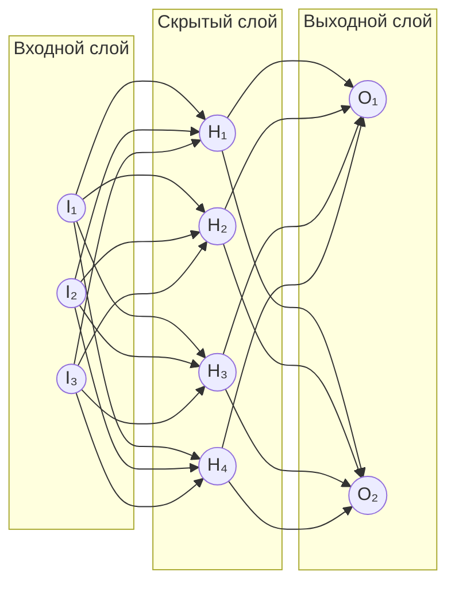

# 🔬 Глубокое обучение (Deep Learning)

> **Определение:** Глубокое обучение — подобласть машинного обучения, использующая искусственные нейронные сети с несколькими слоями для выявления сложных закономерностей в данных.

---

## Чем отличается от машинного обучения?

| | Машинное обучение | Глубокое обучение |
|---|---|---|
| **Метод** | Простые алгоритмы | Нейронные сети со множеством слоёв |
| **Признаки** | Выбираются вручную | Извлекаются автоматически |
| **Данные** | Работает и на малых объёмах | Требует больших объёмов |
| **Обработка** | Простые закономерности | Сложные паттерны и представления |

> Слово **«глубокое»** в названии означает наличие **множества слоёв** в нейронной сети — каждый слой анализирует данные всё глубже.

---

## Искусственная нейронная сеть (ANN)

> **Искусственная нейронная сеть (ANN)** — упрощённая модель мозга, состоящая из искусственных узлов (нейронов) и их слоёв. Каждый слой анализирует и преобразует входные данные, выявляя всё более сложные закономерности.

**Ключевые термины:**
- **Узел (нейрон)** — базовая вычислительная единица
- **Слой** — группа узлов на одном уровне
- **Вес (weight)** — число, присвоенное связи между узлами; определяет силу влияния

![[Pasted image 20260326223811.png]]

---

## Пример: распознавание велосипеда

Каждый последующий слой опирается на предыдущий — от простых форм к полному распознаванию объекта.

---

## Процессы глубокого обучения

| Процесс | Описание |
|---------|----------|
| 🔎 **Извлечение признаков** | Алгоритмы автоматически извлекают из данных релевантные признаки — не нужно искать вручную |
| 📊 **Обработка сложных данных** | Глубокие сети обрабатывают огромные объёмы данных: изображения, речь, текст |
| 🔄 **Обобщение** | Модели хорошо применяют полученные знания к ранее не виданным данным |

---

## Примеры применения

| Область | Пример |
|---------|--------|
| 👁️ **Распознавание изображений** | Идентификация объектов, лиц и сцен |
| 🗣️ **Распознавание речи** | Преобразование устной речи в текст |
| 🚗 **Самоуправляемые автомобили** | Анализ обстановки и принятие решений |

---

## Связь с NLP

Модели глубокого обучения можно сначала обучить на огромных объёмах данных, а затем настроить для конкретных задач. Именно способность обрабатывать массивы данных сделала их **ключевым компонентом обработки естественного языка (NLP)**.

---

## Связанные темы

- [[ML]] — Машинное обучение (родительская область)
- [[NLP]] — Обработка естественного языка (использует методы DL)

> [!info] 📖 Источник
> Бхуян Ш., Исаченко Т. — «Генеративный ИИ с LLM для джунов», Глава 2, стр. 63–66
