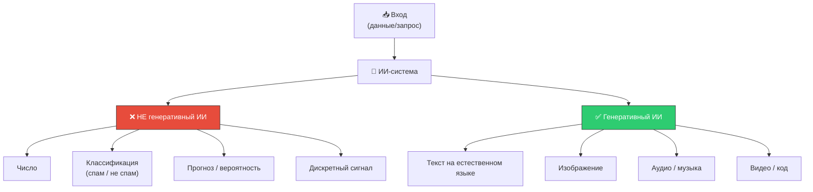
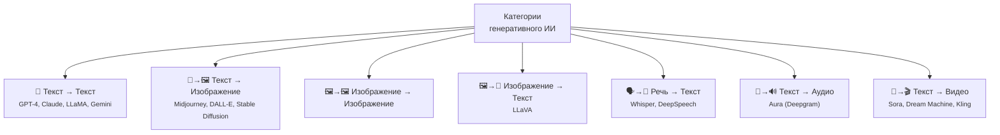
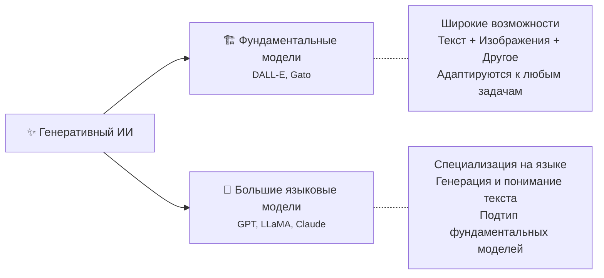

# ✨ Генеративный ИИ (Generative AI)

> **Определение:** Генеративный ИИ — тип искусственного интеллекта, способный **создавать** совершенно новый контент (текст, изображения, музыку, код) посредством синтеза информации из существующих данных. В отличие от систем, которые просто распознают закономерности или делают прогнозы.

---

## Генеративный ИИ vs. Не-генеративный ИИ

> **Простое правило:** Если на выходе — число, классификация или прогноз → **не** генеративный ИИ. Если на выходе — текст, изображение, аудио или видео → **генеративный** ИИ.

![[Pasted image 20260326224302.png]]

![[Pasted image 20260326224320.png]]

---

## Преимущества

| Преимущество | Описание |
|-------------|----------|
| 🎨 **Творчество** | Создание художественных, музыкальных и литературных произведений |
| ⚡ **Автоматизация** | Составление отчётов, маркетинговых материалов, обработка запросов |
| 🎯 **Персонализация** | Адаптация под предпочтения пользователя (рекомендации, реклама) |
| 📊 **Аугментация данных** | Создание синтетических данных для обучения моделей |
| ♿ **Доступность** | Описания изображений, озвучка для людей с нарушениями зрения |
| 🔬 **Исследования** | Моделирование сценариев и сред для научных задач |

---

## Категории генеративного ИИ

---

## Два типа моделей генеративного ИИ

> [!important] Важное соотношение
> Все LLM — это генеративные ИИ-модели, но **не все** генеративные ИИ-модели — это LLM. Например, модель генерации изображений (Midjourney) — это генеративный ИИ, но не LLM.

---

## Связанные темы

- [[Фундаментальные модели]] — Базовые модели с широкими возможностями
- [[LLM]] — Большие языковые модели (подтип фундаментальных моделей)
- [[NLP]] — Обработка естественного языка
- [[AI]] — Искусственный интеллект (родительская область)

> [!info] 📖 Источник
> Бхуян Ш., Исаченко Т. — «Генеративный ИИ с LLM для джунов», Глава 2, стр. 74–84
