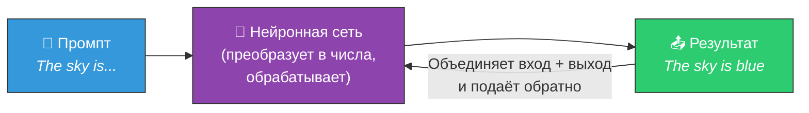
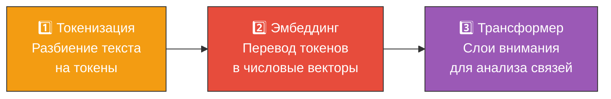
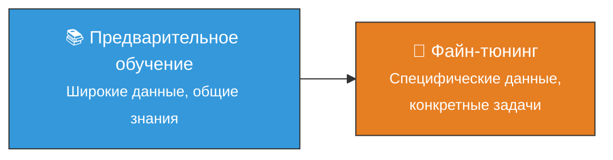

# 📝 Большие языковые модели (LLM)

> **Определение:** Большая языковая модель (LLM, Large Language Model) — разновидность фундаментальных моделей, использующая механизмы глубокого обучения для анализа огромных объёмов данных. LLM достигают исключительной эффективности в обработке и генерации текста, почти неотличимого от написанного человеком.

---

## Почему «большая»?

Термин **«большая» (Large)** относится к:
- 🔢 **Количеству параметров** — от миллиардов (8B) до сотен миллиардов (405B)
- 📚 **Объёму обучающих данных** — от миллиардов до триллионов слов

> Когда говорят, что LLM имеет 8–405 миллиардов параметров, имеется в виду количество **весов** (связей между узлами) в нейронной сети.

---

## Ключевые характеристики

| Характеристика | Описание |
|---------------|----------|
| 🎯 **Специализация** | Разработаны для задач, связанных с естественным языком |
| ✍️ **Генерация** | Создают текст, обрабатывают язык, понимают языковые шаблоны |
| 📊 **Масштаб** | Обучаются на массивных наборах данных из различных источников |

---

## Как работает LLM: упрощённая схема

Три ключевых принципа:
1. Нейронная сеть состоит из узлов (**параметров**) со связями (**весами**)
2. Сеть обрабатывает **только числа** — входной текст преобразуется в числовой формат
3. Любой контент (текст, изображения) можно представить числами и передать в модель

> Когда вы объединяете вход и выход и возвращаете обратно в LLM — она продолжает генерировать текст, предсказывая следующее слово. Именно так работает ChatGPT!

<!-- PLACEHOLDER: Здесь была картинка (Pasted image 20260323233255.png) — схема нейронной сети LLM -->

---

## Внутренняя работа LLM: 3 этапа

| Этап | Что происходит | Пример |
|------|---------------|--------|
| **Токенизация** | Текст разбивается на мелкие единицы (токены) | *«Machine learning»* → [*«Machine»*, *«learning»*] |
| **Эмбеддинг** | Токены переводятся в числовые векторы с семантикой | *«Machine»* → [0.5, 0.1, 0.7, …] |
| **Трансформер** | Слои внимания выявляют связи между токенами | Модель понимает, что «Machine» и «learning» связаны |

---

## Примеры LLM и их размеры

| Модель | Параметры | Лимит токенов |
|--------|:---------:|:-------------:|
| LLaMA 2 | 7B–70B | 4 096 |
| GPT-4 | ~1.8T (предп.) | 8 192+ |
| LLaMA 3.1 | 8B–405B | 128K |
| Mistral | 7B–8x22B | 32K |

---

## Обучение LLM

Обучение делится на две стадии:

Подробнее: [[Обучение]] → [[Предварительное обучение]] → [[Файн-тюнинг]]

---

## Расширение возможностей LLM

Помимо файн-тюнинга существует альтернативный метод — **RAG**, который позволяет LLM динамически обращаться к внешним базам данных.

| Метод | Суть | Когда использовать |
|-------|------|--------------------|
| **Файн-тюнинг** | Изменение весов модели на специфических данных | Нужно изменить «поведение» модели |
| **RAG** | Подключение внешних баз знаний при генерации | Нужен доступ к актуальной/частной информации |

---

## Связанные темы

- [[Токенизация]] — Первый этап обработки текста в LLM
- [[Вектор]] — Числовое представление токенов
- [[Эмбеддинг]] — Семантическое числовое представление
- [[Трансформер]] — Архитектура, лежащая в основе LLM
- [[Обучение]] — Процесс обучения LLM
- [[RAG]] — Расширенная генерация данных
- [[Фундаментальные модели]] — LLM как подтип фундаментальных моделей

> [!info] 📖 Источник
> Бхуян Ш., Исаченко Т. — «Генеративный ИИ с LLM для джунов», Глава 2, стр. 84–98
