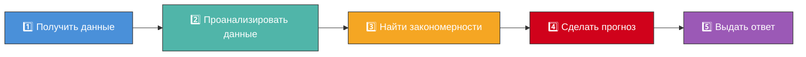
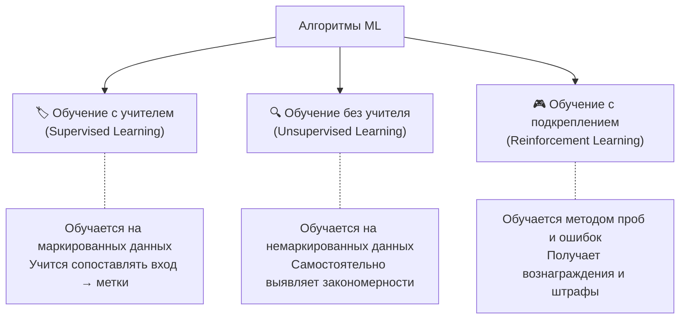

# ⚙️ Машинное обучение (Machine Learning)

> **Определение:** Машинное обучение — направление в области ИИ, исследующее методы и модели обучения компьютеров на основе данных без предварительного явного программирования.

---

## Основная идея



Четыре ключевых компонента:

| Компонент | Суть |
|-----------|------|
| **Данные** | Алгоритмам нужны большие объёмы данных (текст, числа, показания датчиков и т.д.) |
| **Алгоритм** | «Рецепт обучения» — компьютер анализирует данные и ищет закономерности |
| **Обучение** | Алгоритм настраивает внутренние параметры, чтобы повысить эффективность |
| **Прогнозирование** | После обучения алгоритм делает предсказания на новых данных |

![[Pasted image 20260326224920.png]]


---

## Типы алгоритмов машинного обучения



1. **Обучение с учителем (Supervised Learning)** — алгоритм обучается на маркированных (помеченных) данных. Он учится правильно сопоставлять входные данные с уже проставленными метками.
2. **Обучение без учителя (Unsupervised Learning)** — алгоритм обучается на немаркированных данных и должен самостоятельно выявлять закономерности и взаимосвязи.
3. **Обучение с подкреплением (Reinforcement Learning)** — алгоритм обучается методом проб и ошибок, получая вознаграждение за правильные действия и наказание за неправильные.

---

## Практические примеры

| Пример | Описание |
|--------|----------|
| 🎬 **Рекомендательные системы** | Netflix предлагает фильмы, Amazon рекомендует товары на основе предпочтений |
| 📧 **Спам-фильтры** | Идентификация и блокировка нежелательных писем |
| 🏦 **Выявление мошенничества** | Отметка подозрительных транзакций в банковской системе |

---

## Пример: рекомендательная система

Представим интернет-магазин с данными о покупках и оценках пользователей. Столбцы вроде «Жанр» и «Рейтинг» — это **признаки** (фичи), которые используются алгоритмами для прогнозирования. Система выявляет паттерны: если пользователь A и пользователь B высоко оценили одинаковые книги, то можно предложить книги одного пользователя другому.

> [!tip] Термин
> **Признаки (фичи)** — столбцы данных, используемые алгоритмами для прогнозирования или классификации.

---

## Место в иерархии

```
ИИ (AI) ⊃ Машинное обучение (ML) ⊃ Глубокое обучение (DL) ⊃ NLP ⊃ Генеративный ИИ ⊃ LLM
```

---

## Связанные темы

- [[AI]] — Искусственный интеллект (родительская область)
- [[DL]] — Глубокое обучение (подобласть ML)

> [!info] 📖 Источник
> Бхуян Ш., Исаченко Т. — «Генеративный ИИ с LLM для джунов», Глава 2, стр. 59–63
