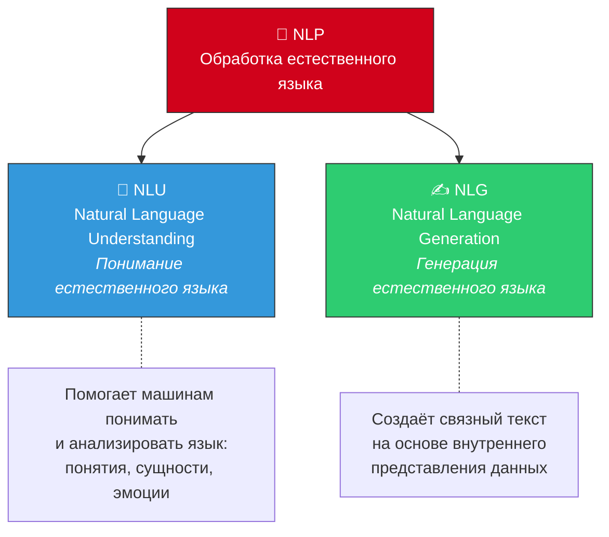
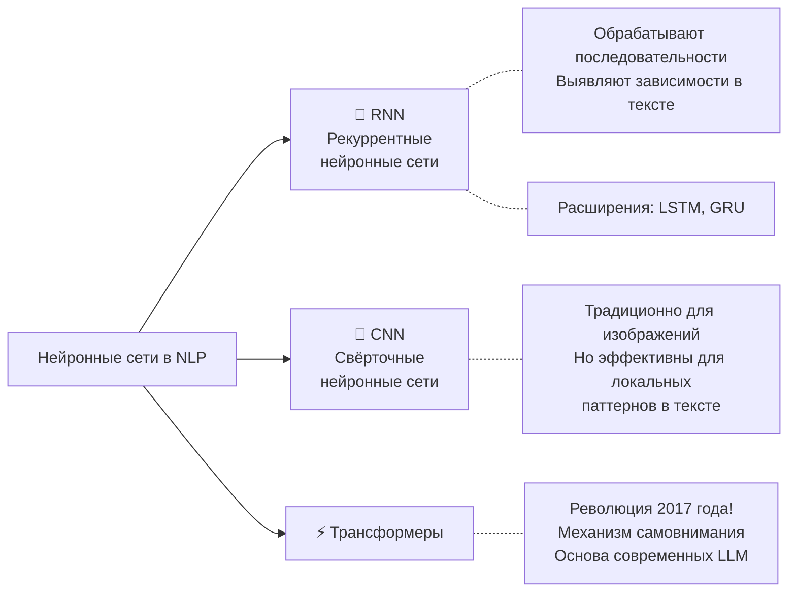

# 💬 Обработка естественного языка (NLP)

> **Определение:** NLP (Natural Language Processing) — направление ИИ, посвящённое компьютерному анализу (пониманию и интерпретации) и синтезу (генерации) человеческих высказываний на естественных языках. Находится на стыке лингвистики, информатики и науки о данных.

---

## Две области NLP

- **NLU** — фокусируется на **понимании**: выявление понятий, сущностей, эмоций, ключевых слов
- **NLG** — фокусируется на **генерации**: создание связных фраз, предложений, абзацев

> Модели, предназначенные для понимания и генерации текста, называют **языковыми моделями (LM, Language Models)**.

---

## Связь NLP и глубокого обучения

NLP — это **не часть** глубокого обучения. Но модели глубокого обучения **расширяют возможности** NLP, позволяя выявлять сложные закономерности из больших наборов данных.

### Типы нейронных сетей в NLP

| Тип сети | Назначение | Ограничения |
|----------|-----------|-------------|
| **RNN** | Обработка последовательных данных, выявление зависимостей в тексте | Плохо справляются с дальними зависимостями |
| **LSTM / GRU** | Расширения RNN для работы с далёкими фрагментами текста | Высокие вычислительные затраты |
| **CNN** | Классификация предложений, распознавание именованных сущностей | Ограничены локальными паттернами |
| **Трансформеры** | Универсальная архитектура для понимания и генерации языка | Требуют много вычислительных ресурсов |

---

## Революция трансформеров

> В 2017 году появилась статья **«Attention Is All You Need»**, описавшая революционно новую архитектуру — **трансформеры**. Благодаря механизму самовнимания модели стали гораздо эффективнее обрабатывать текст, фокусируясь на наиболее значимых частях.

До трансформеров языковые модели на основе RNN:
- Требовали больших вычислительных затрат
- Часто «переобучались» на длинных последовательностях
- С трудом улавливали связи между далёкими словами

Трансформеры решили все эти проблемы и стали **основой современного NLP и генеративного ИИ**.

---

## Связанные темы

- [[DL]] — Глубокое обучение (предоставляет методы для NLP)
- [[Трансформер]] — Ключевая архитектура для NLP
- [[Механизм самовнимания]] — Основа работы трансформеров
- [[Архитектура кодировщика-декодировщика]] — Структура сетей для перевода и генерации

> [!info] 📖 Источник
> Бхуян Ш., Исаченко Т. — «Генеративный ИИ с LLM для джунов», Глава 2, стр. 66–68
