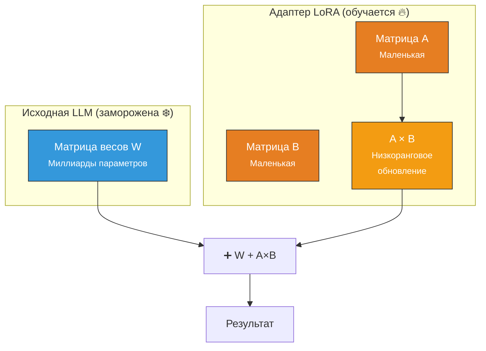
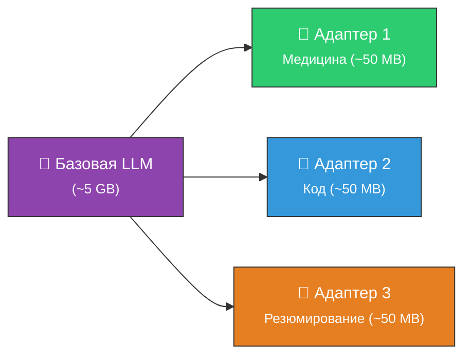

# ⚡ PEFT — LoRA и QLoRA

> **Определение:** PEFT (Parameter-Efficient Fine-Tuning) — метод файн-тюнинга, при котором обновляется только **небольшое подмножество** параметров модели. Остальная часть «замораживается» (остаётся неизменной). Самые популярные реализации — **LoRA** и **QLoRA**.

---

## Идея PEFT

Вместо обновления **всех** весов (как при полном файн-тюнинге) → обновляется только **маленькая часть**, часто через дополнительные компоненты — **адаптеры**.
![[Pasted image 20260328131251.png]]

---

## Ключевые преимущества PEFT

| Преимущество | Описание |
|-------------|----------|
| 💾 **Экономия памяти** | Значительно меньше обучаемых параметров |
| 🧠 **Сохранение знаний** | Замороженные слои хранят знания предобучения → минимальный риск «катастрофического забывания» |
| 🔀 **Многозадачность** | Можно создать разные адаптеры для разных задач без изменения основной модели |
| 📈 **Масштабируемость** | Эффективно адаптировать модель к десяткам задач одновременно |

> [!warning] Ограничение
> PEFT **не всегда** достигает того же уровня точности, что и полный файн-тюнинг, поскольку адаптируется только часть модели.

---

## LoRA (Low-Rank Adaptation)

> **LoRA** — метод, при котором в слои внимания трансформера вводятся **низкоранговые матрицы** обновления. Основная модель замораживается, а обучаются только эти маленькие матрицы.

### Что такое адаптер LoRA?

Адаптер — это **маленький «плагин»** для предобученной модели:
- Размер: **несколько процентов** от исходной LLM (мегабайты, не гигабайты)
- Для **разных задач** можно создавать **разные адаптеры**
- При инференсе адаптер **комбинируется** с исходной LLM

> Одна базовая модель + несколько лёгких адаптеров = гибкая система для разных задач.

---

## QLoRA (Quantized LoRA)

> **QLoRA** — вариант LoRA с добавлением **квантизации** модели. Снижает разрядность параметров (например, с 16 бит до 4 бит), что резко уменьшает потребление памяти.

### Что такое квантизация?

Квантизация снижает **разрядность** параметров модели:

| Формат | Размер на параметр | Пример модели 7B |
|--------|:-:|:-:|
| float32 (полная точность) | 32 бита | ~28 GB |
| float16 (половинная) | 16 бит | ~14 GB |
| **int4 (QLoRA)** | **4 бита** | **~3.5 GB** |

### Как работает QLoRA

> 4-битная квантизация позволяет обучать **очень большие модели** даже на **небольших GPU** (например, Google Colab T4 с 16 GB RAM).

---

## Сравнение LoRA и QLoRA

| | LoRA | QLoRA |
|---|---|---|
| **Базовая модель** | Исходная (16/32 бит) | Квантизированная (4 бита) |
| **Память** | Меньше, чем полный FT | **Ещё меньше** (в 3–4 раза) |
| **Точность** | Близка к полному FT | Чуть ниже, но приемлемая |
| **GPU** | Средний (16+ GB) | **Маленький** (8–16 GB хватает) |
| **Когда** | Есть хороший GPU | Ограничены ресурсы |

---

## Сравнение всех методов

| Метод | Параметры | Память | Точность | Скорость |
|-------|:---------:|:------:|:--------:|:--------:|
| **Полный FT** | 100% | 🔴 Макс. | 🟢 Макс. | 🔴 Медл. |
| **LoRA** | ~1–5% | 🟡 Сред. | 🟡 Хор. | 🟢 Быстр. |
| **QLoRA** | ~1–5% | 🟢 Мин. | 🟡 Хор. | 🟢 Быстр. |

---

## Связанные темы

- [[Файн-тюнинг]] — Общий обзор файн-тюнинга
- [[Полный файн-тюнинг]] — Альтернатива: все параметры
- [[Дистилляция знаний]] — Альтернатива: сжатие модели
- [[Практический пример файн-тюнинга]] — Пошаговый пример с QLoRA

> [!info] 📖 Источник
> Бхуян Ш., Исаченко Т. — «Генеративный ИИ с LLM для джунов», Глава 5, стр. 189–193
