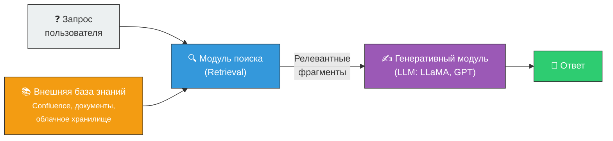
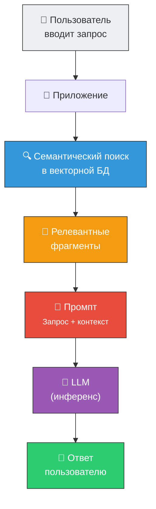
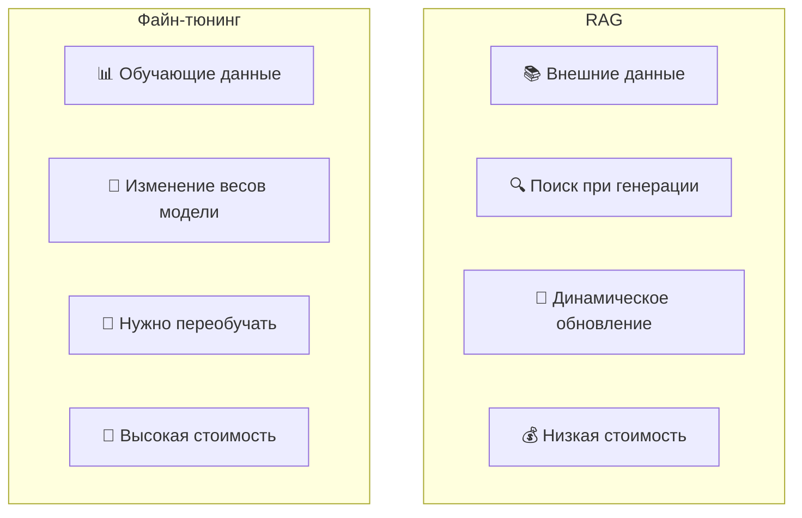
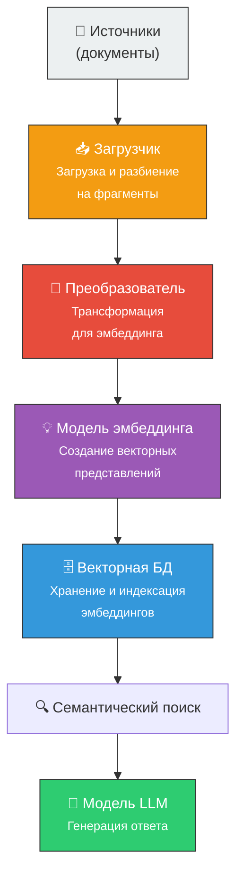

# 🔍 RAG (Retrieval-Augmented Generation)

> **Определение:** RAG (Retrieval-Augmented Generation, «расширенная генерация данных») — гибридный метод адаптации LLM, сочетающий **поиск информации** из внешних источников с **генерацией** ответа. Позволяет LLM динамически обращаться к базам данных (Confluence, документы, Wikipedia) без переобучения модели.

---

## Два основных компонента

| Компонент | Задача |
|-----------|--------|
| 🔍 **Модуль поиска** (Retrieval) | Ищет в большой внешней базе знаний наиболее релевантные фрагменты |
| ✍️ **Генеративный модуль** | Использует найденную информацию + исходный запрос для создания ответа |

---

## Как работает RAG: пошагово

1. Пользователь отправляет запрос
2. Модуль поиска **извлекает** релевантную информацию из базы знаний
3. Информация **дополняет** (аугментирует) исходный запрос
4. LLM **генерирует** ответ на основе дополненного контекста
![[Pasted image 20260326225202.png]]

![[Pasted image 20260326225224.png]]

---

## Ключевые аспекты RAG

| Аспект | Описание |
|--------|----------|
| 🎯 **Знания по конкретной сфере** | Охватывает широкий круг тем, даёт точные и актуальные ответы |
| 🕸️ **Интеграция графов знаний** | Использует обширные графы знаний из различных источников |
| 💰 **Экономическая эффективность** | Дешевле файн-тюнинга — не нужно переобучать модель |

---

## RAG vs Файн-тюнинг

![[Pasted image 20260326225251.png]]

| Характеристика | RAG | Файн-тюнинг |
|---------------|-----|-------------|
| **Механизм** | Поиск + генерация | Изменение весов модели |
| **Источник данных** | Внешняя БД при инференсе | Данные при обучении |
| **Адаптивность** | Динамическая, без переобучения | Нужно переобучать |
| **Примеры** | QA, динамическая интеграция знаний | Анализ настроения, перевод |
| **Стоимость** | Низкая | Высокая |

> RAG идеально подходит, когда модель должна получать доступ к **динамической внешней информации** в реальном времени.

---

## Компоненты локальной RAG-системы

![[Pasted image 20260326225310.png]]

![[Pasted image 20260326225340.png]]

Для создания локальной RAG-системы нужны:

|  №  | Компонент             | Назначение                                            |
| :-: | --------------------- | ----------------------------------------------------- |
|  1  | **Источники**         | Исходные документы (PDF, TXT, HTML и т.д.)            |
|  2  | **Загрузчик**         | Загружает и разбивает документы на фрагменты (chunks) |
|  3  | **Преобразователь**   | Трансформирует фрагменты для эмбеддинга               |
|  4  | **Модель эмбеддинга** | Создаёт векторные представления                       |
|  5  | **Векторная БД**      | Хранит и индексирует эмбеддинги                       |
|  6  | **Модель LLM**        | Генерирует ответы на основе найденного контекста      |

---

## Ключевые концепции RAG

| Концепция | Описание |
|-----------|----------|
| [[Эмбеддинг]] | Числовое представление текста с семантикой |
| [[Векторная база данных]] | Хранилище эмбеддингов для быстрого поиска |
| **Семантический поиск** | Поиск по смыслу, а не по ключевым словам |

---

## Связанные темы

- [[Файн-тюнинг]] — Альтернативный метод адаптации LLM
- [[Эмбеддинг]] — Основа для семантического поиска в RAG
- [[Векторная база данных]] — Хранение данных для RAG
- [[LLM]] — Модели, расширяемые через RAG

> [!info] 📖 Источник
> Бхуян Ш., Исаченко Т. — «Генеративный ИИ с LLM для джунов», Глава 2, стр. 103–105; Глава 3, стр. 114–141
