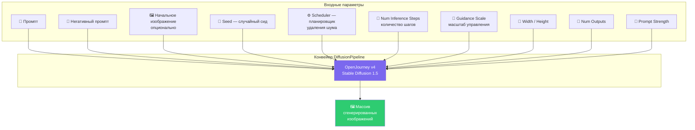
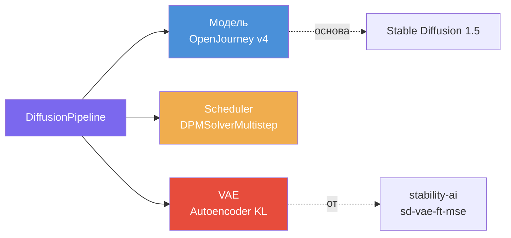

# Конвейер диффузии: вход, выход, параметры

## Архитектура конвейера

## Параметры генерации

### Входные параметры (Input)

| Параметр | Описание | Пример |
|---|---|---|
| **Промпт** | Текстовое описание желаемого изображения | `Istanbul street, old city, summer, sunny, hyperdetailed 8k` |
| **Негативный промпт** | Что НЕ должно быть на изображении | `blur haze, pencils, pens, fingers` |
| **Начальное изображение** | Опциональная база для вариаций | — |
| **Width / Height** | Размеры выходного изображения | `(400, 600)` |
| **Seed** | Случайное число для контроля генерации | Определяет воспроизводимость |
| **Scheduler** | Планировщик удаления шума | `DPMSolverMultistepScheduler` |
| **Num Outputs** | Количество генерируемых изображений | `1` |
| **Guidance Scale** | Коэффициент «следования» промпту (classifier-free guidance) | `9` |
| **Prompt Strength** | Степень влияния промпта | — |
| **Num Inference Steps** | Количество шагов уменьшения шума | `20` |

### Выходные данные (Output)

Массив из одного или нескольких сгенерированных изображений.

## Ключевые компоненты конвейера

| Компонент | Роль |
|---|---|
| **DiffusionPipeline** | Основной конвейер, объединяющий все компоненты |
| **Модель** (`prompthero/openjourney-v4`) | Предобученная модель генерации |
| **Scheduler** (`DPMSolverMultistepScheduler`) | Управляет процессом пошагового удаления шума |
| **VAE** (`AutoencoderKL`) | Вариационный автокодировщик — кодирует/декодирует изображения в латентное пространство и обратно |

## Советы по улучшению генерации

1. **Больше деталей в промпте** — чем детальнее описание, тем точнее результат
2. **Экспериментируйте** — пробуйте разные промпты и параметры
3. **Файн-тюнинг** — при особых требованиях можно дообучить модель на своих данных

## Требования к оборудованию

- **GPU (CUDA)** — рекомендуется для ускорения (драйверы Nvidia)
- **CPU** — работает, но значительно медленнее
- **Google Colab** — альтернатива с GPU T4

## Связанные заметки

- [[llava|LLaVA-v1.6]]
- [[openjourney|OpenJourney и text-to-image]]
