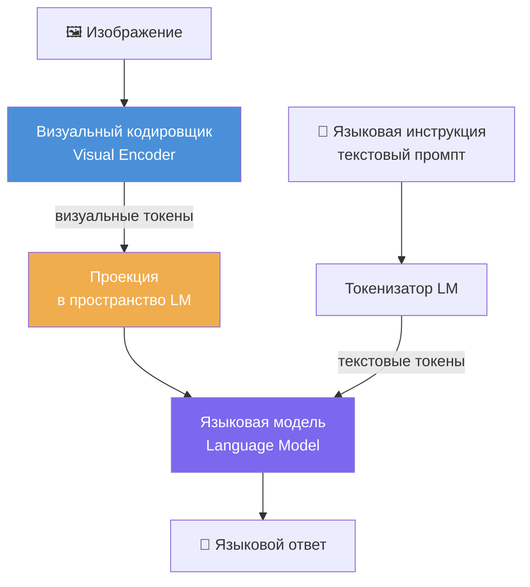
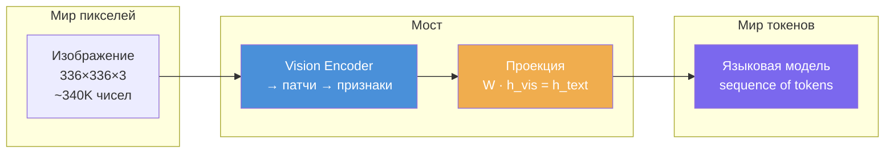
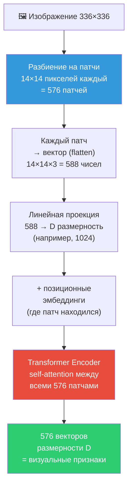
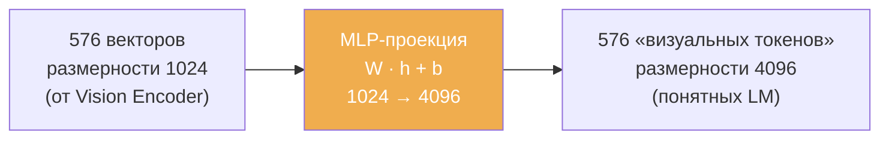
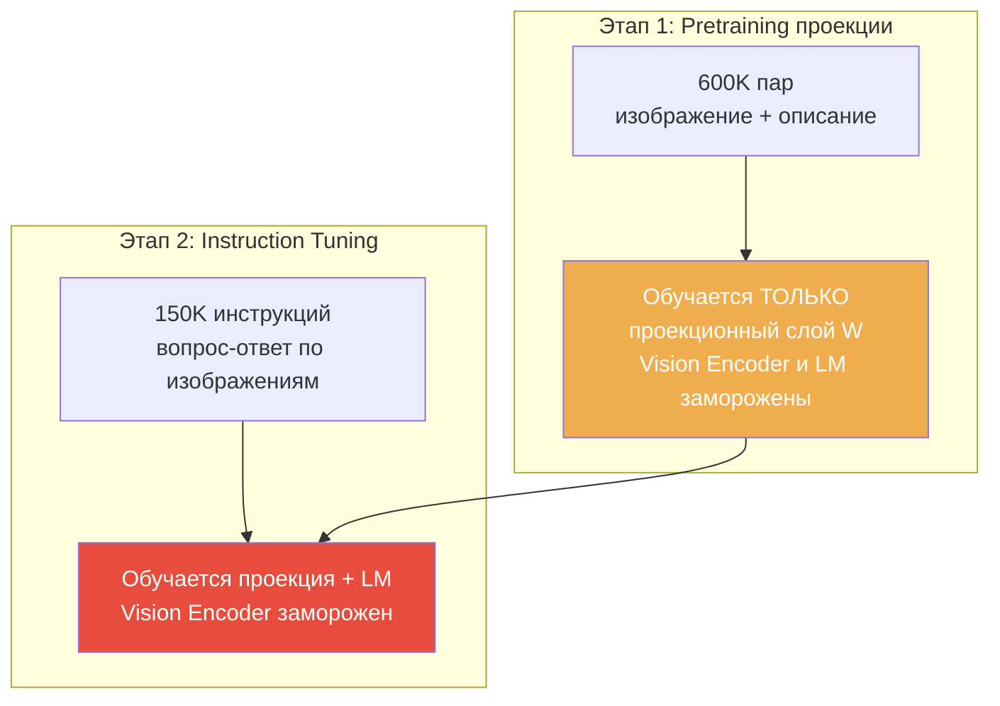
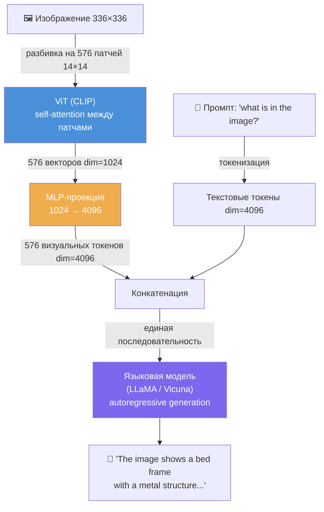
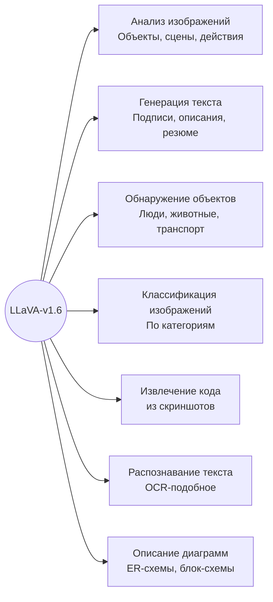

# LLaVA-v1.6: архитектура и возможности

> Часть конспекта: [[ch6_00_overview|Глава 6. Обработка и генерация изображений]]

## Что такое LLaVA

**LLaVA** (Large Language and Vision Assistant) — модель глубокого обучения, совмещающая обработку естественного языка и распознавание изображений. Разрабатывается с 2019 года, версия v1.6 — последняя на момент книги.

Ключевая идея: модель **одновременно «читает» текст и «смотрит» на изображение**, выдавая осмысленный текстовый ответ.

## Архитектура LLaVA



### Как это работает (пошагово)

1. **Изображение** поступает в **визуальный кодировщик** (комбинация CNN + RNN), который извлекает признаки
2. Визуальные признаки **проецируются** в пространство языковой модели (преобразуются в «токены», понятные LM)
3. **Текстовый промпт** обрабатывается **токенизатором** языковой модели напрямую
4. Языковая модель получает оба набора токенов (визуальные + текстовые) и генерирует **текстовый ответ**

---

## Теория: как устроено распознавание изображений в VLM

> Этот раздел дополняет книгу — в ней механизм описан кратко, здесь разбираем подробно.

### Общая идея Vision-Language Models (VLM)

Задача VLM — **перевести изображение на «язык» языковой модели**. Изображение — это матрица пикселей (например, 336×336×3 = ~340 тыс. чисел). Языковая модель работает с токенами (дискретными единицами). Нужен «мост» между этими мирами.



### Шаг 1: Визуальный кодировщик (Vision Encoder)

В LLaVA используется **CLIP ViT** (Vision Transformer) — не просто CNN, а трансформер для изображений.

**Как ViT обрабатывает изображение:**



1. **Разбиение на патчи** — изображение нарезается на квадраты (например, 14×14 px). Каждый патч — это «визуальный токен»
2. **Линейная проекция** — каждый патч (массив пикселей) превращается в вектор фиксированной размерности через умножение на матрицу весов
3. **Позиционные эмбеддинги** — к каждому вектору прибавляется информация о позиции патча (иначе трансформер не знает, где что расположено)
4. **Self-Attention** — каждый патч «смотрит» на все остальные патчи. Это позволяет модели понять контекст: патч с глазом «видит» патч с носом и понимает, что это лицо

> **Почему ViT, а не просто CNN?** CNN обрабатывает изображение локальными фильтрами (3×3, 5×5) и строит иерархию признаков снизу вверх. ViT сразу даёт каждому патчу глобальный контекст через self-attention — каждый кусочек изображения «знает» обо всех остальных.

### Шаг 2: Проекция (Projection Layer)

Визуальный кодировщик выдаёт 576 векторов размерности D_vis (например, 1024). Но языковая модель ожидает векторы размерности D_text (например, 4096 у LLaMA).

**Проекция — это обучаемая линейная трансформация:**

```
h_text = W · h_vis + b
```

где `W` — матрица весов размера D_text × D_vis



> **Ключевой момент:** после проекции визуальные признаки становятся неотличимы по формату от текстовых токенов. Для языковой модели это просто ещё одна часть входной последовательности.

### Шаг 3: Объединение и генерация

Языковая модель получает **одну последовательность**:

```
[визуальный_токен_1] [визуальный_токен_2] ... [визуальный_токен_576] [текстовый_токен_1] [текстовый_токен_2] ...
```



```mermaid
flowchart LR
    subgraph "Входная последовательность LM"
        direction LR
        V1["v₁"] --> V2["v₂"] --> VDOT["..."] --> V576["v₅₇₆"]
        V576 --> T1["What"]
        T1 --> T2["is"]
        T2 --> T3["in"]
        T3 --> T4["the"]
        T4 --> T5["image"]
        T5 --> T6["?"]
    end

    subgraph "Генерация (авторегрессия)"
        T6 --> O1["The"]
        O1 --> O2["image"]
        O2 --> O3["shows"]
        O3 --> O4["..."]
    end

    style V1 fill:#4a90d9,color:#fff
    style V2 fill:#4a90d9,color:#fff
    style V576 fill:#4a90d9,color:#fff
    style VDOT fill:#4a90d9,color:#fff
    style O1 fill:#2ecc71,color:#fff
    style O2 fill:#2ecc71,color:#fff
    style O3 fill:#2ecc71,color:#fff
    style O4 fill:#2ecc71,color:#fff
```

Языковая модель через **self-attention** связывает текстовые и визуальные токены: когда она генерирует слово «кровать», она «обращает внимание» на те визуальные токены, которые содержат признаки кровати.

**Генерация идёт авторегрессионно:** каждый следующий токен предсказывается на основе всех предыдущих (и визуальных, и текстовых).

### Обучение LLaVA: два этапа



1. **Pretraining проекции** — модель учится «переводить» визуальные признаки в язык LM. Vision Encoder (CLIP) и LM заморожены, обучается только матрица проекции W
2. **Instruction Tuning** — модель учится следовать инструкциям: отвечать на вопросы об изображениях, описывать диаграммы и т.д. Размораживается и LM

### Итого: полный пайплайн распознавания



## Возможности LLaVA-v1.6



### Что умеет на практике

| Задача | Пример промпта | Результат |
|---|---|---|
| Описание изображения | `what is in the image` | Текстовое описание содержимого |
| Описание диаграммы | `describe the diagram` | Разбор узлов, связей, структуры |
| Извлечение кода | `extract code from the image` | Код на языке программирования |
| Распознавание текста | `extract text from the image` | Текст с изображения |

## Область применения

Здравоохранение, финансы, образование — везде, где нужно анализировать визуальные данные и получать текстовые описания.

## Ограничения

- Для модели `llava:34b` нужно **>20 ГБ** свободной памяти
- Обработка больших изображений занимает несколько минут (кодирование + декодирование)
- Работает через **Ollama** (локальный запуск)

## Связанные заметки
- [[openjourney|OpenJourney — генерация изображений]]
