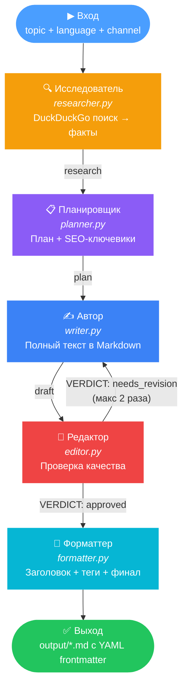
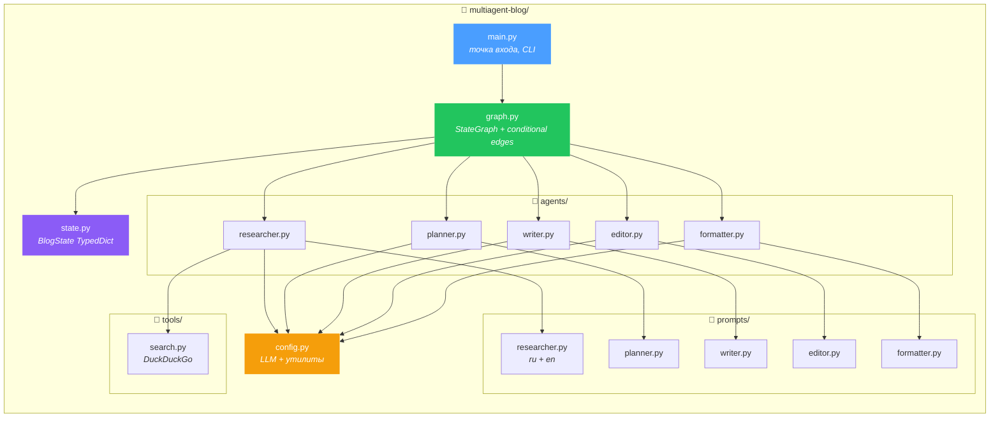
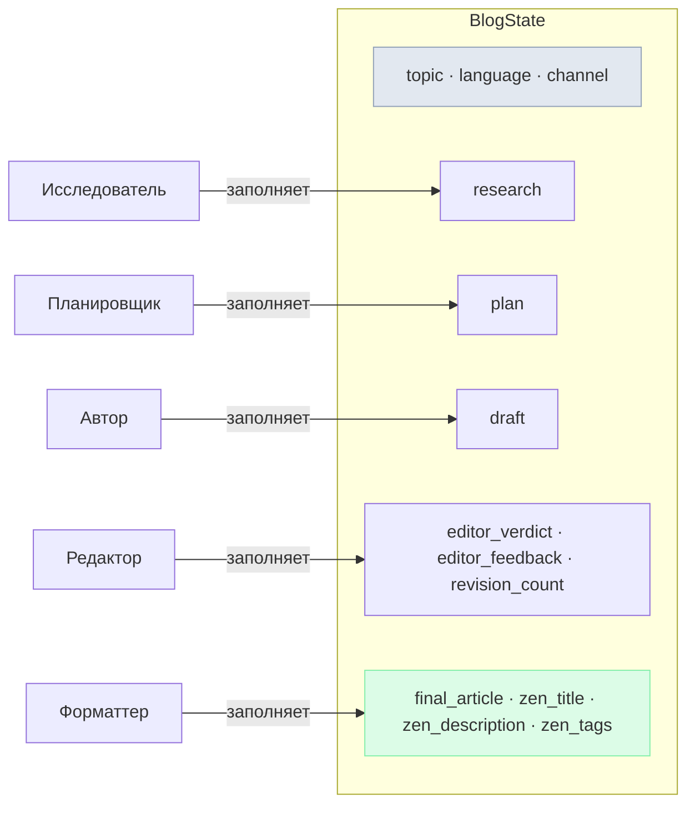

# Архитектура: Мультиагентная система генерации статей

## Граф агентов (LangGraph)



## Структура проекта



## Поток данных (State)



## Зачем LangGraph?

LangGraph решает одну конкретную задачу: **оркестрация цепочки LLM-вызовов с ветвлениями и циклами**.

Без LangGraph пришлось бы писать:
```python
research = call_researcher(topic)
plan = call_planner(research)
draft = call_writer(plan, research)
feedback = call_editor(draft)
if feedback == "bad" and count < 2:
    draft = call_writer(plan, research, feedback)  # а если опять bad?
    feedback = call_editor(draft)                   # вложенные if...
```

С LangGraph это **декларативный граф**: добавил узлы, рёбра, conditional edge — и `app.stream()` сам гоняет данные по конвейеру, включая возврат автору на ревизию.
