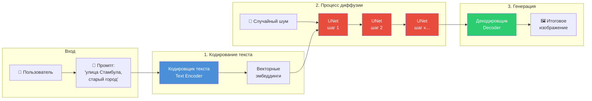
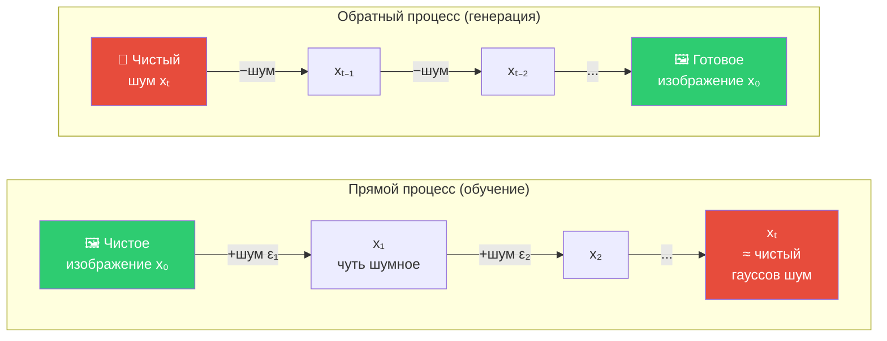
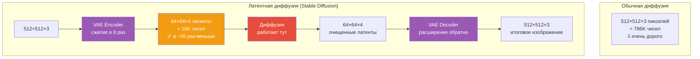
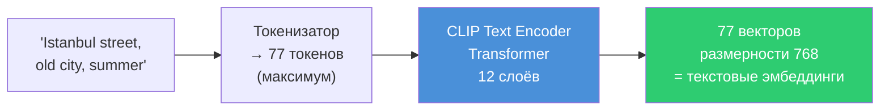
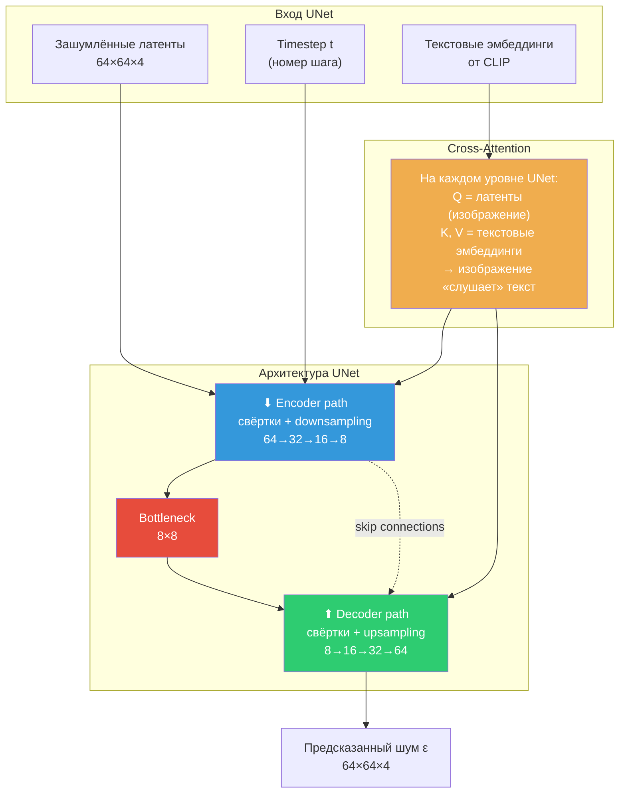
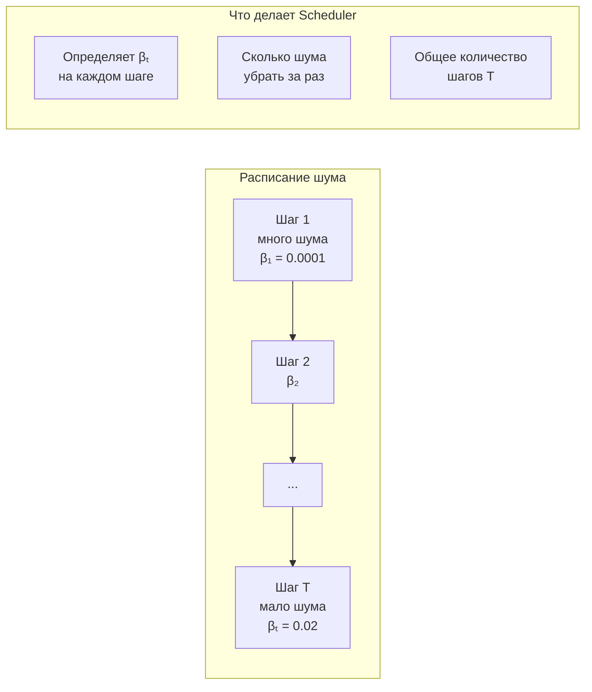
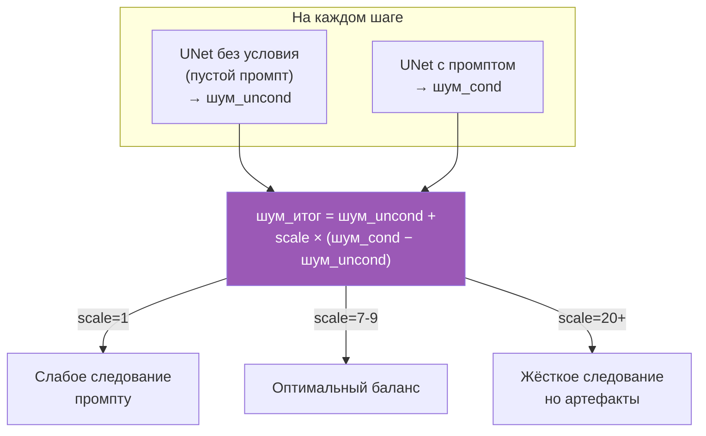
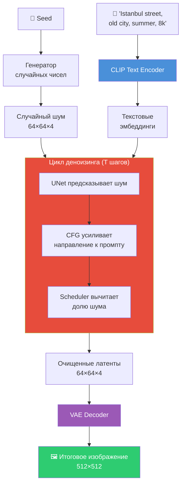
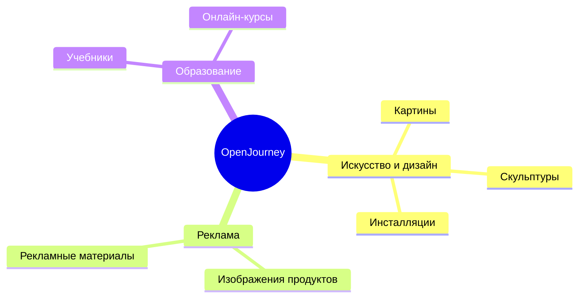

# OpenJourney и процесс text-to-image

## Что такое OpenJourney

**OpenJourney** — open-source модель генерации изображений из текста, основанная на **Stable Diffusion 1.5**. Дополнительно дообучена компанией **PromptHero** на наборе из **124 000+ изображений MidJourney v4**.

Основная задача — создание высококачественных изображений по текстовым описаниям (промптам).

## Процесс text-to-image (Stable Diffusion)

### Три этапа генерации

| Этап | Что происходит |
|---|---|
| **1. Кодирование текста** | Текстовый промпт → числовое представление (эмбеддинги) через предобученную языковую модель |
| **2. Диффузия** | Начинаем со случайного шума → на каждом шаге UNet убирает шум, ориентируясь на эмбеддинги текста → изображение постепенно «проявляется» |
| **3. Генерация** | Постобработка: изображение становится чётче, декодер выдаёт финальный результат |

> **Ключевая идея диффузии:** модель учится **убирать шум**. Начиная с полностью зашумлённого изображения, за множество шагов она постепенно «очищает» его, следуя текстовому описанию.

---

## Теория: механизм диффузии подробно

> Этот раздел дополняет книгу — в ней процесс описан схематично, здесь разбираем каждый компонент.

### Два процесса: прямой и обратный

Вся идея диффузионных моделей строится на **двух процессах:**

**Прямой процесс** (forward diffusion) — берём реальное изображение и за T шагов постепенно добавляем к нему гауссов шум, пока оно не превратится в «белый шум». Это чисто математический процесс, нейросеть тут не участвует.

**Обратный процесс** (reverse diffusion) — нейросеть (UNet) учится **предсказывать шум**, добавленный на каждом шаге, и вычитать его. Начинаем с чистого шума → за T шагов получаем изображение.

### Почему «латентная» диффузия (Latent Diffusion)

Stable Diffusion работает **не с пикселями напрямую**, а в **латентном пространстве** — сжатом представлении изображения. Это ключевое отличие от ранних диффузионных моделей.

**VAE (Variational Autoencoder)** — сжимает изображение 512×512 в латентное представление 64×64, и обратно. Вся диффузия происходит в этом маленьком пространстве, что экономит в ~50 раз вычислений.

### Компонент 1: Кодировщик текста (CLIP)

Текстовый промпт нужно превратить в числа, которые UNet сможет «понять».

**CLIP** (Contrastive Language-Image Pre-training) — модель от OpenAI, обученная на 400M пар «текст + изображение». Она «понимает» связь между словами и визуальными концепциями. Текст кодируется трансформером в набор из 77 векторов размерности 768.

### Компонент 2: UNet — ядро диффузии

UNet — нейросеть, которая на каждом шаге предсказывает, **какой шум нужно убрать**.

**Три входа UNet:**
1. **Зашумлённые латенты** — текущее состояние изображения
2. **Timestep** — на каком шаге мы находимся (уровень шума разный на разных шагах)
3. **Текстовые эмбеддинги** — «куда» нужно убирать шум (чтобы получить именно то, что описано в промпте)

**Cross-Attention — ключевой механизм связи текста и изображения:**

Внутри UNet на каждом уровне разрешения происходит cross-attention:
- **Q (Query)** = латенты изображения (что сейчас есть)
- **K (Key), V (Value)** = текстовые эмбеддинги (что нужно получить)
- Результат: каждый пиксель латентного изображения «обращает внимание» на релевантные слова промпта

> Например, при промпте «красная машина на зелёной траве» — пиксели в области машины будут «слушать» токены «красная» и «машина», а пиксели фона — «зелёная» и «трава».

### Компонент 3: Scheduler (планировщик шума)

Scheduler определяет **расписание** добавления/удаления шума.

`DPMSolverMultistepScheduler` — один из эффективных планировщиков, позволяет генерировать качественные изображения за **20–25 шагов** (вместо 1000 в оригинальном DDPM).

### Компонент 4: Classifier-Free Guidance (CFG)

**Guidance Scale** — один из важнейших параметров. Он контролирует, насколько сильно модель «следует» промпту.

Суть: модель делает **два прохода** через UNet — с промптом и без. Разница между ними показывает «направление к промпту». Guidance Scale усиливает это направление. Типичные значения: 7–9.

### Негативный промпт

Негативный промпт работает через тот же механизм CFG: вместо пустого промпта в «безусловном» проходе используется **негативный промпт**. Модель получает направление «от нежелательного» к «желаемому».

### Полный пайплайн Stable Diffusion

---

## Применение OpenJourney

## Связанные заметки

- [[ch6_00_overview|Глава 6. Обзор]]
- [[llava|LLaVA-v1.6]]
- [[diffusion pipeline|Конвейер диффузии: параметры]]
