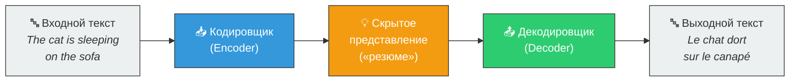
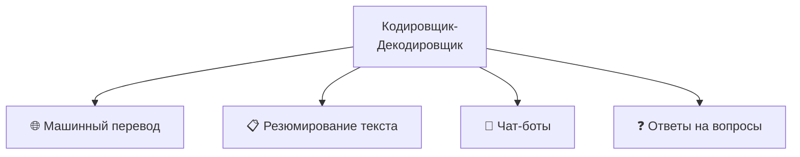

# 🔄 Архитектура кодировщика-декодировщика

> **Определение:** Особая структура нейронных сетей, состоящая из двух частей: **кодировщик** (энкодер) принимает и понимает входную информацию, а **декодировщик** (декодер) на её основе генерирует выходную информацию.

---

## Аналогия: работа переводчика

Представьте переводчика-гида в аэропорту:
1. 📖 **Кодировщик** — гид читает указатель на французском: *«Sortie de secours»* и **понимает** его смысл
2. 🗣️ **Декодировщик** — поняв смысл, гид **говорит вам**: «Emergency Exit» (Аварийный выход)

---

## Схема работы

![[Pasted image 20260326225444.png]]

---

## Кодировщик (Encoder)

**Задача:** принять входной сигнал и **понять его смысл**.

| Этап | Что происходит |
|------|---------------|
| Приём входа | Получает предложение (например, *«The cat is sleeping on the sofa»*) |
| Обработка | Анализирует каждое слово и связи между ними |
| Результат | Создаёт **скрытое представление** — компактное «резюме», отражающее суть предложения |

> Скрытое представление — это не текст, а числовой вектор, в котором закодирован весь смысл входного предложения.

---

## Декодировщик (Decoder)

**Задача:** получить «резюме» от кодировщика и создать **выходной результат**.

| Этап | Что происходит |
|------|---------------|
| Получение резюме | Принимает скрытое представление от кодировщика |
| Генерация | Предсказывает **по одному слову за раз**, сверяясь с кодировщиком |
| Результат | Генерирует итоговый текст (*Le chat dort sur le canapé*) |

---

## Применение

Архитектура кодировщик-декодировщик используется в:

---

## Связанные темы

- [[Трансформер]] — Использует архитектуру кодировщик-декодировщик
- [[Механизм самовнимания]] — Работает внутри каждого блока кодировщика и декодировщика

> [!info] 📖 Источник
> Бхуян Ш., Исаченко Т. — «Генеративный ИИ с LLM для джунов», Глава 2, стр. 71–73
