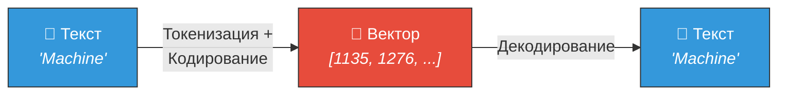
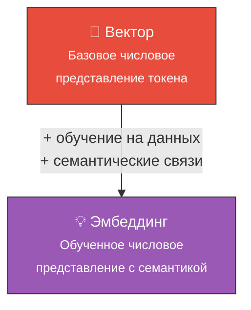

# 🔢 Вектор (Vector)

> **Определение:** В математике вектор — объект, характеризующийся величиной и направлением в разных измерениях. В контексте LLM векторы используются для представления текста в **числовом формате**, благодаря чему модель может его понимать и обрабатывать.

---

## Зачем нужны векторы?

Машины воспринимают **только числа**, а не текст или изображения. Поэтому любой контент нужно перевести в числовой формат — **векторизовать**.



> Вектор легко преобразуется **обратно в текст** через декодировщик (декодер).

---

## Пример: создание вектора

```python
import numpy as np
vector = np.array([1, 2, 3, 4, 5])
print("Вектор из 5 элементов:", vector)
# Выход: Vector of 5 elements: [1 2 3 4 5]
```

---

## Пример: кодирование текста в векторы (модель Phi-2)

```python
from transformers import AutoTokenizer

tokenizer = AutoTokenizer.from_pretrained('microsoft/phi-2')
txt = "We must always change, renew, rejuvenate ourselves"
token = tokenizer.encode(txt)
print(token)
# Выход: [1135, 1276, 1464, 1487, 11, 6931, 11, 46834, 378, 6731]

decoded = tokenizer.decode(token)
print(decoded)
# Выход: We must always change, renew, rejuvenate ourselves
```

> Каждое слово (или подслово) получает уникальный числовой код. Разные LLM используют **разные схемы кодирования**, поэтому для одного и того же слова могут получаться разные векторы.

---

## Что могут векторы?

| Возможность | Описание |
|------------|----------|
| 📊 **Числовое представление** | Переводят любые данные в формат, понятный нейросети |
| 🔍 **Определение сходства** | Операции над векторами позволяют определить, насколько похожи два объекта |
| 🧠 **Основа для нейросетей** | Нейронные сети на базе трансформеров отлично обрабатывают векторные данные |

---

## Вектор vs Эмбеддинг



| | Вектор | Эмбеддинг |
|---|---|---|
| **Что это** | Простое числовое представление | Обученное представление с семантикой |
| **Семантика** | Не передаёт смысл | Отражает значение и связи между словами |
| **Создание** | Кодирование по схеме | Обучение на больших наборах данных |

> Самих по себе векторов для LLM **недостаточно** — они представляют только базовые числовые характеристики, но не семантику. Для передачи смысловых отношений нужны [[Эмбеддинг|эмбеддинги]].

---

## Связь с векторными базами данных

> [!tip] Новая концепция
> **Векторные базы данных** хранят данные в виде высокоразмерных векторов (эмбеддингов), отражающих семантический смысл. Они необходимы для технологии [[RAG]] — расширенной генерации данных.

---

## Связанные темы

- [[Токенизация]] — Предшествующий этап (разбиение текста)
- [[Эмбеддинг]] — Следующий этап (семантические векторы)
- [[Векторная база данных]] — Хранилище векторных представлений
- [[LLM]] — Используют векторы для обработки текста

> [!info] 📖 Источник
> Бхуян Ш., Исаченко Т. — «Генеративный ИИ с LLM для джунов», Глава 2, стр. 89–92
