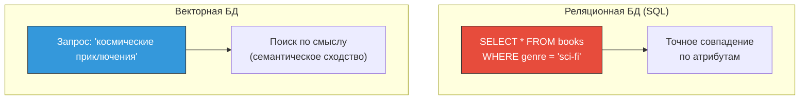
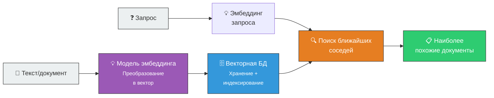

# 🗄️ Векторная база данных (Vector Database)

> **Определение:** Векторная база данных (система поиска по сходству) — специализированная база данных для хранения и эффективного извлечения высокоразмерных векторов (эмбеддингов). Оптимизирована для **поиска ближайших соседей** — нахождения наиболее похожих элементов по их семантическому смыслу.

---

## Чем отличается от обычной БД?

| | Реляционная БД | Векторная БД |
|---|---|---|
| **Запрос** | Явные атрибуты (WHERE genre = …) | Поиск по **сходству** |
| **Данные** | Строки и столбцы | Высокоразмерные векторы |
| **Поиск** | Точное совпадение | Ближайшие соседи |
| **Смысл** | Не понимает семантику | Отражает семантические связи |

---

## Ключевые характеристики

| Характеристика | Описание |
|---------------|----------|
| 💾 **Хранение эмбеддингов** | Данные хранятся как высокоразмерные векторы, отражающие семантику |
| 📇 **Специализированное индексирование** | Хэширование, квантование, методы на основе графов для быстрого поиска |
| 📈 **Масштабируемость** | Эффективная работа с миллионами и миллиардами векторов |

---

## Как работает: схема

![[Pasted image 20260326225624.png]]

---

## Роль в RAG

В системах [[RAG]] векторные базы используются для **семантического поиска**: когда пользователь задаёт вопрос, его запрос превращается в эмбеддинг, и в базе находятся наиболее релевантные фрагменты документов.

---

## Популярные векторные БД

| База данных | Особенности |
|------------|-------------|
| **Milvus** | Open-source, масштабируемая, поддержка GPU |
| **Chroma** | Лёгкая, удобная для прототипирования |
| **Pinecone** | Облачная, полностью управляемая |
| **Weaviate** | Open-source, с поддержкой гибридного поиска |

---

## Связанные темы

- [[Эмбеддинг]] — Данные, которые хранятся в векторной БД
- [[Вектор]] — Математическая основа
- [[RAG]] — Основной сценарий использования векторных БД

> [!info] 📖 Источник
> Бхуян Ш., Исаченко Т. — «Генеративный ИИ с LLM для джунов», Глава 3, стр. 118–120
