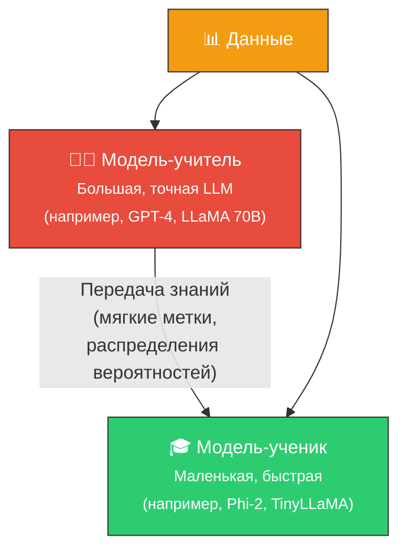
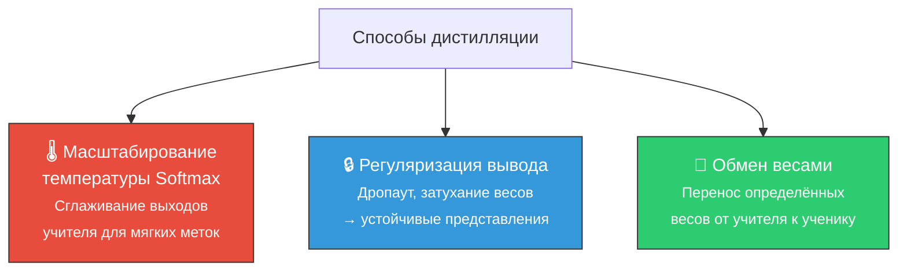
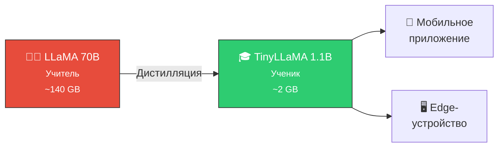

# 🎓 Дистилляция знаний (Knowledge Distillation)

> **Определение:** Дистилляция знаний (KD) — метод, при котором маленькая модель (**«ученик»**) обучается подражать поведению большой модели (**«учитель»**). Цель — уменьшить размер модели, сохранив большую часть её производительности.

---

## Схема работы

![[Pasted image 20260328131458.png]]

> Маленькая модель учится **не просто правильным ответам**, а **распределениям вероятностей** от «учителя» — это называется **мягкие метки (soft targets)**.

---

## Жёсткие vs мягкие метки

| | Жёсткие метки | Мягкие метки |
|---|---|---|
| **Что это** | Один правильный ответ | Распределение вероятностей по всем вариантам |
| **Пример** | «Это кот» (100%) | «Кот 85%, тигр 10%, собака 5%» |
| **Информация** | Мало (только ответ) | Много (отношения между классами) |

> Мягкие метки передают **более общие и абстрактные** представления — ученик усваивает, что кот и тигр похожи, а кот и собака — менее.

---

## Ключевые особенности

| Особенность | Описание |
|------------|----------|
| 👨‍🏫 **Учитель-ученик** | Две модели: большая (учитель) обучает маленькую (ученика) |
| 📤 **Перенос знаний** | Ученик обучается на тех же данных + вероятностные распределения учителя |
| 📱 **Компактность** | Ученик значительно меньше → подходит для мобильных устройств |
| ⚡ **Эффективность** | Ученик может учиться на **меньшем** наборе данных благодаря знаниям учителя |

---

## Способы реализации

| Метод | Как работает |
|-------|-------------|
| **Температура Softmax** | Параметр температуры «размягчает» выходы учителя, создавая более информативные метки |
| **Регуляризация** | Дропаут и затухание весов побуждают ученика формировать **устойчивые** представления |
| **Обмен весами** | Определённые веса из учителя напрямую используются в ученике |

---

## Когда использовать?

- ✅ Нужна модель для **мобильных устройств** или **edge-устройств**
- ✅ Нужна **быстрая** модель для продакшена
- ✅ Есть доступ к хорошей модели-учителю
- ❌ KD **не заменяет** традиционные методы файн-тюнинга — это **дополнительный** инструмент

---

## Сравнение с другими методами

| | Полный FT | PEFT/LoRA | Дистилляция |
|---|---|---|---|
| **Что меняется** | Все веса | Часть весов | Создаётся новая модель |
| **Размер результата** | Тот же | Тот же + адаптер | **Меньше** |
| **Скорость инференса** | Та же | Та же | **Быстрее** |
| **Основное применение** | Макс. точность | Баланс | Сжатие модели |

---

## Пример из реального мира

---

## Связанные темы

- [[Файн-тюнинг]] — Общий обзор файн-тюнинга
- [[Полный файн-тюнинг]] — Альтернатива: все параметры
- [[PEFT (LoRA и QLoRA)]] — Альтернатива: часть параметров

> [!info] 📖 Источник
> Бхуян Ш., Исаченко Т. — «Генеративный ИИ с LLM для джунов», Глава 5, стр. 193–195
