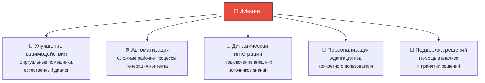
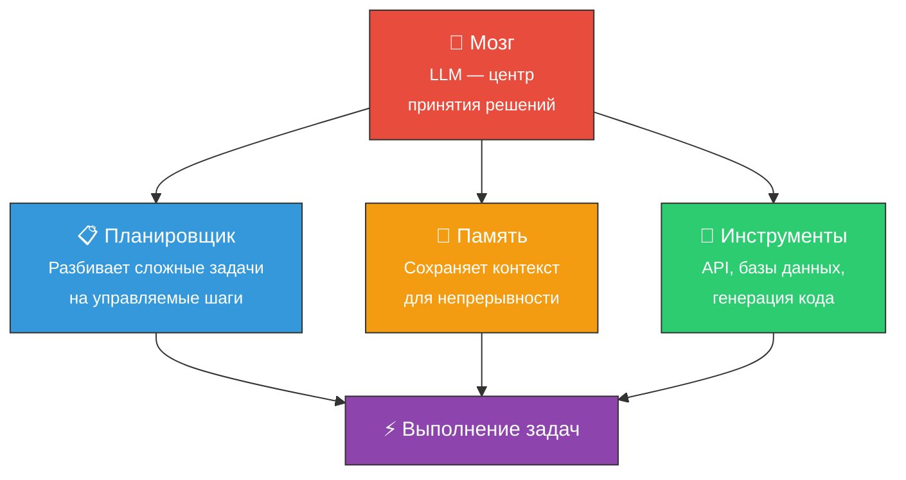
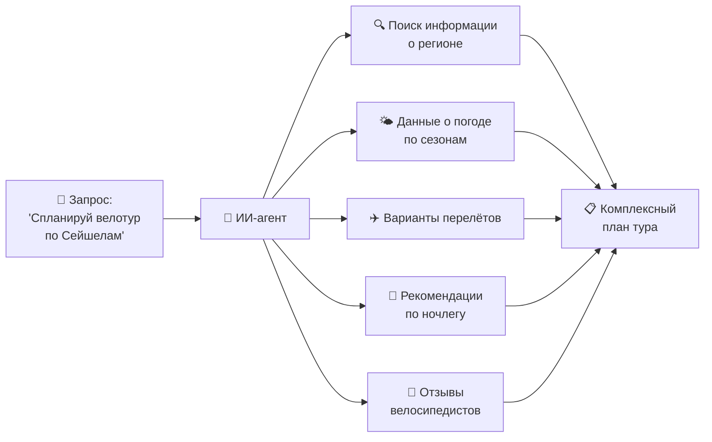

# 🤖 ИИ-агенты (AI Agents)

> **Определение:** В контексте генеративного ИИ и LLM, ИИ-агенты — сложные системы, использующие генеративные модели (LLaMA, Mistral, GPT-4) для выполнения задач, связанных с пониманием языка, генерацией текста и взаимодействием с пользователем. Они предназначены для имитации взаимодействия с человеком, автоматизации принятия решений и работы различных приложений.

---

## Шире: что такое ИИ-агенты?

В широком смысле ИИ-агенты — это **автономные или полуавтономные системы**, которые:
1. 🔍 Анализируют окружение
2. 🧠 Обрабатывают информацию
3. 🎯 Принимают решения
4. ⚡ Выполняют действия

> Примеры за пределами LLM: автопилоты в автомобилях, системы управления ядерными реакторами.

---

## Основные цели ИИ-агентов в генеративном ИИ

---

## Архитектура LLM-агента

| Компонент | Роль | Пример |
|-----------|------|--------|
| 🧠 **Мозг** | Ядро агента — LLM как центр принятия решений | GPT-4, LLaMA, Mistral |
| 📋 **Планировщик** | Разбивает сложные задачи на шаги | «Спланируй поездку» → бронирование, маршрут, бюджет |
| 💾 **Память** | Хранит контекст и информацию между шагами | История диалога, промежуточные результаты |
| 🔧 **Инструменты** | Вызовы API, запросы к БД, генерация кода | Поиск в интернете, работа с файлами |

![[Pasted image 20260326225657.png]]

---

## Пример: планирование велотура

Вы хотите спланировать велосипедный тур по Сейшельским островам. Обычная LLM даст **общий план**. Но ИИ-агент:

Агент **самостоятельно** использует поисковые системы, собирает данные из разных источников и с помощью LLM составляет единый план.

---

## Отличие ИИ-агента от обычного LLM

Будущее ИИ-агентов: ![[Pasted image 20260328134838.png]]

| | Обычная LLM | ИИ-агент |
|---|---|---|
| **Работа** | Отвечает на один запрос | Выполняет **цепочку** задач |
| **Инструменты** | Только генерация текста | Использует API, БД, поиск |
| **Память** | Только текущий контекст | Сохраняет историю |
| **Автономность** | Реактивная (ждёт запрос) | Проактивная (планирует шаги) |

---

## Связанные темы

- [[AI]] — Искусственный интеллект (более широкая область)
- [[LLM]] — Модели, которые составляют «мозг» агента
- [[RAG]] — Часто используется агентами для доступа к данным
- [[Промпт-инжиниринг]] — Настройка взаимодействия с агентами

> [!info] 📖 Источник
> Бхуян Ш., Исаченко Т. — «Генеративный ИИ с LLM для джунов», Глава 2, стр. 105–109; Глава 7, стр. 270–314
