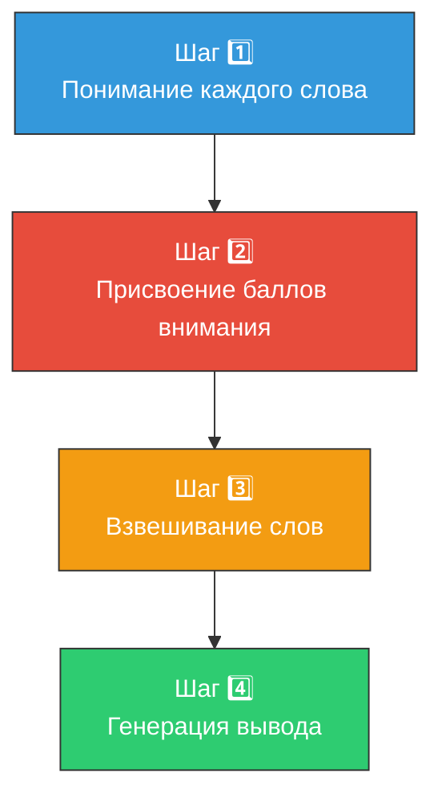
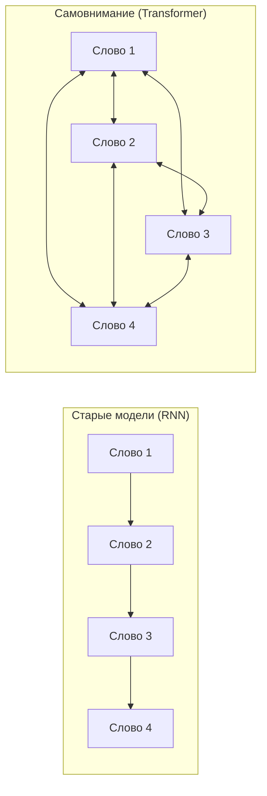

# 🎯 Механизм самовнимания (Self-Attention)

> **Определение:** Механизм самовнимания — ключевой компонент трансформера, позволяющий модели определять степень важности каждого слова в предложении и его связь с другими словами.

---

## Зачем нужен механизм самовнимания?

До его появления старые модели (RNN) рассматривали слова **по одному**, часто упуская важные связи. Механизм самовнимания позволяет модели видеть **все слова одновременно** и понимать значение каждого слова на основе контекста.

---

## Принцип работы: 4 шага

### Пример: *«The dog barked loudly because **it** saw a stranger.»*

---

### Шаг 1. Понимание каждого слова

Модель доходит до слова **«it»** и должна понять, к чему оно относится. К собаке? К лаю? К незнакомцу?

### Шаг 2. Присвоение баллов внимания

Механизм присваивает каждому слову **балл внимания** — насколько оно связано с текущим словом:

| Слово | Балл внимания | Почему? |
|-------|:---:|---------|
| **dog** | 🔴 Высокий | «it» относится именно к «dog» |
| **barked** | 🟡 Средний | Связано с собакой, но не определяет «it» |
| **loudly** | ⚪ Низкий | Не помогает понять, к чему относится «it» |
| **because** | ⚪ Низкий | Служебное слово |
| **saw** | 🟡 Средний | Действие субъекта «it» |
| **stranger** | 🟡 Средний | Объект действия |

### Шаг 3. Взвешивание слов

Слова с высокими баллами **вносят больший вклад** в понимание смысла. Слово «dog» получает наибольший вес → модель понимает, что «it» = «dog».

### Шаг 4. Генерация вывода

Определив фокус, модель использует информацию для:
- 🌐 **Перевода** предложения на другой язык
- 📋 **Резюмирования** длинного текста
- ❓ **Ответа** на вопрос

![[Pasted image 20260326225748.png]]

---

## Повседневные примеры

| Приложение | Как работает самовнимание |
|-----------|--------------------------|
| 🔍 **Поиск Google** | Запрос: «hotel close to the airport» → модель понимает, что «close» относится к расположению отеля, а «airport» — к пункту назначения |
| 📧 **Gmail** | Автодополнение и smart reply — модель фокусируется на ключевых словах письма |
| 🌍 **Переводчики** | Правильно связывает местоимения с существительными при переводе |

---

## Ключевое отличие от старых моделей

**RNN**: каждое слово «видит» только предыдущие слова (последовательно).
**Самовнимание**: каждое слово «видит» **все остальные слова** одновременно.

---

## Связанные темы

- [[Трансформер]] — Архитектура, в которой используется самовнимание
- [[Архитектура кодировщика-декодировщика]] — Второй ключевой компонент трансформера

> [!info] 📖 Источник
> Бхуян Ш., Исаченко Т. — «Генеративный ИИ с LLM для джунов», Глава 2, стр. 69–71, 94–97
