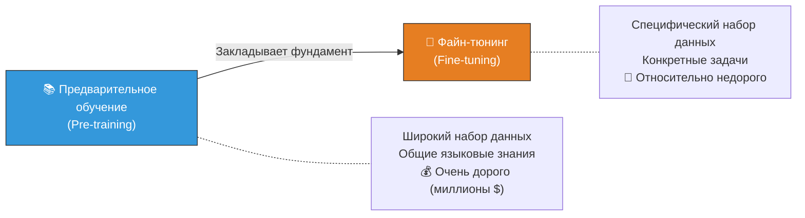
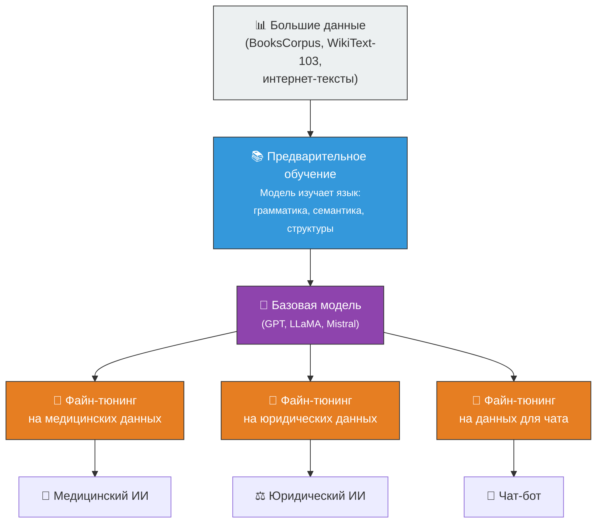

# 🎓 Обучение LLM

> **Определение:** Обучение — важнейший этап разработки больших языковых моделей. Позволяет создать мощные и универсальные модели, способные решать задачи от генерации текста до специализированных функций.

---

## Две стадии обучения

**Предварительное обучение** закладывает основу — модели предлагают широкий набор данных и общие задачи, чтобы освоить основы работы с языком.

**Файн-тюнинг** — на основе более специализированного набора данных модель адаптируют для конкретных задач или узкой сферы.

---

## Сравнение двух стадий

| Область | Предобучение | Файн-тюнинг |
|---------|-------------|-------------|
| 🎯 **Цель** | Широкое понимание языка | Адаптация к конкретным задачам |
| 📊 **Данные** | Огромные, разнообразные (книги, статьи, сайты) | Меньшие, специфические для области |
| 📝 **Задачи** | Предсказание слов, заполнение пропусков | Классификация, резюмирование, перевод |
| 📏 **Размер данных** | Масштабные наборы (миллиарды слов) | Целевые наборы (тысячи–миллионы) |
| 🔧 **Адаптация** | Создаёт широкую базу знаний | Уточняет знания для конкретных задач |
| 💰 **Стоимость** | Миллионы долларов | Значительно дешевле |

![[Pasted image 20260326225851.png]]

![[Pasted image 20260326225907.png]]

---

## Визуальная схема процесса

![[Pasted image 20260326225923.png]]

---

## Важно понимать

> [!warning] Для новичков
> Вы вряд ли будете заниматься **предварительным обучением** самостоятельно — это требует огромных вычислительных ресурсов и стоит миллионы долларов. Обычно используют уже обученные open-source модели и **дообучают** (файн-тюнят) их под свои задачи.

---

## Связанные темы

- [[Предварительное обучение]] — Подробнее о первой стадии
- [[Файн-тюнинг]] — Подробнее о второй стадии
- [[LLM]] — Большие языковые модели
- [[RAG]] — Альтернативный метод расширения LLM (без переобучения)

> [!info] 📖 Источник
> Бхуян Ш., Исаченко Т. — «Генеративный ИИ с LLM для джунов», Глава 2, стр. 98–103
