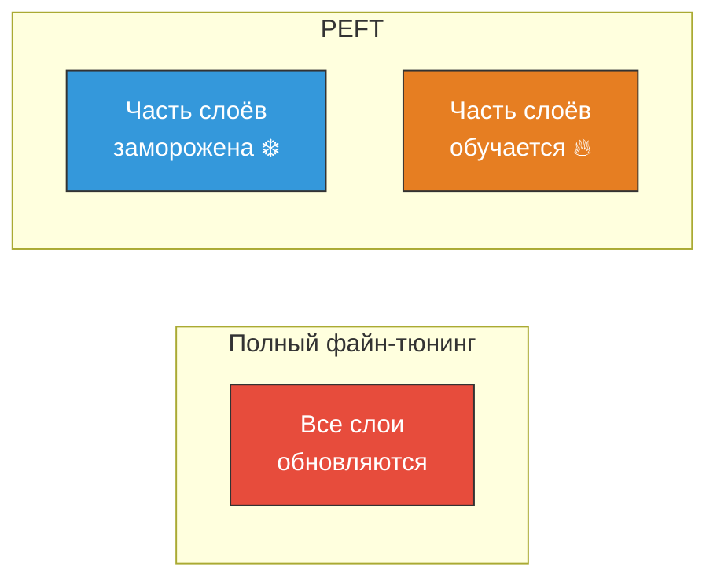

# 📦 Полный файн-тюнинг (Full Fine-tuning)

> **Определение:** Полный файн-тюнинг — метод, при котором **все веса** модели обновляются на основе набора данных, специфичного для конкретной задачи. Модель полностью адаптирует свои внутренние представления к новым данным.

---

## Как работает

Обновление происходит через алгоритмы оптимизации:
- **Adam** — адаптивный метод оптимизации
- **SGD** (Stochastic Gradient Descent) — стохастический градиентный спуск

Обновляются **все слои** — и те, что отражают общие языковые особенности, и глубокие слои абстрактных представлений. Степень обновления контролируется гиперпараметром **скорость обучения (learning rate)**.

> [!tip] Совет
> **Низкая скорость обучения** гарантирует, что веса не изменятся слишком резко → предварительные знания сохранятся при адаптации к новой задаче.

---

## Ключевые особенности

| Особенность | Описание |
|------------|----------|
| 🔄 **Обновление всех слоёв** | Корректируется каждый вес → глубокая специализация |
| 🖥️ **Значительные ресурсы** | Требуются мощные GPU, объём ~как при предобучении |
| 🎯 **Максимальная точность** | Лучший способ адаптировать модель к конкретной задаче |
| ⚠️ **Риск переобучения** | Особенно на маленьких наборах данных |

---

## Сравнение с другими методами
![[Pasted image 20260328130933.png]]

| | Полный файн-тюнинг | PEFT |
|---|---|---|
| **Параметры** | Все обновляются | Только часть |
| **Ресурсы** | Очень высокие | Умеренные |
| **Точность** | Максимальная | Близка к полному |
| **Переобучение** | Высокий риск | Низкий риск |
| **Скорость** | Медленно | Быстро |

---

## Когда использовать полный файн-тюнинг?

- ✅ Есть **достаточно данных** (чтобы избежать переобучения)
- ✅ Есть **мощное GPU** (минимум 16GB VRAM, лучше больше)
- ✅ Нужна **максимальная** производительность для конкретной задачи
- ❌ **Не подходит**, если мало данных или ограничены ресурсы → тогда [[PEFT (LoRA и QLoRA)]]

---

## Связанные темы

- [[Файн-тюнинг]] — Общий обзор файн-тюнинга
- [[PEFT (LoRA и QLoRA)]] — Альтернатива: обновление части параметров
- [[Дистилляция знаний]] — Альтернатива: сжатие модели

> [!info] 📖 Источник
> Бхуян Ш., Исаченко Т. — «Генеративный ИИ с LLM для джунов», Глава 5, стр. 188–189
