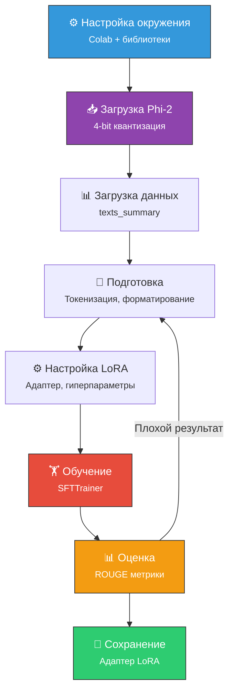

# 🛠️ Практический пример файн-тюнинга

> Пошаговый пример файн-тюнинга модели **Microsoft Phi-2** для задачи **резюмирования технических статей** с использованием **QLoRA** и **Hugging Face**.

---

## Задача

Небольшая компания хочет ИИ-систему, которая резюмирует технические статьи в удобном для чтения виде. Решение:
- Базовая модель: **Phi-2** (2.7B параметров, ~5 GB)
- Метод: **QLoRA** (4-bit квантизация + LoRA)
- Среда: **Google Colab** (T4 GPU, 16 GB)
- Набор данных: **yasminesarraj/texts_summary** (47 статей + резюме)

---

## Окружение и библиотеки

| Среда | Требования |
|-------|-----------|
| Google Colab | T4 GPU (16 GB), бесплатная подписка |
| Kaggle | T4 GPU (16 GB) |
| Hugging Face | Токен доступа (API key) |

### Установка библиотек

```python
!pip install -U bitsandbytes transformers peft accelerate \
  datasets scipy einops evaluate trl rouge_score
```

| Библиотека | Назначение |
|-----------|-----------|
| **bitsandbytes** | 8/4-битная квантизация для экономии памяти |
| **transformers** | Модели и API от Hugging Face |
| **peft** | Параметрически эффективный файн-тюнинг (LoRA) |
| **accelerate** | Распределённое обучение на GPU/CPU |
| **datasets** | Загрузка и обработка наборов данных |
| **trl** | Обучение трансформеров с подкреплением |
| **rouge_score** | Метрика ROUGE для оценки резюмирования |
| **evaluate** | Оценка моделей ML |

---

## Шаг за шагом

### Часть 1. Конфигурация квантизации

```python
compute_dtype = getattr(torch, "float16")
bnb_config = BitsAndBytesConfig(
    load_in_4bit=True,
    bnb_4bit_quant_type='nf4',
    bnb_4bit_compute_dtype=compute_dtype,
    bnb_4bit_use_double_quant=False,
)
```

| Параметр | Значение | Что делает |
|----------|----------|-----------|
| `load_in_4bit` | True | Включает 4-битную квантизацию |
| `bnb_4bit_quant_type` | 'nf4' | Normalized Float 4 — точнее стандартной 4-bit |
| `bnb_4bit_compute_dtype` | float16 | Вычисления в 16-bit (баланс скорость/точность) |
| `bnb_4bit_use_double_quant` | False | Двойная квантизация выключена (лучше точность) |

### Часть 2. Загрузка модели

```python
model_name = 'microsoft/phi-2'
original_model = AutoModelForCausalLM.from_pretrained(
    model_name,
    device_map={"": 0},
    quantization_config=bnb_config,
    trust_remote_code=True
)
```

### Часть 3. Загрузка и подготовка данных

```python
dataset = load_dataset("yasminesarraj/texts_summary")
# train: 47 строк, test: 47 строк
# Столбцы: text (статья), summary (резюме)
```

### Часть 4. Обучение модели

Настройка через **SFTTrainer** (Supervised Fine-Tuning Trainer) из библиотеки `trl`. Ключевые гиперпараметры:
- **Learning rate** — скорость обучения
- **Batch size** — размер батча
- **Эпохи** — количество проходов по данным

### Часть 5. Оценка модели

Метрика **ROUGE** — сравнивает сгенерированное резюме с эталонным:
- **ROUGE-1** — совпадение отдельных слов
- **ROUGE-2** — совпадение пар слов (биграмм)
- **ROUGE-L** — наибольшая общая подпоследовательность

### Часть 6. Сохранение и развёртывание

После обучения сохраняется **адаптер LoRA** (маленький файл), который при инференсе комбинируется с базовой моделью.

---

## Схема всего процесса



---

## Связанные темы

- [[Файн-тюнинг]] — Теория файн-тюнинга
- [[PEFT (LoRA и QLoRA)]] — Метод, использованный в примере
- [[Токенизация]] — Подготовка текста для модели
- [[LLM]] — Большие языковые модели

> [!info] 📖 Источник
> Бхуян Ш., Исаченко Т. — «Генеративный ИИ с LLM для джунов», Глава 5, стр. 198–239
> Полный код доступен в репозитории авторов на GitHub.
