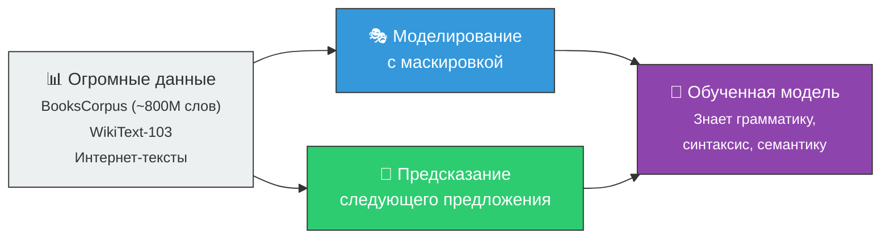
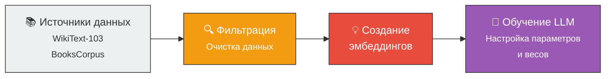

# 📚 Предварительное обучение (Pre-training)

> **Определение:** Предварительное обучение — начальная стадия, на которой LLM обучается на широком и разнообразном наборе данных, выявляя общие языковые шаблоны, структуры и семантику. Модель усваивает основные правила обработки языка.

---

## Что происходит при предобучении?

---

## Основные задачи предобучения

### 1. Моделирование языка с маскировкой (Masked Language Modeling)

Случайное маскирование некоторых слов и предсказание их по контексту:

| Вход | Ожидаемый выход |
|------|----------------|
| *The quick brown **[MASK]** jumps over the lazy dog* | **fox** |
| *Paris is the capital of **[MASK]*** | **France** |

### 2. Предсказание следующего предложения (Next Sentence Prediction)

Модель учится определять, являются ли два предложения соседними в тексте:

| Предложение A | Предложение B | Соседние? |
|---------------|---------------|:---------:|
| *Кот сел на стул.* | *Он начал мурлыкать.* | ✅ Да |
| *Кот сел на стул.* | *Завтра будет дождь.* | ❌ Нет |

---

## Что описывает схема из книги

![[Pasted image 20260326225950.png]]

> **Пояснение к схеме из книги (Иллюстрация 2.16):**
> Схема показывает путь данных при предобучении. Неструктурированные данные из источников (WikiText-103, BooksCorpus) проходят фильтрацию, затем преобразуются в **эмбеддинги** (векторные представления), которые подаются в LLM для обучения. На выходе модель усваивает языковые паттерны и готова к дальнейшему файн-тюнингу.

---

## Ключевые аспекты

| Аспект | Описание |
|--------|----------|
| 🎯 **Цель** | Сформировать общее понимание языка |
| 📊 **Данные** | Обширный и разнообразный контент: книги, статьи, веб-сайты |
| 📝 **Задачи** | Маскирование, предсказание, переупорядочивание предложений |
| 🗣️ **Результат** | Модель понимает грамматику, синтаксис, семантику, прагматику, структуру дискурса |

---

## Стоимость предобучения

> [!warning] Дорого!
> Предварительное обучение характеризуется **чрезвычайно высокой стоимостью** — затраты порой исчисляются **миллионами долларов**. Это одна из причин, почему open-source модели (LLaMA, Mistral) так ценны — их предобучение уже оплачено корпорациями.
>
> **Новичкам важно:** вы вряд ли будете заниматься предобучением самостоятельно. Обычно берут готовую модель и делают [[Файн-тюнинг]].

---

## Связанные темы

- [[Обучение]] — Общий процесс обучения LLM
- [[Файн-тюнинг]] — Следующая стадия после предобучения
- [[LLM]] — Модели, которые проходят предобучение
- [[Эмбеддинг]] — Создаются в процессе обучения

> [!info] 📖 Источник
> Бхуян Ш., Исаченко Т. — «Генеративный ИИ с LLM для джунов», Глава 2, стр. 98–100
