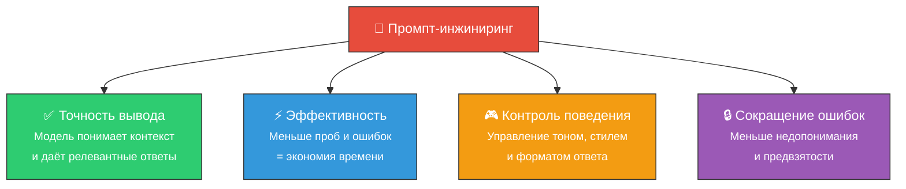
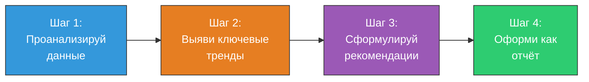
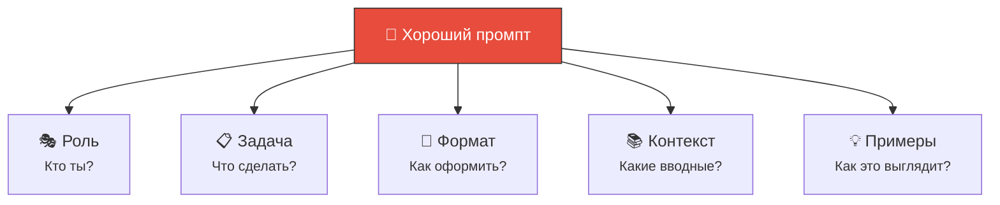

# 🎯 Промпт-инжиниринг (Prompt Engineering)

> **Определение:** Промпт-инжиниринг — практическая дисциплина, занимающаяся разработкой и совершенствованием запросов (промптов) или инструкций, передаваемых языковым моделям (LLaMA, GPT и др.) для получения точного и полезного ответа.

---

## Почему это важно?



---

## Основные методы

### 1. 🎭 Назначение роли

Задаёте модели контекст через определённую роль:

| Промпт | Эффект |
|--------|--------|
| *«Ты — туристический гид»* | Ответы в стиле путеводителя, с рекомендациями |
| *«Ты — редактор»* | Фокус на грамматике, стиле, ясности текста |
| *«Ты — Python-разработчик»* | Код с комментариями и best practices |

### 2. 📋 Чёткие инструкции

Конкретная формулировка формата, стиля и шагов:

```
❌ Плохо: "Расскажи про Python"
✅ Хорошо: "Объясни 5 ключевых преимуществ Python для начинающих. 
            Формат: нумерованный список, каждый пункт — 2 предложения."
```

### 3. 🔗 Определение последовательности (Chain of Thought)

Разбиение сложной задачи на цепочку простых:



### 4. 📚 Обучение с примерами (Few-shot Learning)

Включение примеров, на основе которых модель строит ответ:

```
Пример 1:
  Вопрос: Что такое Python?
  Ответ: Python — высокоуровневый язык программирования...

Пример 2:
  Вопрос: Что такое JavaScript?
  Ответ: JavaScript — язык программирования для веб-разработки...

Теперь ответь:
  Вопрос: Что такое Rust?
```

---

## Примеры применения

| Область | Пример промпта |
|---------|---------------|
| ✍️ **Генерация контента** | *«Напиши статью о влиянии ИИ на образование, 500 слов, для блога»* |
| 💻 **Генерация кода** | *«Напиши функцию на Python, которая принимает список и возвращает отсортированный по убыванию»* |
| 📊 **Анализ данных** | *«Проанализируй эту таблицу и выяви топ-3 аномалии»* |
| 🌐 **Перевод** | *«Переведи на французский, сохраняя формальный стиль»* |

---

## Итого: формула хорошего промпта



> **Роль** + **Задача** + **Формат** + **Контекст** + **Примеры** = качественный результат

---

## Связанные темы

- [[LLM]] — Модели, с которыми работает промпт-инжиниринг
- [[ИИ-агенты]] — Используют продвинутые промпты для работы
- [[AI]] — Общая область искусственного интеллекта

> [!info] 📖 Источник
> Бхуян Ш., Исаченко Т. — «Генеративный ИИ с LLM для джунов», Глава 2, стр. 109–112
