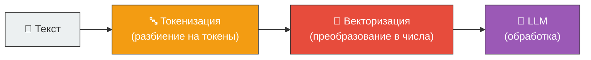
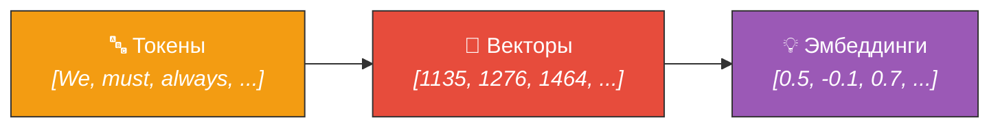

# 🔤 Токенизация (Tokenization)

> **Определение:** Токенизация — процесс разбиения текста на естественном языке на мелкие единицы (**токены**), которые служат строительными блоками для обработки текста моделью. Токенами могут быть целые слова, части слов, буквы или знаки препинания.

---

## Зачем нужна токенизация?

LLM не может работать с «сырым» текстом напрямую. Текст нужно:

![[Pasted image 20260326230100.png]]

---

## Пример токенизации

Предложение: *«We must always change, renew, rejuvenate ourselves; otherwise, we harden.»*

| Токенизатор | Количество токенов | Особенности |
|-------------|:------------------:|-------------|
| **SpaCy** (по словам) | 15 | Каждое слово и знак — отдельный токен |
| **GPT-4 tokenizer** | 17 | Контекстно-зависимый, учитывает подслова |
| **BERT tokenizer** | ~18 | Контекстно-зависимый, расширенный анализ |

> Разные токенизаторы могут давать **разные результаты** для одного и того же текста — схема кодирования сильно зависит от конкретной LLM.

---

## Почему токены важны экономически

| Аспект | Описание |
|--------|----------|
| 💰 **Стоимость** | Цена работы LLM напрямую зависит от количества обрабатываемых токенов: больше токенов = дороже |
| 📏 **Размер модели** | Определяется максимальным количеством токенов на вход (контекстное окно) |
| 💾 **Память** | Токены хранятся и обрабатываются в памяти — отсюда лимиты |

### Лимиты токенов для LLM

| Модель | Лимит токенов |
|--------|:------------:|
| LLaMA 2 | 4 096 |
| GPT-4 | 8 192 |
| LLaMA 3.1 | 128 000 |
| Claude 3.5 | 200 000 |

---

## Популярные токенизаторы

| Токенизатор | Тип | Используется в |
|-------------|-----|---------------|
| **NLTK** | По словам | Общие NLP-задачи |
| **SpaCy** | По словам | Быстрый анализ текста |
| **BERT Tokenizer** | Контекстно-зависимый (WordPiece) | Модели BERT |
| **GPT Tokenizer** | Контекстно-зависимый (BPE) | Модели GPT |
| **Keras** | Гибкий | TensorFlow/Keras проекты |

---

## Что дальше после токенизации?

Токены — это ещё только текстовые единицы. LLM работает с **числами**, поэтому следующий шаг — **векторизация**:

> На практике токенизация включает дополнительные приёмы: **паддинг** (дополнение), маркеры конца строки и другие. Подробности — в главе 5 книги (Файн-тюнинг LLM).

---

## Связанные темы

- [[Вектор]] — Числовое представление токенов
- [[Эмбеддинг]] — Семантическое числовое представление
- [[LLM]] — Большие языковые модели (используют токенизацию)

> [!info] 📖 Источник
> Бхуян Ш., Исаченко Т. — «Генеративный ИИ с LLM для джунов», Глава 2, стр. 87–89
