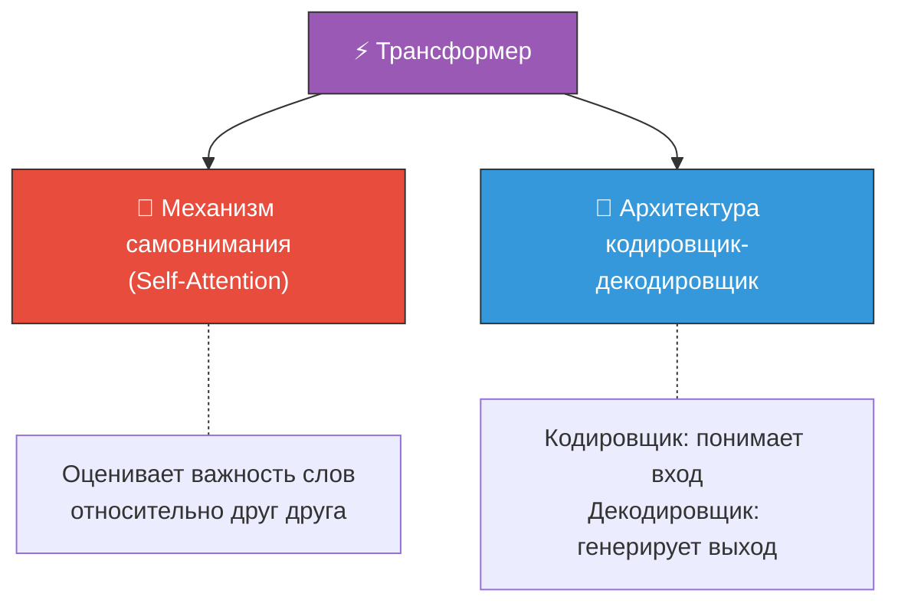
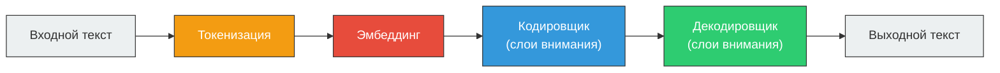
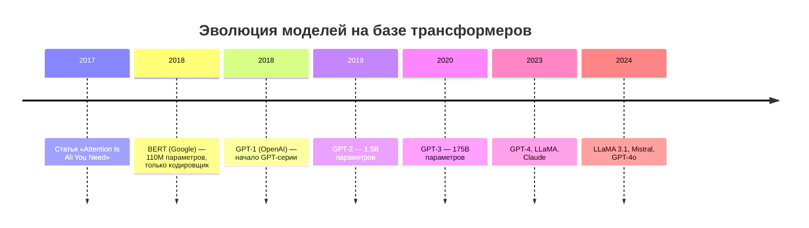

# ⚡ Трансформер (Transformer)

> **Определение:** Модель трансформера — революционная архитектура глубокого обучения, впервые представленная в статье **«Attention Is All You Need»** (2017). Использует механизмы самовнимания для выявления сложных связей между словами, не зависящих от расстояния между ними.

---

## Почему трансформеры — это революция?

| До трансформеров (RNN/CNN) | Трансформеры |
|---|---|
| Обрабатывали слова **последовательно** | Обрабатывают **все слова параллельно** |
| Плохо улавливали **дальние зависимости** | Отлично работают с **любыми расстояниями** |
| Медленное обучение | Быстрое обучение на GPU |
| Часто **переобучались** | Масштабируются до миллиардов параметров |

---

## Основные компоненты

> В оригинальной статье компонентов гораздо больше, но два ключевых — это **механизм самовнимания** и **архитектура кодировщик-декодировщик**.

---

## Как трансформер обрабатывает текст

---

## Простой пример

Представьте предложение: *«The ocean is blue because **it** has no color itself.»*

Человек автоматически понимает, что «it» относится к «ocean». Трансформер, благодаря **механизму внимания**, тоже способен это определить — он рассматривает **все слова одновременно** и выявляет, какие из них связаны друг с другом.

---

## Поколения моделей на основе трансформеров

- **Gen 1** (BERT, CamemBERT) — относительно небольшие модели для базовых языковых задач
- **Gen 2+** (GPT, T5, LLaMA) — огромные предварительно обученные модели, основа генеративного ИИ

![[Pasted image 20260326230146.png]]
---

## Связанные темы

- [[Механизм самовнимания]] — Ключевой компонент трансформера
- [[Архитектура кодировщика-декодировщика]] — Структура кодер/декодер
- [[NLP]] — Область, которую трансформеры революционизировали
- [[LLM]] — Большие языковые модели, построенные на трансформерах

> [!info] 📖 Источник
> Бхуян Ш., Исаченко Т. — «Генеративный ИИ с LLM для джунов», Глава 2, стр. 68–73
