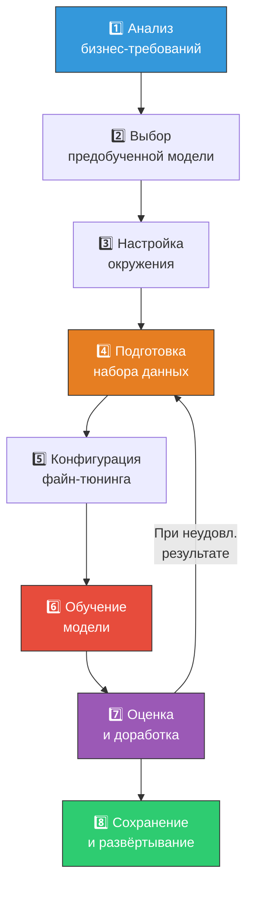
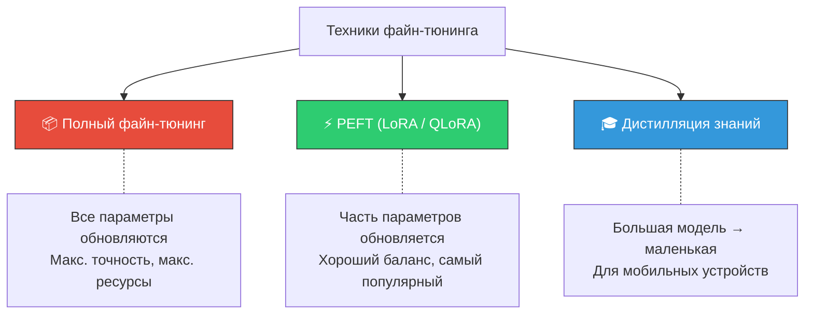

# 🔧 Файн-тюнинг (Fine-tuning)

> **Определение:** Файн-тюнинг — стадия обучения, на которой предварительно обученная модель проходит дальнейшее обучение на **специфическом, меньшем** наборе данных для адаптации к конкретной задаче или области.

---

## Аналогия

- **Предобучение** = университет (широкие знания по медицине)
- **Файн-тюнинг** = ординатура (специализация: кардиология, хирургия и т.д.)

---

## Преимущества

| Преимущество | Описание |
|-------------|----------|
| 💰 **Экономичность** | Меньше ресурсов, чем обучение с нуля |
| 🎯 **Экспертиза** | Адаптация под конкретный домен |
| 🔄 **Гибкость** | Одну модель можно адаптировать к разным задачам |

---

## Когда стоит делать файн-тюнинг?

- 📉 Мало размеченных данных для обучения с нуля
- 🎯 Нужны знания в конкретной области (медицина, право, код)
- 🖥️ Ограничены вычислительные ресурсы

---

## 8 шагов файн-тюнинга
![[Pasted image 20260328130642.png]]

| Шаг | Что делать | Детали |
|:---:|-----------|--------|
| 1 | **Анализ требований** | Определить цель, аудиторию, доступность данных, бюджет |
| 2 | **Выбор модели** | Сравнить по бенчмаркам (MMLU, HellaSwag, DROP) |
| 3 | **Настройка окружения** | HuggingFace + PyTorch, GPU (Colab T4 16GB хватает) |
| 4 | **Подготовка данных** | Собрать, разделить train/test, очистить, токенизировать |
| 5 | **Конфигурация** | Гиперпараметры: learning rate, batch size, эпохи |
| 6 | **Обучение** | Запуск, мониторинг потерь (W&B) |
| 7 | **Оценка** | Метрики: ROUGE, F1, BLEU на тестовых данных |
| 8 | **Развёртывание** | Сохранить, интегрировать, мониторить в продакшене |

---

## Три техники файн-тюнинга

Подробнее:
- [[Полный файн-тюнинг]] — обновление всех весов модели
- [[PEFT (LoRA и QLoRA)]] — обновление только части параметров
- [[Дистилляция знаний]] — передача знаний от «учителя» к «ученику»

---

## Файн-тюнинг vs RAG

| | Файн-тюнинг | RAG |
|---|-------------|-----|
| **Механизм** | Изменение весов | Внешние данные при генерации |
| **Адаптивность** | Нужно переобучать | Динамическое обновление |
| **Стоимость** | Высокая | Низкая |
| **Когда** | Изменить поведение модели | Доступ к актуальной информации |

---

## Популярные фреймворки

| Фреймворк | Особенности |
|-----------|-------------|
| **Hugging Face** | Простые API, класс Trainer, огромное сообщество |
| **PyTorch** | Низкоуровневый контроль, динамические графы |
| **TensorFlow** | Распределённое обучение, Keras API |
| **Unsloth** | 4-bit квантизация + LoRA, экономия памяти |
| **MLX** | Для Apple Silicon (M1/M2/M3) |

---

## Если результат неудовлетворительный

Файн-тюнинг — **итеративный** процесс:
1. **Расширить данные** — добавить примеры или улучшить качество
2. **Настроить гиперпараметры** — learning rate, эпохи
3. **Повторить** — на обновлённом наборе данных

---

## Связанные темы

- [[Обучение]] — Общий процесс (предобучение + файн-тюнинг)
- [[Предварительное обучение]] — Предшествующая стадия
- [[Полный файн-тюнинг]] — Техника: все веса
- [[PEFT (LoRA и QLoRA)]] — Техника: часть параметров
- [[Дистилляция знаний]] — Техника: учитель → ученик
- [[RAG]] — Альтернативный метод расширения LLM
- [[Практический пример файн-тюнинга]] — Пошаговый пример с Phi-2

> [!info] 📖 Источник
> Бхуян Ш., Исаченко Т. — «Генеративный ИИ с LLM для джунов», Глава 2 (стр. 101–103), Глава 5 (стр. 180–239)
