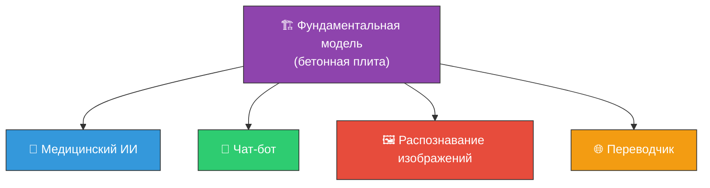
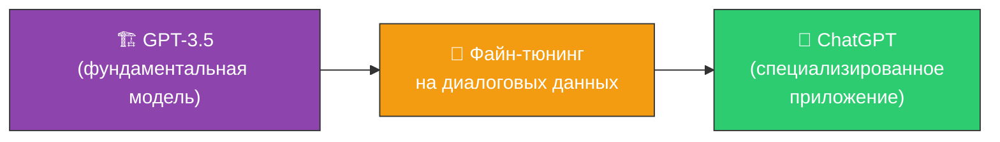
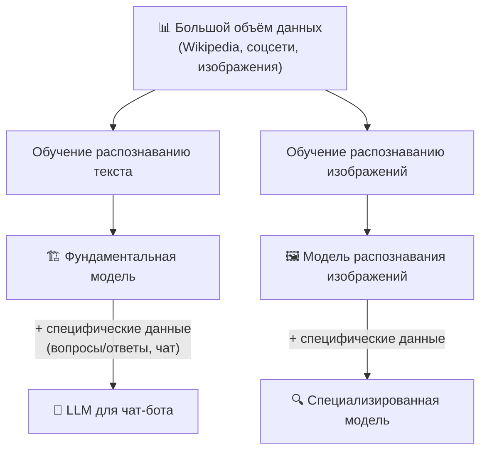

# 🏗️ Фундаментальные модели (Foundation Models)

> **Определение:** Фундаментальные модели — это большие, предварительно обученные модели машинного обучения с широкими возможностями, служащие основой («фундаментом») для различных ИИ-приложений. Обучаются на обширных и разнообразных наборах данных и адаптируются к конкретным задачам с минимальным дополнительным обучением.

---

## Аналогия: фундамент здания

> Фундаментальная модель — как бетонная плита, на которой можно возводить **разные этажи** для разных целей. В отличие от специализированных моделей, которые подобны **отдельным комнатам** — предназначены только для одной функции.

---

## Ключевые характеристики

| Характеристика | Описание |
|---------------|----------|
| 📚 **Обширные данные** | Обучаются на наборах данных из различных источников (текст, изображения, аудио) |
| 🔧 **Адаптивность** | Можно дообучить (файн-тюнинг) для конкретных задач |
| 🔄 **Перенос знаний** | Накопленные знания переносятся на новые задачи с минимальным обучением |

---

## Пример: как из фундаментальной модели получился ChatGPT

![[Pasted image 20260326230256.png]]

---

## Схема создания специализированных моделей

---

## Фундаментальная модель vs LLM

| | Фундаментальная модель | LLM |
|---|---|---|
| **Область** | Широкая (текст, изображения, видео, роботы) | Специализация на **языке** |
| **Примеры** | Gato (DeepMind), DALL-E | GPT, LLaMA, Claude |
| **Назначение** | Базовый слой для любых ИИ-задач | Генерация и понимание текста |

> [!tip] На практике
> Сейчас термин «фундаментальная модель» часто используют как синоним «LLM», потому что языковые модели — самый яркий пример. Но технически фундаментальные модели **шире**: например, Gato может и управлять роботами, и играть в игры.

---

## Связанные темы

- [[Generative AI]] — Генеративный ИИ (родительская область)
- [[LLM]] — Большие языковые модели (подтип фундаментальных моделей)
- [[Предварительное обучение]] — Как обучаются фундаментальные модели
- [[Файн-тюнинг]] — Как адаптируются для конкретных задач

> [!info] 📖 Источник
> Бхуян Ш., Исаченко Т. — «Генеративный ИИ с LLM для джунов», Глава 2, стр. 80–83
