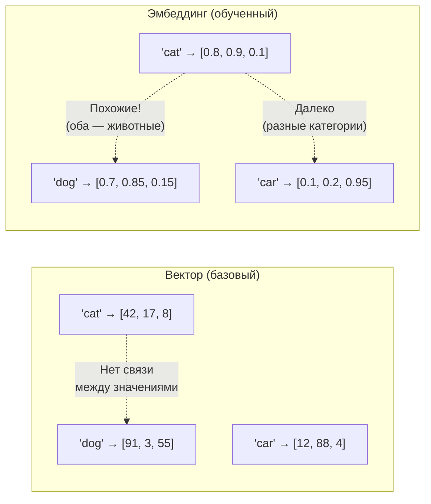
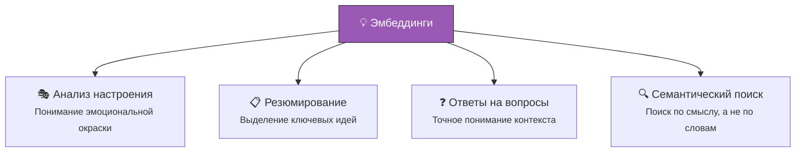
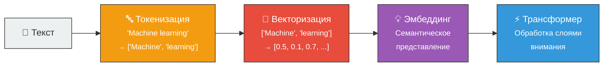

# 💡 Эмбеддинг (Embedding)

> **Определение:** Эмбеддинг — это более сложная версия вектора, создаваемая в процессе обучения на больших наборах данных. В отличие от «сырых» векторов, эмбеддинги отражают **семантические отношения** между токенами: слова с похожими значениями будут иметь похожие эмбеддинги, даже если встречаются в разных контекстах.

---

## Чем эмбеддинг отличается от вектора?



| | Вектор | Эмбеддинг |
|---|---|---|
| **Смысл** | Просто числа по схеме кодирования | Передаёт семантику и связи |
| **Похожие слова** | Могут иметь любые значения | Будут иметь **похожие** числа |
| **Создание** | Кодирование по алгоритму | **Обучение** на больших данных |

---

## Пример: эмбеддинги Lion, Tiger, iPhone

```python
from langchain_openai import OpenAIEmbeddings
model = OpenAIEmbeddings(api_key="ВАШ_КЛЮЧ")

# Генерация эмбеддингов
emb_lion  = model.embed_query("Lion")   # [–0.001, –0.010, –0.015, ...]
emb_tiger = model.embed_query("Tiger")  # [–0.013, –0.009, –0.008, ...]
emb_phone = model.embed_query("IPhone") # [–0.007, –0.021, 0.006, ...]
```

> **Результат:** Эмбеддинги для «Lion» и «Tiger» **более похожи** друг на друга, чем на «IPhone» — потому что оба слова относятся к категории животных.

---

## Что дают эмбеддинги для LLM?



Благодаря эмбеддингам LLM получают **представление о языке**, что позволяет:
- Улавливать тонкости языка (контекст, нюансы, значения)
- Кодировать не только отдельные токены, но и **связи** между ними
- Обрабатывать огромные объёмы текстовых данных

---

## Методы генерации эмбеддингов

| Метод | Описание |
|-------|----------|
| **Word2Vec** | Классический метод — предсказание слова по контексту |
| **GloVe** | Глобальные векторы — на основе статистики совместного появления слов |
| **Трансформерные модели** | Современный подход — контекстные эмбеддинги (BERT, GPT) |
| **OpenAI Embeddings** | Облачный API для генерации эмбеддингов |

---

## Эмбеддинги за пределами LLM

Эмбеддинги используются и **независимо** — для преобразования текста в векторы с сохранением семантического контекста. Это основа для:
- [[Векторная база данных|Векторных баз данных]]
- [[RAG|Систем RAG]]
- Рекомендательных систем
- Поиска изображений по текстовому описанию

---

## Итого: путь текста через LLM



---

## Связанные темы

- [[Вектор]] — Базовое числовое представление (предшествует эмбеддингу)
- [[Токенизация]] — Разбиение текста на токены
- [[Векторная база данных]] — Хранение эмбеддингов для поиска
- [[RAG]] — Использует эмбеддинги для семантического поиска

> [!info] 📖 Источник
> Бхуян Ш., Исаченко Т. — «Генеративный ИИ с LLM для джунов», Глава 2, стр. 92–94
