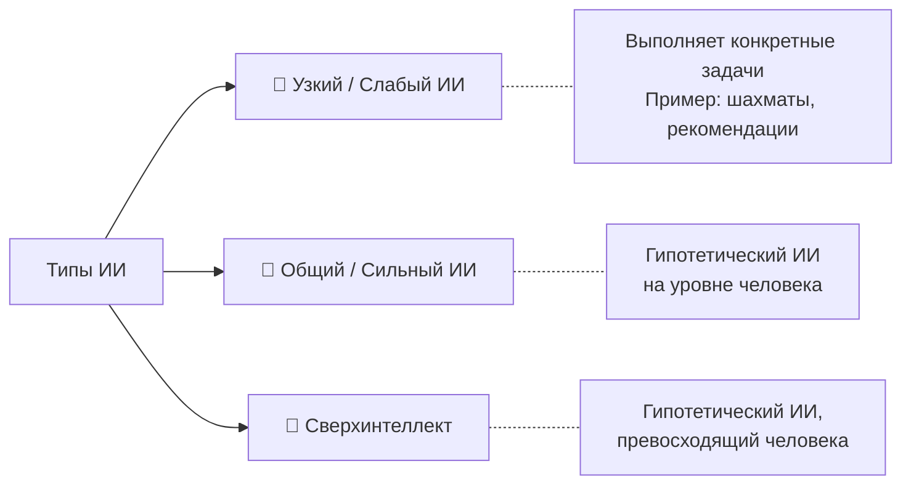
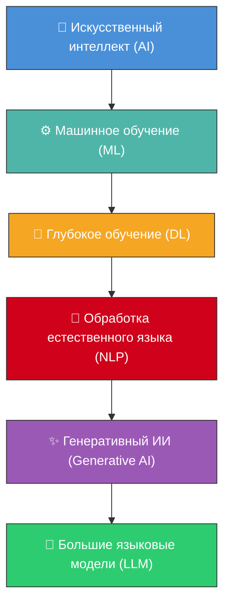

# 🧠 Искусственный интеллект (AI)

> **Определение:** Искусственный интеллект (ИИ) — предмет отдельной сферы компьютерных технологий, занимающейся разработкой методов создания приложений или компьютерных систем, способных имитировать поведение человека.

---

## Ключевые особенности ИИ

| Особенность | Описание |
|-------------|----------|
| 🔍 **Анализ** | ИИ-системы обрабатывают информацию и делают логические выводы, подобно человеку |
| 📚 **Обучение** | Машины обучаются на данных, выявляют закономерности и улучшают работу без явного программирования |
| ⚡ **Действие** | На основе обработанной информации ИИ предпринимает действия в реальном мире |

---

## Типы искусственного интеллекта

- **Узкий (слабый) ИИ** — предназначен для конкретных задач (шахматы, рекомендации товаров)
- **Общий (сильный) ИИ** — гипотетический ИИ, способный выполнять любые интеллектуальные задачи на уровне человека
- **Искусственный сверхинтеллект** — гипотетический ИИ, превосходящий человеческий интеллект по всем параметрам

---

## Иерархия подобластей ИИ

![[Pasted image 20260326223353.png]]

> Каждая последующая область является подмножеством предыдущей.

---

## Краткий путь эволюции

| Этап | Вклад |
|------|-------|
| **Машинное обучение** | Открыло путь к распознаванию образов |
| **Глубокое обучение** | Нейронные сети позволили обрабатывать сложные данные |
| **Трансформеры** | Произвели революцию в NLP и генерации текстов |
| **Масштабное обучение** | Сделало модели (GPT, Llama) достаточно мощными для генерации текста и диалога |

---

## Связанные темы

- [[ML]] — Машинное обучение
- [[DL]] — Глубокое обучение
- [[NLP]] — Обработка естественного языка
- [[Generative AI]] — Генеративный ИИ
- [[LLM]] — Большие языковые модели
- [[ИИ-агенты]] — Автономные системы на базе LLM
- [[Промпт-инжиниринг]] — Составление запросов к языковым моделям

> [!info] 📖 Источник
> Бхуян Ш., Исаченко Т. — «Генеративный ИИ с обучением больших языковых моделей (LLM) для джунов», Глава 2

![[Pasted image 20260326223642.png]]
Краткое описание основных этапов на иллюстрации
• Машинное обучение открыло путь к распознаванию образов.
• Глубокое обучение и нейронные сети позволили моделям обрабатывать сложные данные. 
• Архитектура трансформеров произвела революцию в NLP и генерации текстов. 
• Масштабное обучение сделало генеративные модели ИИ — например, GPT или Llama, достаточно мощными, чтобы справляться с такими сложными задачами, как генерация текста и диалог.
