# Генеративный ИИ

> Конспект-справочник по генеративному искусственному интеллекту и большим языковым моделям.
> Составлен по материалам книги Бхуян Ш., Исаченко Т. — «Генеративный ИИ с обучением больших языковых моделей (LLM) для джунов».
>
> Охватывает путь от базовых понятий ИИ/ML/DL до архитектуры трансформеров, обучения LLM, файн-тюнинга, промптинга, RAG, ИИ-агентов, генерации изображений и вопросов этики.

---

## Оглавление

### Часть I. Фундамент: от ИИ к глубокому обучению

1. 🧠 Искусственный интеллект (AI)
2. ⚙️ Машинное обучение (Machine Learning)
3. 🔬 Глубокое обучение (Deep Learning)
4. 💬 Обработка естественного языка (NLP)

### Часть II. Архитектура трансформера

5. ⚡ Трансформер (Transformer)
6. 🎯 Механизм самовнимания (Self-Attention)
7. 🔄 Архитектура кодировщика-декодировщика
8. 🧩 Многоголовое внимание (Multi-Head Attention)
9. 📍 Позиционное кодирование (Positional Encoding)

### Часть III. Генеративный ИИ и фундаментальные модели

10. ✨ Генеративный ИИ (Generative AI)
11. 🏗️ Фундаментальные модели (Foundation Models)

### Часть IV. Большие языковые модели (LLM) — внутреннее устройство

12. 📝 Большие языковые модели (LLM)
13. 🔤 Токенизация (Tokenization)
14. 🔢 Вектор (Vector)
15. 💡 Эмбеддинг (Embedding)
16. 📏 Контекстное окно (Context Window)

### Часть V. Обучение LLM

17. 🎓 Обучение LLM
18. 📚 Предварительное обучение (Pre-training)
19. 🎯 RLHF (Обучение с подкреплением на основе обратной связи)

### Часть VI. Файн-тюнинг

20. 🔧 Файн-тюнинг (Fine-tuning)
21. 📦 Полный файн-тюнинг (Full Fine-tuning)
22. ⚡ PEFT — LoRA и QLoRA
23. 🎓 Дистилляция знаний (Knowledge Distillation)
24. 🛠️ Практический пример файн-тюнинга

### Часть VII. Использование LLM без переобучения

25. 🎯 Промпт-инжиниринг (Prompt Engineering)
26. 🧪 Продвинутые техники промптинга

### Часть VIII. RAG и семантический поиск

27. 🔍 RAG (Retrieval-Augmented Generation)
28. Семантический поиск
29. 🗄️ Векторная база данных (Vector Database)
30. ✂️ Чанкинг (Chunking)
31. 🛠️ Практический пример RAG-системы

### Часть IX. ИИ-агенты

32. 🤖 ИИ-агенты (AI Agents)
33. 🔧 Инструменты агентов (Tool Use / Function Calling)
34. 🧰 Фреймворки агентов
35. Архитектура: Мультиагентная система генерации статей

### Часть X. Генерация и распознавание изображений

36. OpenJourney и процесс text-to-image
37. Конвейер диффузии: вход, выход, параметры
38. LLaVA-v1.6: архитектура и возможности
39. 🎨 Сравнение моделей генерации изображений

### Часть XI. Прикладные задачи и ответственный ИИ

40. Text-to-SQL
41. 🌀 Галлюцинации LLM и методы их снижения
42. 📊 Оценка качества LLM
43. ⚖️ Этика и безопасность генеративного ИИ

---

# Часть I. Фундамент: от ИИ к глубокому обучению

---

# 🧠 Искусственный интеллект (AI)

> **Определение:** Искусственный интеллект (ИИ) — предмет отдельной сферы компьютерных технологий, занимающейся разработкой методов создания приложений или компьютерных систем, способных имитировать поведение человека.

---

## Ключевые особенности ИИ

| Особенность | Описание |
|-------------|----------|
| 🔍 **Анализ** | ИИ-системы обрабатывают информацию и делают логические выводы, подобно человеку |
| 📚 **Обучение** | Машины обучаются на данных, выявляют закономерности и улучшают работу без явного программирования |
| ⚡ **Действие** | На основе обработанной информации ИИ предпринимает действия в реальном мире |

---

## Типы искусственного интеллекта

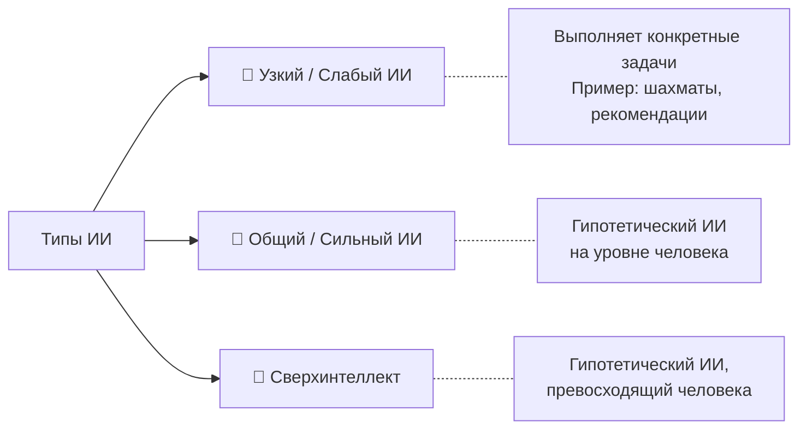

- **Узкий (слабый) ИИ** — предназначен для конкретных задач (шахматы, рекомендации товаров)
- **Общий (сильный) ИИ** — гипотетический ИИ, способный выполнять любые интеллектуальные задачи на уровне человека
- **Искусственный сверхинтеллект** — гипотетический ИИ, превосходящий человеческий интеллект по всем параметрам

---

## Иерархия подобластей ИИ


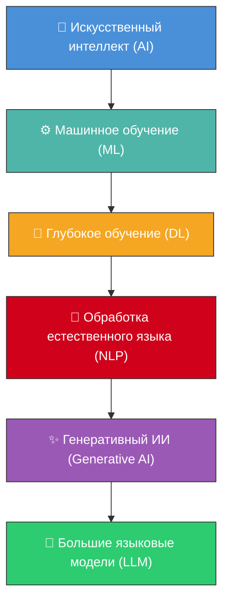

> Каждая последующая область является подмножеством предыдущей.

---

## Краткий путь эволюции

| Этап | Вклад |
|------|-------|
| **Машинное обучение** | Открыло путь к распознаванию образов |
| **Глубокое обучение** | Нейронные сети позволили обрабатывать сложные данные |
| **Трансформеры** | Произвели революцию в NLP и генерации текстов |
| **Масштабное обучение** | Сделало модели (GPT, Llama) достаточно мощными для генерации текста и диалога |

> 📖 Источник
> Бхуян Ш., Исаченко Т. — «Генеративный ИИ с обучением больших языковых моделей (LLM) для джунов», Глава 2


Краткое описание основных этапов на иллюстрации
• Машинное обучение открыло путь к распознаванию образов.
• Глубокое обучение и нейронные сети позволили моделям обрабатывать сложные данные. 
• Архитектура трансформеров произвела революцию в NLP и генерации текстов. 
• Масштабное обучение сделало генеративные модели ИИ — например, GPT или Llama, достаточно мощными, чтобы справляться с такими сложными задачами, как генерация текста и диалог.

---

# ⚙️ Машинное обучение (Machine Learning)

> **Определение:** Машинное обучение — направление в области ИИ, исследующее методы и модели обучения компьютеров на основе данных без предварительного явного программирования.

---

## Основная идея

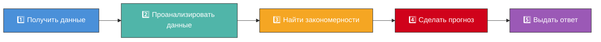

Четыре ключевых компонента:

| Компонент | Суть |
|-----------|------|
| **Данные** | Алгоритмам нужны большие объёмы данных (текст, числа, показания датчиков и т.д.) |
| **Алгоритм** | «Рецепт обучения» — компьютер анализирует данные и ищет закономерности |
| **Обучение** | Алгоритм настраивает внутренние параметры, чтобы повысить эффективность |
| **Прогнозирование** | После обучения алгоритм делает предсказания на новых данных |


---

## Типы алгоритмов машинного обучения

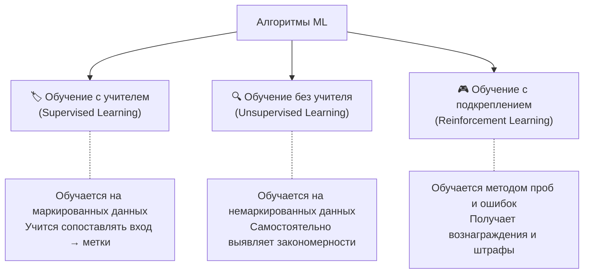

1. **Обучение с учителем (Supervised Learning)** — алгоритм обучается на маркированных (помеченных) данных. Он учится правильно сопоставлять входные данные с уже проставленными метками.
2. **Обучение без учителя (Unsupervised Learning)** — алгоритм обучается на немаркированных данных и должен самостоятельно выявлять закономерности и взаимосвязи.
3. **Обучение с подкреплением (Reinforcement Learning)** — алгоритм обучается методом проб и ошибок, получая вознаграждение за правильные действия и наказание за неправильные.

---

## Практические примеры

| Пример | Описание |
|--------|----------|
| 🎬 **Рекомендательные системы** | Netflix предлагает фильмы, Amazon рекомендует товары на основе предпочтений |
| 📧 **Спам-фильтры** | Идентификация и блокировка нежелательных писем |
| 🏦 **Выявление мошенничества** | Отметка подозрительных транзакций в банковской системе |

---

## Пример: рекомендательная система

Представим интернет-магазин с данными о покупках и оценках пользователей. Столбцы вроде «Жанр» и «Рейтинг» — это **признаки** (фичи), которые используются алгоритмами для прогнозирования. Система выявляет паттерны: если пользователь A и пользователь B высоко оценили одинаковые книги, то можно предложить книги одного пользователя другому.

> Термин
> **Признаки (фичи)** — столбцы данных, используемые алгоритмами для прогнозирования или классификации.

---

## Место в иерархии

```
ИИ (AI) ⊃ Машинное обучение (ML) ⊃ Глубокое обучение (DL) ⊃ NLP ⊃ Генеративный ИИ ⊃ LLM
```

> 📖 Источник
> Бхуян Ш., Исаченко Т. — «Генеративный ИИ с LLM для джунов», Глава 2, стр. 59–63

---

# 🔬 Глубокое обучение (Deep Learning)

> **Определение:** Глубокое обучение — подобласть машинного обучения, использующая искусственные нейронные сети с несколькими слоями для выявления сложных закономерностей в данных.

---

## Чем отличается от машинного обучения?

| | Машинное обучение | Глубокое обучение |
|---|---|---|
| **Метод** | Простые алгоритмы | Нейронные сети со множеством слоёв |
| **Признаки** | Выбираются вручную | Извлекаются автоматически |
| **Данные** | Работает и на малых объёмах | Требует больших объёмов |
| **Обработка** | Простые закономерности | Сложные паттерны и представления |

> Слово **«глубокое»** в названии означает наличие **множества слоёв** в нейронной сети — каждый слой анализирует данные всё глубже.

---

## Искусственная нейронная сеть (ANN)

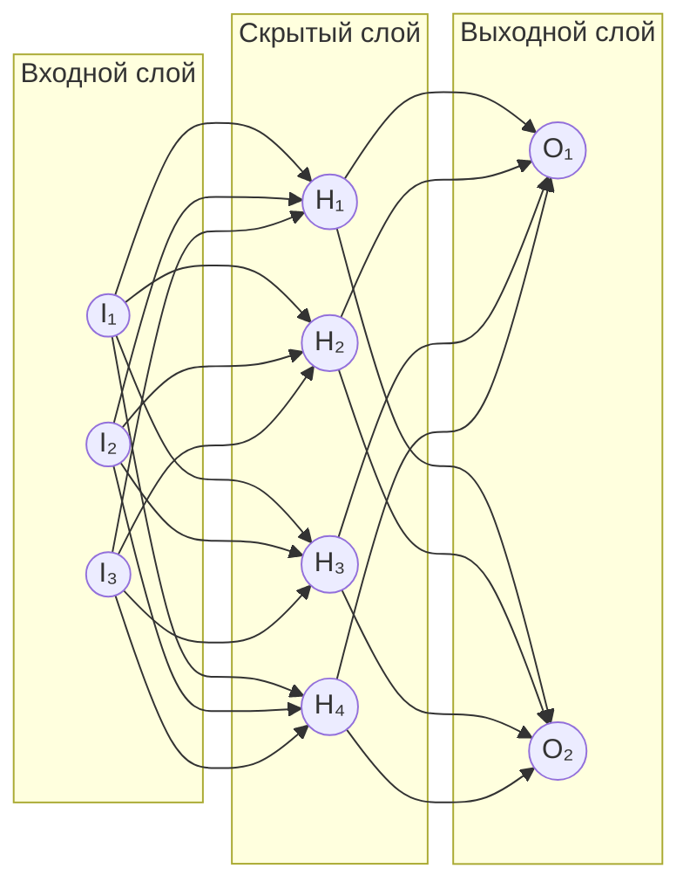

> **Искусственная нейронная сеть (ANN)** — упрощённая модель мозга, состоящая из искусственных узлов (нейронов) и их слоёв. Каждый слой анализирует и преобразует входные данные, выявляя всё более сложные закономерности.

**Ключевые термины:**
- **Узел (нейрон)** — базовая вычислительная единица
- **Слой** — группа узлов на одном уровне
- **Вес (weight)** — число, присвоенное связи между узлами; определяет силу влияния


---

## Пример: распознавание велосипеда

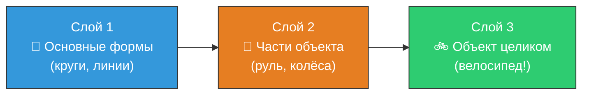

Каждый последующий слой опирается на предыдущий — от простых форм к полному распознаванию объекта.

---

## Процессы глубокого обучения

| Процесс | Описание |
|---------|----------|
| 🔎 **Извлечение признаков** | Алгоритмы автоматически извлекают из данных релевантные признаки — не нужно искать вручную |
| 📊 **Обработка сложных данных** | Глубокие сети обрабатывают огромные объёмы данных: изображения, речь, текст |
| 🔄 **Обобщение** | Модели хорошо применяют полученные знания к ранее не виданным данным |

---

## Примеры применения

| Область | Пример |
|---------|--------|
| 👁️ **Распознавание изображений** | Идентификация объектов, лиц и сцен |
| 🗣️ **Распознавание речи** | Преобразование устной речи в текст |
| 🚗 **Самоуправляемые автомобили** | Анализ обстановки и принятие решений |

---

## Связь с NLP

Модели глубокого обучения можно сначала обучить на огромных объёмах данных, а затем настроить для конкретных задач. Именно способность обрабатывать массивы данных сделала их **ключевым компонентом обработки естественного языка (NLP)**.

> 📖 Источник
> Бхуян Ш., Исаченко Т. — «Генеративный ИИ с LLM для джунов», Глава 2, стр. 63–66

---

# 💬 Обработка естественного языка (NLP)

> **Определение:** NLP (Natural Language Processing) — направление ИИ, посвящённое компьютерному анализу (пониманию и интерпретации) и синтезу (генерации) человеческих высказываний на естественных языках. Находится на стыке лингвистики, информатики и науки о данных.

---

## Две области NLP

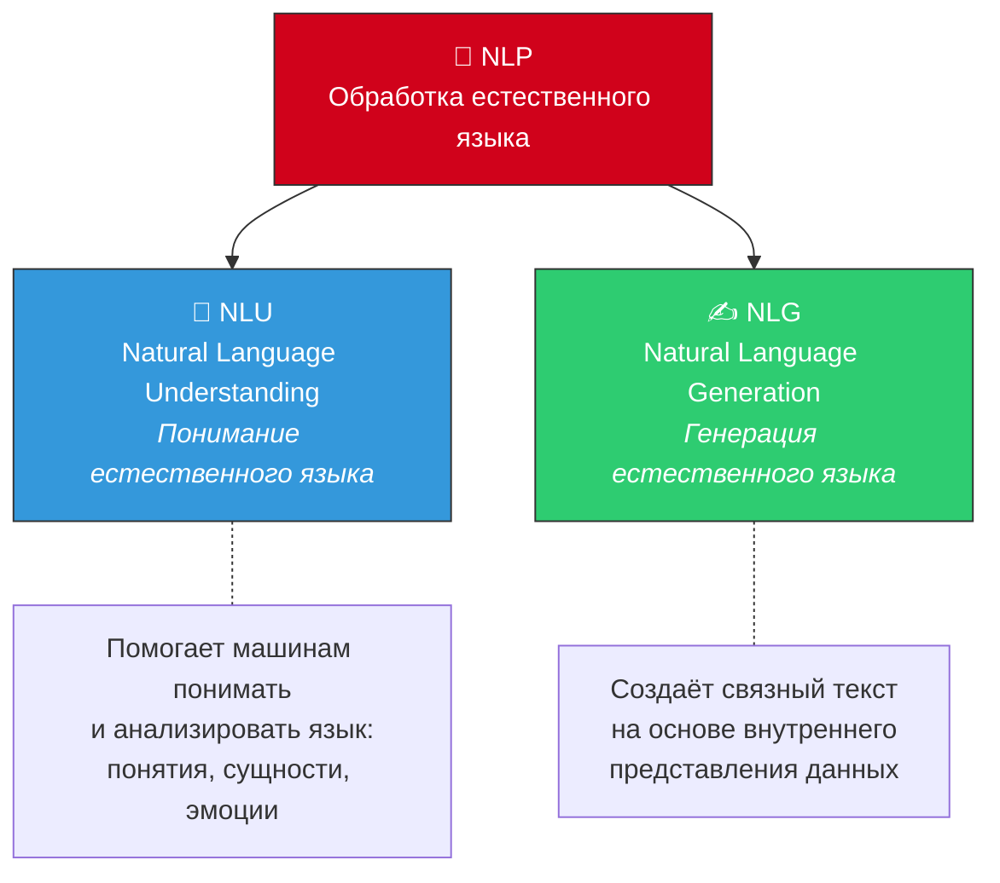

- **NLU** — фокусируется на **понимании**: выявление понятий, сущностей, эмоций, ключевых слов
- **NLG** — фокусируется на **генерации**: создание связных фраз, предложений, абзацев

> Модели, предназначенные для понимания и генерации текста, называют **языковыми моделями (LM, Language Models)**.

---

## Связь NLP и глубокого обучения

NLP — это **не часть** глубокого обучения. Но модели глубокого обучения **расширяют возможности** NLP, позволяя выявлять сложные закономерности из больших наборов данных.

### Типы нейронных сетей в NLP

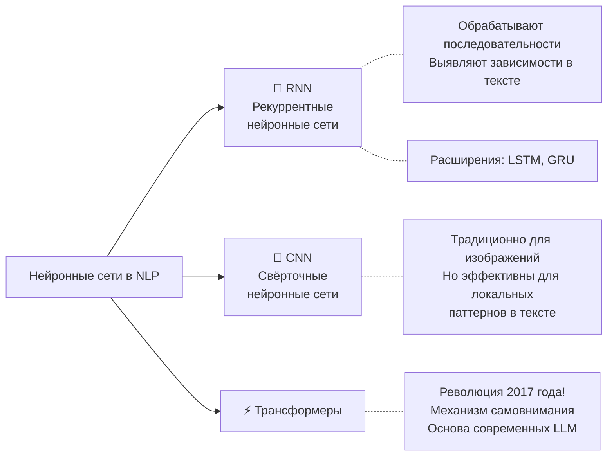

| Тип сети | Назначение | Ограничения |
|----------|-----------|-------------|
| **RNN** | Обработка последовательных данных, выявление зависимостей в тексте | Плохо справляются с дальними зависимостями |
| **LSTM / GRU** | Расширения RNN для работы с далёкими фрагментами текста | Высокие вычислительные затраты |
| **CNN** | Классификация предложений, распознавание именованных сущностей | Ограничены локальными паттернами |
| **Трансформеры** | Универсальная архитектура для понимания и генерации языка | Требуют много вычислительных ресурсов |

---

## Революция трансформеров

> В 2017 году появилась статья **«Attention Is All You Need»**, описавшая революционно новую архитектуру — **трансформеры**. Благодаря механизму самовнимания модели стали гораздо эффективнее обрабатывать текст, фокусируясь на наиболее значимых частях.

До трансформеров языковые модели на основе RNN:
- Требовали больших вычислительных затрат
- Часто «переобучались» на длинных последовательностях
- С трудом улавливали связи между далёкими словами

Трансформеры решили все эти проблемы и стали **основой современного NLP и генеративного ИИ**.

> 📖 Источник
> Бхуян Ш., Исаченко Т. — «Генеративный ИИ с LLM для джунов», Глава 2, стр. 66–68


# Часть II. Архитектура трансформера

---

# ⚡ Трансформер (Transformer)

> **Определение:** Модель трансформера — революционная архитектура глубокого обучения, впервые представленная в статье **«Attention Is All You Need»** (2017). Использует механизмы самовнимания для выявления сложных связей между словами, не зависящих от расстояния между ними.

---

## Почему трансформеры — это революция?

| До трансформеров (RNN/CNN) | Трансформеры |
|---|---|
| Обрабатывали слова **последовательно** | Обрабатывают **все слова параллельно** |
| Плохо улавливали **дальние зависимости** | Отлично работают с **любыми расстояниями** |
| Медленное обучение | Быстрое обучение на GPU |
| Часто **переобучались** | Масштабируются до миллиардов параметров |

---

## Основные компоненты

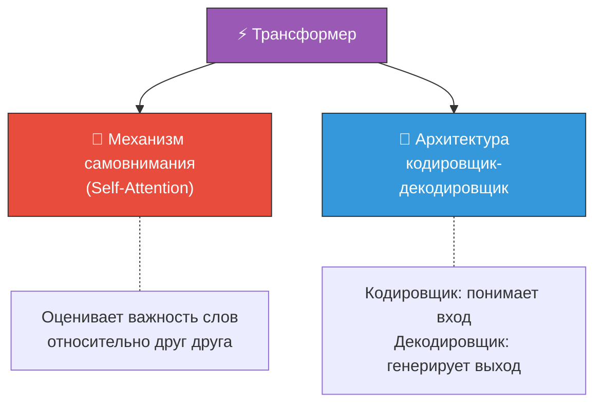

> В оригинальной статье компонентов гораздо больше, но два ключевых — это **механизм самовнимания** и **архитектура кодировщик-декодировщик**.

---

## Как трансформер обрабатывает текст

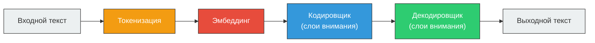

---

## Простой пример

Представьте предложение: *«The ocean is blue because **it** has no color itself.»*

Человек автоматически понимает, что «it» относится к «ocean». Трансформер, благодаря **механизму внимания**, тоже способен это определить — он рассматривает **все слова одновременно** и выявляет, какие из них связаны друг с другом.

---

## Поколения моделей на основе трансформеров

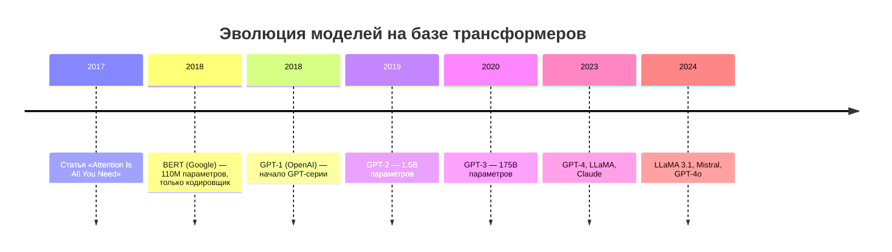

- **Gen 1** (BERT, CamemBERT) — относительно небольшие модели для базовых языковых задач
- **Gen 2+** (GPT, T5, LLaMA) — огромные предварительно обученные модели, основа генеративного ИИ


> 📖 Источник
> Бхуян Ш., Исаченко Т. — «Генеративный ИИ с LLM для джунов», Глава 2, стр. 68–73

---

# 🎯 Механизм самовнимания (Self-Attention)

> **Определение:** Механизм самовнимания — ключевой компонент трансформера, позволяющий модели определять степень важности каждого слова в предложении и его связь с другими словами.

---

## Зачем нужен механизм самовнимания?

До его появления старые модели (RNN) рассматривали слова **по одному**, часто упуская важные связи. Механизм самовнимания позволяет модели видеть **все слова одновременно** и понимать значение каждого слова на основе контекста.

---

## Принцип работы: 4 шага

### Пример: *«The dog barked loudly because **it** saw a stranger.»*

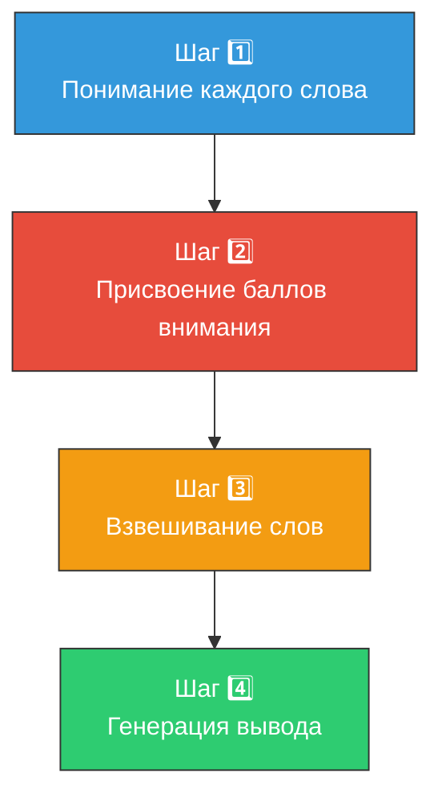

---

### Шаг 1. Понимание каждого слова

Модель доходит до слова **«it»** и должна понять, к чему оно относится. К собаке? К лаю? К незнакомцу?

### Шаг 2. Присвоение баллов внимания

Механизм присваивает каждому слову **балл внимания** — насколько оно связано с текущим словом:

| Слово | Балл внимания | Почему? |
|-------|:---:|---------|
| **dog** | 🔴 Высокий | «it» относится именно к «dog» |
| **barked** | 🟡 Средний | Связано с собакой, но не определяет «it» |
| **loudly** | ⚪ Низкий | Не помогает понять, к чему относится «it» |
| **because** | ⚪ Низкий | Служебное слово |
| **saw** | 🟡 Средний | Действие субъекта «it» |
| **stranger** | 🟡 Средний | Объект действия |

### Шаг 3. Взвешивание слов

Слова с высокими баллами **вносят больший вклад** в понимание смысла. Слово «dog» получает наибольший вес → модель понимает, что «it» = «dog».

### Шаг 4. Генерация вывода

Определив фокус, модель использует информацию для:
- 🌐 **Перевода** предложения на другой язык
- 📋 **Резюмирования** длинного текста
- ❓ **Ответа** на вопрос


---

## Повседневные примеры

| Приложение | Как работает самовнимание |
|-----------|--------------------------|
| 🔍 **Поиск Google** | Запрос: «hotel close to the airport» → модель понимает, что «close» относится к расположению отеля, а «airport» — к пункту назначения |
| 📧 **Gmail** | Автодополнение и smart reply — модель фокусируется на ключевых словах письма |
| 🌍 **Переводчики** | Правильно связывает местоимения с существительными при переводе |

---

## Ключевое отличие от старых моделей

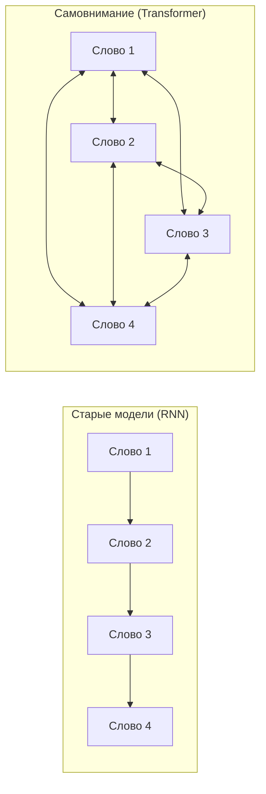

**RNN**: каждое слово «видит» только предыдущие слова (последовательно).
**Самовнимание**: каждое слово «видит» **все остальные слова** одновременно.

> 📖 Источник
> Бхуян Ш., Исаченко Т. — «Генеративный ИИ с LLM для джунов», Глава 2, стр. 69–71, 94–97

---

# 🔄 Архитектура кодировщика-декодировщика

> **Определение:** Особая структура нейронных сетей, состоящая из двух частей: **кодировщик** (энкодер) принимает и понимает входную информацию, а **декодировщик** (декодер) на её основе генерирует выходную информацию.

---

## Аналогия: работа переводчика

Представьте переводчика-гида в аэропорту:
1. 📖 **Кодировщик** — гид читает указатель на французском: *«Sortie de secours»* и **понимает** его смысл
2. 🗣️ **Декодировщик** — поняв смысл, гид **говорит вам**: «Emergency Exit» (Аварийный выход)

---

## Схема работы

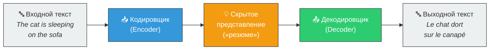


---

## Кодировщик (Encoder)

**Задача:** принять входной сигнал и **понять его смысл**.

| Этап | Что происходит |
|------|---------------|
| Приём входа | Получает предложение (например, *«The cat is sleeping on the sofa»*) |
| Обработка | Анализирует каждое слово и связи между ними |
| Результат | Создаёт **скрытое представление** — компактное «резюме», отражающее суть предложения |

> Скрытое представление — это не текст, а числовой вектор, в котором закодирован весь смысл входного предложения.

---

## Декодировщик (Decoder)

**Задача:** получить «резюме» от кодировщика и создать **выходной результат**.

| Этап | Что происходит |
|------|---------------|
| Получение резюме | Принимает скрытое представление от кодировщика |
| Генерация | Предсказывает **по одному слову за раз**, сверяясь с кодировщиком |
| Результат | Генерирует итоговый текст (*Le chat dort sur le canapé*) |

---

## Применение

Архитектура кодировщик-декодировщик используется в:

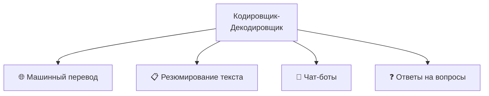

> 📖 Источник
> Бхуян Ш., Исаченко Т. — «Генеративный ИИ с LLM для джунов», Глава 2, стр. 71–73

---

# 🧩 Многоголовое внимание (Multi-Head Attention)

> **Определение:** Многоголовое внимание — расширение механизма самовнимания, при котором вычисление внимания выполняется **параллельно несколькими «головами»**. Каждая голова фокусируется на **разных аспектах** связей между словами, а затем результаты объединяются. Это ключевой компонент оригинальной архитектуры трансформера из статьи «Attention Is All You Need» (2017).

---

## Зачем нужно несколько голов?

Одна голова внимания может уловить **только один тип связи** за раз. Но в языке одновременно существует множество типов зависимостей:

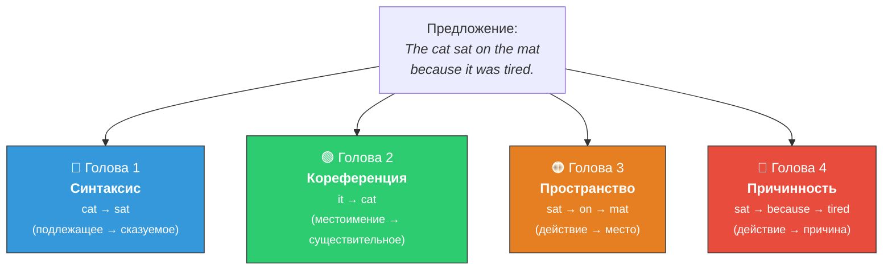

> Если бы была только одна голова, модель вынуждена была бы «сжать» все эти связи в одно представление — и неизбежно потеряла бы часть информации.

---

## Принцип работы: пошагово

### Шаг 1. Создание Query, Key, Value

Для каждого слова (токена) создаются три вектора:

| Вектор | Аналогия | Назначение |
|--------|----------|-----------|
| **Q (Query)** | Вопрос: «С чем я связан?» | Определяет, что ищет данный токен |
| **K (Key)** | Ответ: «Вот что я предлагаю» | Определяет, что данный токен может предоставить |
| **V (Value)** | Содержание: «Вот моя информация» | Фактическое содержание, которое передаётся |

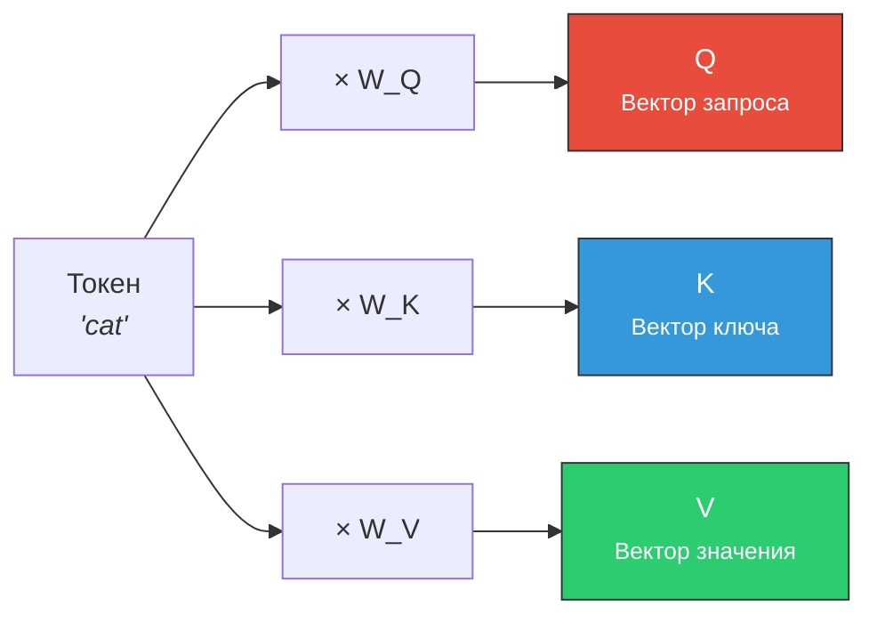

### Шаг 2. Разделение на головы

Векторы Q, K, V **разделяются** на несколько частей — по одной на каждую голову:

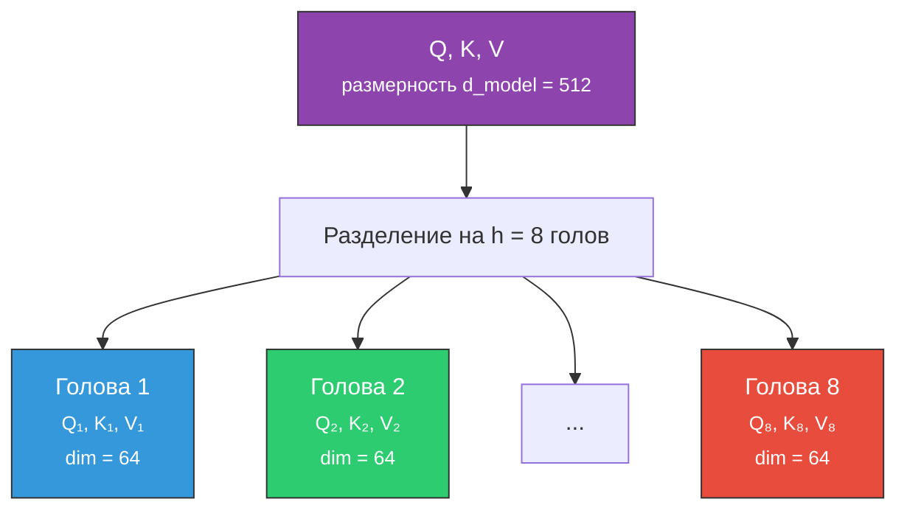

> **Ключевой момент:** если `d_model = 512` и голов `h = 8`, то каждая голова работает с векторами размерности `d_k = 512 / 8 = 64`. Общий объём вычислений **не увеличивается** по сравнению с одноголовым вниманием!

### Шаг 3. Вычисление внимания в каждой голове

Каждая голова **независимо** вычисляет внимание по формуле Scaled Dot-Product Attention:

```
Attention(Q, K, V) = softmax(Q × Kᵀ / √d_k) × V
```

| Операция | Что происходит |
|----------|---------------|
| `Q × Kᵀ` | Скалярное произведение — определяет, насколько каждый токен «подходит» другому |
| `/ √d_k` | Масштабирование — предотвращает слишком большие значения (стабилизация обучения) |
| `softmax(...)` | Нормализация — превращает баллы в вероятности (сумма = 1) |
| `× V` | Взвешенная сумма — собирает информацию от релевантных токенов |

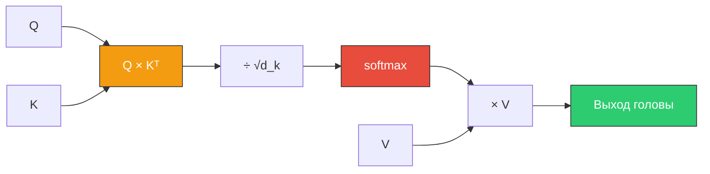

### Шаг 4. Конкатенация и проекция

Выходы всех голов **объединяются** (конкатенируются) и проходят через финальную линейную проекцию:

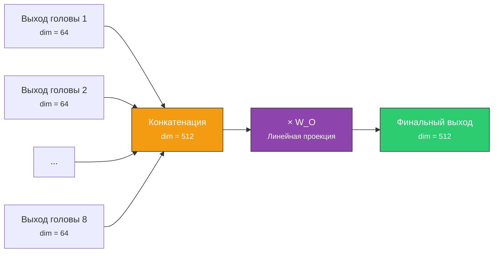

```
MultiHead(Q, K, V) = Concat(head₁, head₂, ..., headₕ) × W_O
```

---

## Полная схема Multi-Head Attention

```mermaid
graph TB
    INPUT["Входные эмбеддинги<br/><small>все токены предложения</small>"]

    INPUT --> Q["Линейная проекция → Q"]
    INPUT --> K["Линейная проекция → K"]
    INPUT --> V["Линейная проекция → V"]

    Q --> SPLIT_Q["Разделение на h голов"]
    K --> SPLIT_K["Разделение на h голов"]
    V --> SPLIT_V["Разделение на h голов"]

    SPLIT_Q --> ATT["Scaled Dot-Product Attention<br/><small>× h голов параллельно</small>"]
    SPLIT_K --> ATT
    SPLIT_V --> ATT

    ATT --> CONCAT["Конкатенация выходов"]
    CONCAT --> PROJ["Линейная проекция W_O"]
    PROJ --> OUTPUT["Выход Multi-Head Attention"]

    style INPUT fill:#ECF0F1,stroke:#333
    style ATT fill:#E74C3C,stroke:#333,color:#fff
    style CONCAT fill:#F39C12,stroke:#333,color:#fff
    style OUTPUT fill:#2ECC71,stroke:#333,color:#fff
```

---

## Сколько голов используют реальные модели?

| Модель | d_model | Количество голов (h) | d_k (на голову) |
|--------|:-------:|:-------------------:|:---------------:|
| Transformer (оригинал) | 512 | 8 | 64 |
| BERT-base | 768 | 12 | 64 |
| GPT-2 | 768 | 12 | 64 |
| GPT-3 | 12 288 | 96 | 128 |
| LLaMA 2 (70B) | 8 192 | 64 | 128 |

---

## Аналогия: команда экспертов

Представьте, что вы анализируете юридический контракт. Вместо одного юриста-универсала вы нанимаете **команду специалистов**:

| Голова | «Эксперт» | На что обращает внимание |
|:------:|-----------|-------------------------|
| 1 | Грамматист | Синтаксические связи (подлежащее-сказуемое) |
| 2 | Семантик | Смысловые связи (синонимы, антонимы) |
| 3 | Логик | Причинно-следственные связи (потому что, следовательно) |
| 4 | Стилист | Тон и регистр (формальный, неформальный) |

Каждый анализирует один и тот же текст, но фокусируется на **своём аспекте**. Затем их выводы объединяются в общий анализ.

---

## Типы внимания в трансформере

```mermaid
graph TB
    MHA["Multi-Head Attention"]

    MHA --> SELF["🔄 Self-Attention<br/><small>Q, K, V — из одного<br/>источника (кодировщик<br/>или декодировщик)</small>"]
    MHA --> CROSS["🔀 Cross-Attention<br/><small>Q — из декодировщика,<br/>K, V — из кодировщика</small>"]
    MHA --> MASKED["🎭 Masked Self-Attention<br/><small>В декодировщике:<br/>токен не «видит»<br/>будущие токены</small>"]

    style SELF fill:#3498DB,stroke:#333,color:#fff
    style CROSS fill:#E67E22,stroke:#333,color:#fff
    style MASKED fill:#9B59B6,stroke:#333,color:#fff
```

| Тип | Где используется | Особенность |
|-----|-----------------|-------------|
| **Self-Attention** | Кодировщик | Каждый токен видит все остальные |
| **Masked Self-Attention** | Декодировщик | Токен видит только предыдущие (для авторегрессии) |
| **Cross-Attention** | Между кодировщиком и декодировщиком | Декодировщик «смотрит» на кодировщик |

> 📖 Источник
> Vaswani A. et al. — «Attention Is All You Need», 2017 (раздел 3.2.2 Multi-Head Attention)
> Бхуян Ш., Исаченко Т. — «Генеративный ИИ с LLM для джунов», Глава 2

---

# 📍 Позиционное кодирование (Positional Encoding)

> **Определение:** Позиционное кодирование — механизм, позволяющий трансформеру учитывать **порядок слов** в предложении. Поскольку трансформер обрабатывает все токены параллельно (а не последовательно, как RNN), без позиционного кодирования он не различает «кот съел мышь» и «мышь съела кота».

---

## Проблема: трансформер не знает порядок

```mermaid
graph TB
    subgraph "Без позиционного кодирования"
        S1["'Кот съел мышь'"]
        S2["'Мышь съела кота'"]
        S1 --> SAME["Одинаковые<br/>эмбеддинги!<br/>⚠️ Модель не различает"]
        S2 --> SAME
    end

    subgraph "С позиционным кодированием"
        S3["'Кот съел мышь'"]
        S4["'Мышь съела кота'"]
        S3 --> DIFF1["Эмбеддинг +<br/>позиция [1,2,3]"]
        S4 --> DIFF2["Эмбеддинг +<br/>позиция [1,2,3]"]
        DIFF1 --> OK["✅ Модель различает!"]
        DIFF2 --> OK
    end

    style SAME fill:#E74C3C,stroke:#333,color:#fff
    style OK fill:#2ECC71,stroke:#333,color:#fff
```

RNN обрабатывает слова **по одному**, поэтому порядок «встроен» в саму архитектуру. Трансформер видит **все слова разом** — как набор карточек на столе. Позиционное кодирование — это **номера**, написанные на каждой карточке.

---

## Как это работает

Каждому токену присваивается **вектор позиции** той же размерности, что и эмбеддинг. Затем они **складываются**:

```mermaid
graph LR
    TOK["Эмбеддинг токена<br/><small>'кот' → [0.5, 0.1, 0.7, ...]</small>"]
    POS["Позиционный вектор<br/><small>позиция 1 → [0.0, 1.0, 0.0, ...]</small>"]

    TOK --> SUM["➕ Сложение"]
    POS --> SUM

    SUM --> FINAL["Финальный вход<br/><small>[0.5, 1.1, 0.7, ...]</small>"]

    style TOK fill:#3498DB,stroke:#333,color:#fff
    style POS fill:#F39C12,stroke:#333,color:#fff
    style FINAL fill:#2ECC71,stroke:#333,color:#fff
```

```
Вход трансформера = Эмбеддинг(токен) + Позиционное кодирование(позиция)
```

---

## Синусоидальное кодирование (оригинальный трансформер)

В оригинальной статье «Attention Is All You Need» используются **синусоидальные функции** — синус и косинус с разными частотами:

```
PE(pos, 2i)   = sin(pos / 10000^(2i/d_model))
PE(pos, 2i+1) = cos(pos / 10000^(2i/d_model))
```

| Параметр | Описание |
|----------|----------|
| `pos` | Позиция токена в предложении (0, 1, 2, ...) |
| `i` | Индекс измерения в векторе (0, 1, 2, ..., d/2) |
| `d_model` | Размерность эмбеддинга (например, 512) |

### Почему синусоиды?

| Свойство | Объяснение |
|----------|-----------|
| **Уникальность** | Каждая позиция получает уникальный вектор — нет двух одинаковых |
| **Относительные расстояния** | Модель может вычислить расстояние между позициями через линейную комбинацию |
| **Экстраполяция** | Работает для последовательностей **длиннее**, чем те, на которых обучалась |
| **Ограниченные значения** | sin и cos всегда в диапазоне [-1, 1] — не нарушают масштаб эмбеддингов |

```mermaid
graph TB
    subgraph "Пример: 4 позиции, d_model = 4"
        P0["Позиция 0:<br/>[sin(0), cos(0), sin(0), cos(0)]<br/>= [0.0, 1.0, 0.0, 1.0]"]
        P1["Позиция 1:<br/>[sin(1), cos(1), sin(0.01), cos(0.01)]<br/>= [0.84, 0.54, 0.01, 1.0]"]
        P2["Позиция 2:<br/>[sin(2), cos(2), sin(0.02), cos(0.02)]<br/>= [0.91, -0.42, 0.02, 1.0]"]
        P3["Позиция 3:<br/>[sin(3), cos(3), sin(0.03), cos(0.03)]<br/>= [0.14, -0.99, 0.03, 1.0]"]
    end

    P0 --> NOTE["Высокие частоты (первые измерения)<br/>быстро меняются от позиции к позиции<br/><br/>Низкие частоты (последние измерения)<br/>меняются медленно — кодируют<br/>«глобальное» положение"]

    style NOTE fill:#F5F5F5,stroke:#333
```

> Разные измерения вектора работают на **разных частотах**: одни быстро осциллируют (различают соседние позиции), другие меняются медленно (кодируют общее положение в тексте). Это похоже на **двоичное представление числа** — младшие биты переключаются быстро, старшие — редко.

---

## Обучаемое позиционное кодирование

Альтернативный подход, используемый в BERT и GPT:

```mermaid
graph LR
    subgraph "Синусоидальное (Transformer)"
        SIN["Фиксированные<br/>синусоиды<br/><small>Не обучается</small>"]
    end

    subgraph "Обучаемое (BERT, GPT)"
        LEARN["Матрица позиций<br/><small>Обучается вместе<br/>с моделью</small>"]
    end

    style SIN fill:#3498DB,stroke:#333,color:#fff
    style LEARN fill:#E67E22,stroke:#333,color:#fff
```

| | Синусоидальное | Обучаемое |
|---|---|---|
| **Создание** | По формуле (фиксировано) | Обучается на данных |
| **Экстраполяция** | Работает на любых длинах | Ограничено максимальной позицией при обучении |
| **Гибкость** | Одинаковое для всех моделей | Адаптируется к данным |
| **Используется в** | Оригинальный Transformer | BERT, GPT-2, GPT-3 |

---

## RoPE — современный подход (LLaMA, Mistral)

**RoPE** (Rotary Position Embedding) — метод, при котором позиция кодируется через **вращение** векторов в многомерном пространстве:

```mermaid
graph TB
    ROPE["🔄 RoPE<br/>(Rotary Position Embedding)"]

    ROPE --> R1["📐 Кодирует позицию через<br/>вращение вектора на угол,<br/>пропорциональный позиции"]
    ROPE --> R2["🔗 Относительные позиции<br/>«встроены» в скалярное<br/>произведение Q × Kᵀ"]
    ROPE --> R3["📏 Лучше экстраполирует<br/>на длинные последовательности<br/>(с NTK-aware scaling)"]

    style ROPE fill:#9B59B6,stroke:#333,color:#fff
```

| Метод | Тип позиции | Экстраполяция | Используется в |
|-------|:-----------:|:-------------:|---------------|
| Синусоидальное | Абсолютная | Хорошая | Transformer (2017) |
| Обучаемое | Абсолютная | Плохая | BERT, GPT-2/3 |
| **RoPE** | **Относительная** | **Отличная** | **LLaMA, Mistral, Qwen** |
| ALiBi | Относительная | Отличная | BLOOM, MPT |

> На практике
> Большинство современных LLM (2023–2025) используют **RoPE** — он позволяет модели, обученной на контексте 4K токенов, эффективно работать с контекстом 128K+ токенов через технику масштабирования (NTK-aware scaling, YaRN).

---

## Визуализация: от текста до входа трансформера

```mermaid
graph LR
    TEXT["📄 Текст:<br/><i>'The cat sat'</i>"]
    TEXT --> TOK["🔤 Токенизация<br/><small>['The', 'cat', 'sat']</small>"]
    TOK --> EMB["💡 Эмбеддинги<br/><small>3 вектора dim=512</small>"]
    EMB --> ADD["➕ + Позиционное<br/>кодирование<br/><small>3 вектора dim=512</small>"]
    ADD --> INPUT["⚡ Вход трансформера<br/><small>3 вектора dim=512<br/>с информацией о<br/>смысле И порядке</small>"]

    style TEXT fill:#ECF0F1,stroke:#333
    style TOK fill:#F39C12,stroke:#333,color:#fff
    style EMB fill:#9B59B6,stroke:#333,color:#fff
    style ADD fill:#E74C3C,stroke:#333,color:#fff
    style INPUT fill:#2ECC71,stroke:#333,color:#fff
```

> 📖 Источник
> Vaswani A. et al. — «Attention Is All You Need», 2017 (раздел 3.5 Positional Encoding)
> Su J. et al. — «RoFormer: Enhanced Transformer with Rotary Position Embedding», 2021


# Часть III. Генеративный ИИ и фундаментальные модели

---

# ✨ Генеративный ИИ (Generative AI)

> **Определение:** Генеративный ИИ — тип искусственного интеллекта, способный **создавать** совершенно новый контент (текст, изображения, музыку, код) посредством синтеза информации из существующих данных. В отличие от систем, которые просто распознают закономерности или делают прогнозы.

---

## Генеративный ИИ vs. Не-генеративный ИИ

```mermaid
graph TB
    INPUT["📥 Вход<br/>(данные/запрос)"] --> AI["🤖 ИИ-система"]
    
    AI --> NGI["❌ НЕ генеративный ИИ"]
    AI --> GI["✅ Генеративный ИИ"]

    NGI --> N1["Число"]
    NGI --> N2["Классификация<br/>(спам / не спам)"]
    NGI --> N3["Прогноз / вероятность"]
    NGI --> N4["Дискретный сигнал"]

    GI --> G1["Текст на естественном языке"]
    GI --> G2["Изображение"]
    GI --> G3["Аудио / музыка"]
    GI --> G4["Видео / код"]

    style NGI fill:#E74C3C,stroke:#333,color:#fff
    style GI fill:#2ECC71,stroke:#333,color:#fff
```

> **Простое правило:** Если на выходе — число, классификация или прогноз → **не** генеративный ИИ. Если на выходе — текст, изображение, аудио или видео → **генеративный** ИИ.


---

## Преимущества

| Преимущество | Описание |
|-------------|----------|
| 🎨 **Творчество** | Создание художественных, музыкальных и литературных произведений |
| ⚡ **Автоматизация** | Составление отчётов, маркетинговых материалов, обработка запросов |
| 🎯 **Персонализация** | Адаптация под предпочтения пользователя (рекомендации, реклама) |
| 📊 **Аугментация данных** | Создание синтетических данных для обучения моделей |
| ♿ **Доступность** | Описания изображений, озвучка для людей с нарушениями зрения |
| 🔬 **Исследования** | Моделирование сценариев и сред для научных задач |

---

## Категории генеративного ИИ

```mermaid
graph TB
    G["Категории<br/>генеративного ИИ"]
    
    G --> TT["📝 Текст → Текст<br/><small>GPT-4, Claude, LLaMA, Gemini</small>"]
    G --> TI["📝→🖼️ Текст → Изображение<br/><small>Midjourney, DALL-E, Stable Diffusion</small>"]
    G --> II["🖼️→🖼️ Изображение → Изображение"]
    G --> IT["🖼️→📝 Изображение → Текст<br/><small>LLaVA</small>"]
    G --> ST["🗣️→📝 Речь → Текст<br/><small>Whisper, DeepSpeech</small>"]
    G --> TA["📝→🔊 Текст → Аудио<br/><small>Aura (Deepgram)</small>"]
    G --> TV["📝→🎬 Текст → Видео<br/><small>Sora, Dream Machine, Kling</small>"]
```

---

## Два типа моделей генеративного ИИ

```mermaid
graph LR
    GenAI["✨ Генеративный ИИ"]
    GenAI --> FM["🏗️ Фундаментальные модели<br/><small>DALL-E, Gato</small>"]
    GenAI --> LLM["📝 Большие языковые модели<br/><small>GPT, LLaMA, Claude</small>"]

    FM -.- FM1["Широкие возможности<br/>Текст + Изображения + Другое<br/>Адаптируются к любым задачам"]
    LLM -.- LLM1["Специализация на языке<br/>Генерация и понимание текста<br/>Подтип фундаментальных моделей"]
```

> [!important] Важное соотношение
> Все LLM — это генеративные ИИ-модели, но **не все** генеративные ИИ-модели — это LLM. Например, модель генерации изображений (Midjourney) — это генеративный ИИ, но не LLM.

> 📖 Источник
> Бхуян Ш., Исаченко Т. — «Генеративный ИИ с LLM для джунов», Глава 2, стр. 74–84

---

# 🏗️ Фундаментальные модели (Foundation Models)

> **Определение:** Фундаментальные модели — это большие, предварительно обученные модели машинного обучения с широкими возможностями, служащие основой («фундаментом») для различных ИИ-приложений. Обучаются на обширных и разнообразных наборах данных и адаптируются к конкретным задачам с минимальным дополнительным обучением.

---

## Аналогия: фундамент здания

```mermaid
graph TB
    F["🏗️ Фундаментальная модель<br/>(бетонная плита)"]
    F --> A["🏥 Медицинский ИИ"]
    F --> B["💬 Чат-бот"]
    F --> C["🖼️ Распознавание изображений"]
    F --> D["🌐 Переводчик"]

    style F fill:#8E44AD,stroke:#333,color:#fff
    style A fill:#3498DB,stroke:#333,color:#fff
    style B fill:#2ECC71,stroke:#333,color:#fff
    style C fill:#E74C3C,stroke:#333,color:#fff
    style D fill:#F39C12,stroke:#333,color:#fff
```

> Фундаментальная модель — как бетонная плита, на которой можно возводить **разные этажи** для разных целей. В отличие от специализированных моделей, которые подобны **отдельным комнатам** — предназначены только для одной функции.

---

## Ключевые характеристики

| Характеристика | Описание |
|---------------|----------|
| 📚 **Обширные данные** | Обучаются на наборах данных из различных источников (текст, изображения, аудио) |
| 🔧 **Адаптивность** | Можно дообучить (файн-тюнинг) для конкретных задач |
| 🔄 **Перенос знаний** | Накопленные знания переносятся на новые задачи с минимальным обучением |

---

## Пример: как из фундаментальной модели получился ChatGPT

```mermaid
graph LR
    FM["🏗️ GPT-3.5<br/>(фундаментальная модель)"] --> FT["🔧 Файн-тюнинг<br/>на диалоговых данных"]
    FT --> CHAT["💬 ChatGPT<br/>(специализированное<br/>приложение)"]

    style FM fill:#8E44AD,stroke:#333,color:#fff
    style FT fill:#F39C12,stroke:#333,color:#fff
    style CHAT fill:#2ECC71,stroke:#333,color:#fff
```


---

## Схема создания специализированных моделей

```mermaid
graph TB
    DATA["📊 Большой объём данных<br/>(Wikipedia, соцсети, изображения)"]
    
    DATA --> TRAIN1["Обучение распознаванию текста"]
    DATA --> TRAIN2["Обучение распознаванию изображений"]
    
    TRAIN1 --> FM["🏗️ Фундаментальная модель"]
    TRAIN2 --> IM["🖼️ Модель распознавания изображений"]
    
    FM -->|"+ специфические данные<br/>(вопросы/ответы, чат)"| LLM["💬 LLM для чат-бота"]
    IM -->|"+ специфические данные"| SPEC["🔍 Специализированная модель"]
```

---

## Фундаментальная модель vs LLM

| | Фундаментальная модель | LLM |
|---|---|---|
| **Область** | Широкая (текст, изображения, видео, роботы) | Специализация на **языке** |
| **Примеры** | Gato (DeepMind), DALL-E | GPT, LLaMA, Claude |
| **Назначение** | Базовый слой для любых ИИ-задач | Генерация и понимание текста |

> На практике
> Сейчас термин «фундаментальная модель» часто используют как синоним «LLM», потому что языковые модели — самый яркий пример. Но технически фундаментальные модели **шире**: например, Gato может и управлять роботами, и играть в игры.

> 📖 Источник
> Бхуян Ш., Исаченко Т. — «Генеративный ИИ с LLM для джунов», Глава 2, стр. 80–83


# Часть IV. Большие языковые модели (LLM) — внутреннее устройство

---

# 📝 Большие языковые модели (LLM)

> **Определение:** Большая языковая модель (LLM, Large Language Model) — разновидность фундаментальных моделей, использующая механизмы глубокого обучения для анализа огромных объёмов данных. LLM достигают исключительной эффективности в обработке и генерации текста, почти неотличимого от написанного человеком.

---

## Почему «большая»?

Термин **«большая» (Large)** относится к:
- 🔢 **Количеству параметров** — от миллиардов (8B) до сотен миллиардов (405B)
- 📚 **Объёму обучающих данных** — от миллиардов до триллионов слов

> Когда говорят, что LLM имеет 8–405 миллиардов параметров, имеется в виду количество **весов** (связей между узлами) в нейронной сети.

---

## Ключевые характеристики

| Характеристика | Описание |
|---------------|----------|
| 🎯 **Специализация** | Разработаны для задач, связанных с естественным языком |
| ✍️ **Генерация** | Создают текст, обрабатывают язык, понимают языковые шаблоны |
| 📊 **Масштаб** | Обучаются на массивных наборах данных из различных источников |

---

## Как работает LLM: упрощённая схема

```mermaid
graph LR
    P["📝 Промпт<br/><i>The sky is...</i>"] --> NN["🧠 Нейронная сеть<br/>(преобразует в числа,<br/>обрабатывает)"]
    NN --> R["📤 Результат<br/><i>The sky is blue</i>"]
    R -->|"Объединяет вход + выход<br/>и подаёт обратно"| NN

    style P fill:#3498DB,stroke:#333,color:#fff
    style NN fill:#8E44AD,stroke:#333,color:#fff
    style R fill:#2ECC71,stroke:#333,color:#fff
```

Три ключевых принципа:
1. Нейронная сеть состоит из узлов (**параметров**) со связями (**весами**)
2. Сеть обрабатывает **только числа** — входной текст преобразуется в числовой формат
3. Любой контент (текст, изображения) можно представить числами и передать в модель

> Когда вы объединяете вход и выход и возвращаете обратно в LLM — она продолжает генерировать текст, предсказывая следующее слово. Именно так работает ChatGPT!

<!-- PLACEHOLDER: Здесь была картинка (Pasted image 20260323233255.png) — схема нейронной сети LLM -->

---

## Внутренняя работа LLM: 3 этапа

```mermaid
graph LR
    T["1️⃣ Токенизация<br/>Разбиение текста<br/>на токены"] --> E["2️⃣ Эмбеддинг<br/>Перевод токенов<br/>в числовые векторы"] --> TR["3️⃣ Трансформер<br/>Слои внимания<br/>для анализа связей"]

    style T fill:#F39C12,stroke:#333,color:#fff
    style E fill:#E74C3C,stroke:#333,color:#fff
    style TR fill:#9B59B6,stroke:#333,color:#fff
```

| Этап | Что происходит | Пример |
|------|---------------|--------|
| **Токенизация** | Текст разбивается на мелкие единицы (токены) | *«Machine learning»* → [*«Machine»*, *«learning»*] |
| **Эмбеддинг** | Токены переводятся в числовые векторы с семантикой | *«Machine»* → [0.5, 0.1, 0.7, …] |
| **Трансформер** | Слои внимания выявляют связи между токенами | Модель понимает, что «Machine» и «learning» связаны |

---

## Примеры LLM и их размеры

| Модель | Параметры | Лимит токенов |
|--------|:---------:|:-------------:|
| LLaMA 2 | 7B–70B | 4 096 |
| GPT-4 | ~1.8T (предп.) | 8 192+ |
| LLaMA 3.1 | 8B–405B | 128K |
| Mistral | 7B–8x22B | 32K |

---

## Обучение LLM

Обучение делится на две стадии:

```mermaid
graph LR
    PRE["📚 Предварительное обучение<br/><small>Широкие данные, общие знания</small>"] --> FT["🔧 Файн-тюнинг<br/><small>Специфические данные,<br/>конкретные задачи</small>"]

    style PRE fill:#3498DB,stroke:#333,color:#fff
    style FT fill:#E67E22,stroke:#333,color:#fff
```

Подробнее: Обучение → Предварительное обучение → Файн-тюнинг

---

## Расширение возможностей LLM

Помимо файн-тюнинга существует альтернативный метод — **RAG**, который позволяет LLM динамически обращаться к внешним базам данных.

| Метод | Суть | Когда использовать |
|-------|------|--------------------|
| **Файн-тюнинг** | Изменение весов модели на специфических данных | Нужно изменить «поведение» модели |
| **RAG** | Подключение внешних баз знаний при генерации | Нужен доступ к актуальной/частной информации |

> 📖 Источник
> Бхуян Ш., Исаченко Т. — «Генеративный ИИ с LLM для джунов», Глава 2, стр. 84–98

---

# 🔤 Токенизация (Tokenization)

> **Определение:** Токенизация — процесс разбиения текста на естественном языке на мелкие единицы (**токены**), которые служат строительными блоками для обработки текста моделью. Токенами могут быть целые слова, части слов, буквы или знаки препинания.

---

## Зачем нужна токенизация?

LLM не может работать с «сырым» текстом напрямую. Текст нужно:

```mermaid
graph LR
    T["📄 Текст"] --> TOK["🔤 Токенизация<br/>(разбиение на токены)"]
    TOK --> VEC["🔢 Векторизация<br/>(преобразование в числа)"]
    VEC --> LLM["🧠 LLM<br/>(обработка)"]

    style T fill:#ECF0F1,stroke:#333
    style TOK fill:#F39C12,stroke:#333,color:#fff
    style VEC fill:#E74C3C,stroke:#333,color:#fff
    style LLM fill:#9B59B6,stroke:#333,color:#fff
```


---

## Пример токенизации

Предложение: *«We must always change, renew, rejuvenate ourselves; otherwise, we harden.»*

| Токенизатор | Количество токенов | Особенности |
|-------------|:------------------:|-------------|
| **SpaCy** (по словам) | 15 | Каждое слово и знак — отдельный токен |
| **GPT-4 tokenizer** | 17 | Контекстно-зависимый, учитывает подслова |
| **BERT tokenizer** | ~18 | Контекстно-зависимый, расширенный анализ |

> Разные токенизаторы могут давать **разные результаты** для одного и того же текста — схема кодирования сильно зависит от конкретной LLM.

---

## Почему токены важны экономически

| Аспект | Описание |
|--------|----------|
| 💰 **Стоимость** | Цена работы LLM напрямую зависит от количества обрабатываемых токенов: больше токенов = дороже |
| 📏 **Размер модели** | Определяется максимальным количеством токенов на вход (контекстное окно) |
| 💾 **Память** | Токены хранятся и обрабатываются в памяти — отсюда лимиты |

### Лимиты токенов для LLM

| Модель | Лимит токенов |
|--------|:------------:|
| LLaMA 2 | 4 096 |
| GPT-4 | 8 192 |
| LLaMA 3.1 | 128 000 |
| Claude 3.5 | 200 000 |

---

## Популярные токенизаторы

| Токенизатор | Тип | Используется в |
|-------------|-----|---------------|
| **NLTK** | По словам | Общие NLP-задачи |
| **SpaCy** | По словам | Быстрый анализ текста |
| **BERT Tokenizer** | Контекстно-зависимый (WordPiece) | Модели BERT |
| **GPT Tokenizer** | Контекстно-зависимый (BPE) | Модели GPT |
| **Keras** | Гибкий | TensorFlow/Keras проекты |

---

## Что дальше после токенизации?

Токены — это ещё только текстовые единицы. LLM работает с **числами**, поэтому следующий шаг — **векторизация**:

```mermaid
graph LR
    TOK["🔤 Токены<br/><i>[We, must, always, ...]</i>"] --> VEC["🔢 Векторы<br/><i>[1135, 1276, 1464, ...]</i>"] --> EMB["💡 Эмбеддинги<br/><i>[0.5, -0.1, 0.7, ...]</i>"]

    style TOK fill:#F39C12,stroke:#333,color:#fff
    style VEC fill:#E74C3C,stroke:#333,color:#fff
    style EMB fill:#9B59B6,stroke:#333,color:#fff
```

> На практике токенизация включает дополнительные приёмы: **паддинг** (дополнение), маркеры конца строки и другие. Подробности — в главе 5 книги (Файн-тюнинг LLM).

> 📖 Источник
> Бхуян Ш., Исаченко Т. — «Генеративный ИИ с LLM для джунов», Глава 2, стр. 87–89

---

# 🔢 Вектор (Vector)

> **Определение:** В математике вектор — объект, характеризующийся величиной и направлением в разных измерениях. В контексте LLM векторы используются для представления текста в **числовом формате**, благодаря чему модель может его понимать и обрабатывать.

---

## Зачем нужны векторы?

Машины воспринимают **только числа**, а не текст или изображения. Поэтому любой контент нужно перевести в числовой формат — **векторизовать**.

```mermaid
graph LR
    TEXT["📄 Текст<br/><i>'Machine'</i>"] -->|"Токенизация +<br/>Кодирование"| VEC["🔢 Вектор<br/><i>[1135, 1276, ...]</i>"]
    VEC -->|"Декодирование"| TEXT2["📄 Текст<br/><i>'Machine'</i>"]

    style TEXT fill:#3498DB,stroke:#333,color:#fff
    style VEC fill:#E74C3C,stroke:#333,color:#fff
    style TEXT2 fill:#3498DB,stroke:#333,color:#fff
```

> Вектор легко преобразуется **обратно в текст** через декодировщик (декодер).

---

## Пример: создание вектора

```python
import numpy as np
vector = np.array([1, 2, 3, 4, 5])
print("Вектор из 5 элементов:", vector)
# Выход: Vector of 5 elements: [1 2 3 4 5]
```

---

## Пример: кодирование текста в векторы (модель Phi-2)

```python
from transformers import AutoTokenizer

tokenizer = AutoTokenizer.from_pretrained('microsoft/phi-2')
txt = "We must always change, renew, rejuvenate ourselves"
token = tokenizer.encode(txt)
print(token)
# Выход: [1135, 1276, 1464, 1487, 11, 6931, 11, 46834, 378, 6731]

decoded = tokenizer.decode(token)
print(decoded)
# Выход: We must always change, renew, rejuvenate ourselves
```

> Каждое слово (или подслово) получает уникальный числовой код. Разные LLM используют **разные схемы кодирования**, поэтому для одного и того же слова могут получаться разные векторы.

---

## Что могут векторы?

| Возможность | Описание |
|------------|----------|
| 📊 **Числовое представление** | Переводят любые данные в формат, понятный нейросети |
| 🔍 **Определение сходства** | Операции над векторами позволяют определить, насколько похожи два объекта |
| 🧠 **Основа для нейросетей** | Нейронные сети на базе трансформеров отлично обрабатывают векторные данные |

---

## Вектор vs Эмбеддинг

```mermaid
graph TB
    VEC["🔢 Вектор<br/><small>Базовое числовое<br/>представление токена</small>"]
    EMB["💡 Эмбеддинг<br/><small>Обученное числовое<br/>представление с семантикой</small>"]

    VEC -->|"+ обучение на данных<br/>+ семантические связи"| EMB

    style VEC fill:#E74C3C,stroke:#333,color:#fff
    style EMB fill:#9B59B6,stroke:#333,color:#fff
```

| | Вектор | Эмбеддинг |
|---|---|---|
| **Что это** | Простое числовое представление | Обученное представление с семантикой |
| **Семантика** | Не передаёт смысл | Отражает значение и связи между словами |
| **Создание** | Кодирование по схеме | Обучение на больших наборах данных |

> Самих по себе векторов для LLM **недостаточно** — они представляют только базовые числовые характеристики, но не семантику. Для передачи смысловых отношений нужны эмбеддинги.

---

## Связь с векторными базами данных

> Новая концепция
> **Векторные базы данных** хранят данные в виде высокоразмерных векторов (эмбеддингов), отражающих семантический смысл. Они необходимы для технологии RAG — расширенной генерации данных.

> 📖 Источник
> Бхуян Ш., Исаченко Т. — «Генеративный ИИ с LLM для джунов», Глава 2, стр. 89–92

---

# 💡 Эмбеддинг (Embedding)

> **Определение:** Эмбеддинг — это более сложная версия вектора, создаваемая в процессе обучения на больших наборах данных. В отличие от «сырых» векторов, эмбеддинги отражают **семантические отношения** между токенами: слова с похожими значениями будут иметь похожие эмбеддинги, даже если встречаются в разных контекстах.

---

## Чем эмбеддинг отличается от вектора?

```mermaid
graph LR
    subgraph "Вектор (базовый)"
        V1["'cat' → [42, 17, 8]"]
        V2["'dog' → [91, 3, 55]"]
        V3["'car' → [12, 88, 4]"]
    end

    subgraph "Эмбеддинг (обученный)"
        E1["'cat' → [0.8, 0.9, 0.1]"]
        E2["'dog' → [0.7, 0.85, 0.15]"]
        E3["'car' → [0.1, 0.2, 0.95]"]
    end

    V1 -.->|"Нет связи<br/>между значениями"| V2
    E1 -.->|"Похожие!<br/>(оба — животные)"| E2
    E1 -.->|"Далеко<br/>(разные категории)"| E3
```

| | Вектор | Эмбеддинг |
|---|---|---|
| **Смысл** | Просто числа по схеме кодирования | Передаёт семантику и связи |
| **Похожие слова** | Могут иметь любые значения | Будут иметь **похожие** числа |
| **Создание** | Кодирование по алгоритму | **Обучение** на больших данных |

---

## Пример: эмбеддинги Lion, Tiger, iPhone

```python
from langchain_openai import OpenAIEmbeddings
model = OpenAIEmbeddings(api_key="ВАШ_КЛЮЧ")

# Генерация эмбеддингов
emb_lion  = model.embed_query("Lion")   # [–0.001, –0.010, –0.015, ...]
emb_tiger = model.embed_query("Tiger")  # [–0.013, –0.009, –0.008, ...]
emb_phone = model.embed_query("IPhone") # [–0.007, –0.021, 0.006, ...]
```

> **Результат:** Эмбеддинги для «Lion» и «Tiger» **более похожи** друг на друга, чем на «IPhone» — потому что оба слова относятся к категории животных.

---

## Что дают эмбеддинги для LLM?

```mermaid
graph TB
    EMB["💡 Эмбеддинги"]
    EMB --> U1["🎭 Анализ настроения<br/><small>Понимание эмоциональной окраски</small>"]
    EMB --> U2["📋 Резюмирование<br/><small>Выделение ключевых идей</small>"]
    EMB --> U3["❓ Ответы на вопросы<br/><small>Точное понимание контекста</small>"]
    EMB --> U4["🔍 Семантический поиск<br/><small>Поиск по смыслу, а не по словам</small>"]

    style EMB fill:#9B59B6,stroke:#333,color:#fff
```

Благодаря эмбеддингам LLM получают **представление о языке**, что позволяет:
- Улавливать тонкости языка (контекст, нюансы, значения)
- Кодировать не только отдельные токены, но и **связи** между ними
- Обрабатывать огромные объёмы текстовых данных

---

## Методы генерации эмбеддингов

| Метод | Описание |
|-------|----------|
| **Word2Vec** | Классический метод — предсказание слова по контексту |
| **GloVe** | Глобальные векторы — на основе статистики совместного появления слов |
| **Трансформерные модели** | Современный подход — контекстные эмбеддинги (BERT, GPT) |
| **OpenAI Embeddings** | Облачный API для генерации эмбеддингов |

---

## Эмбеддинги за пределами LLM

Эмбеддинги используются и **независимо** — для преобразования текста в векторы с сохранением семантического контекста. Это основа для:
- Векторных баз данных
- Систем RAG
- Рекомендательных систем
- Поиска изображений по текстовому описанию

---

## Итого: путь текста через LLM

```mermaid
graph LR
    A["📄 Текст"] --> B["🔤 Токенизация<br/><small>'Machine learning'<br/>→ ['Machine', 'learning']</small>"]
    B --> C["🔢 Векторизация<br/><small>['Machine', 'learning']<br/>→ [0.5, 0.1, 0.7, ...]</small>"]
    C --> D["💡 Эмбеддинг<br/><small>Семантическое<br/>представление</small>"]
    D --> E["⚡ Трансформер<br/><small>Обработка слоями<br/>внимания</small>"]

    style A fill:#ECF0F1,stroke:#333
    style B fill:#F39C12,stroke:#333,color:#fff
    style C fill:#E74C3C,stroke:#333,color:#fff
    style D fill:#9B59B6,stroke:#333,color:#fff
    style E fill:#3498DB,stroke:#333,color:#fff
```

> 📖 Источник
> Бхуян Ш., Исаченко Т. — «Генеративный ИИ с LLM для джунов», Глава 2, стр. 92–94

---

# 📏 Контекстное окно (Context Window)

> **Определение:** Контекстное окно — максимальное количество токенов, которое LLM может обработать **за один вызов** (включая входной промпт и генерируемый ответ). Это фундаментальное ограничение архитектуры трансформера, определяющее, сколько информации модель может «видеть» одновременно.

---

## Почему окно ограничено?

```mermaid
graph TB
    SA["Механизм самовнимания<br/><small>Каждый токен сравнивается<br/>с КАЖДЫМ другим</small>"]

    SA --> MEM["💾 Память<br/><small>Растёт как O(n²)<br/>n токенов → n² сравнений</small>"]
    SA --> COMP["⚡ Вычисления<br/><small>Растут как O(n²)<br/>Удвоение контекста =<br/>4× больше вычислений</small>"]

    style SA fill:#E74C3C,stroke:#333,color:#fff
    style MEM fill:#F39C12,stroke:#333,color:#fff
    style COMP fill:#3498DB,stroke:#333,color:#fff
```

| Количество токенов | Сравнений (n²) | Память (примерно) |
|:-:|:-:|:-:|
| 1 000 | 1 000 000 | ~100 MB |
| 4 000 | 16 000 000 | ~1.6 GB |
| 32 000 | 1 024 000 000 | ~50 GB |
| 128 000 | 16 384 000 000 | ~800 GB |

> Квадратичная сложность самовнимания — главная причина, по которой контекстное окно ограничено. Увеличение окна в 2 раза требует в **4 раза** больше памяти и вычислений.

---

## Размеры контекстного окна популярных моделей

| Модель | Контекстное окно | Примерно в словах | Примерно в страницах |
|--------|:----------------:|:-----------------:|:-------------------:|
| GPT-2 | 1 024 | ~750 | ~1.5 |
| LLaMA 2 | 4 096 | ~3 000 | ~6 |
| GPT-4 | 8 192 | ~6 000 | ~12 |
| Mistral 7B | 32 768 | ~24 000 | ~48 |
| LLaMA 3.1 | 128 000 | ~96 000 | ~190 |
| Claude 3.5 | 200 000 | ~150 000 | ~300 |
| Gemini 1.5 Pro | 1 000 000 | ~750 000 | ~1500 |

> Правило пересчёта
> 1 токен ≈ 0.75 слова (для английского). Для русского — примерно 1 токен ≈ 0.5–0.6 слова (кириллица обычно требует больше токенов).

---

## Что входит в контекстное окно?

```mermaid
graph LR
    subgraph "Контекстное окно (например, 4096 токенов)"
        direction LR
        SYS["📋 Системный<br/>промпт<br/><small>~200 токенов</small>"]
        HIST["💬 История<br/>диалога<br/><small>~1500 токенов</small>"]
        USER["👤 Запрос<br/>пользователя<br/><small>~400 токенов</small>"]
        RAG["📄 RAG-контекст<br/><small>~1000 токенов</small>"]
        GEN["✍️ Генерация<br/>ответа<br/><small>~996 токенов</small>"]
    end

    style SYS fill:#9B59B6,stroke:#333,color:#fff
    style HIST fill:#3498DB,stroke:#333,color:#fff
    style USER fill:#2ECC71,stroke:#333,color:#fff
    style RAG fill:#F39C12,stroke:#333,color:#fff
    style GEN fill:#E74C3C,stroke:#333,color:#fff
```

> **Важно:** генерируемый ответ тоже занимает место в контекстном окне! Если промпт занял 3 500 из 4 096 токенов, на ответ остаётся всего 596 токенов.

---

## Что происходит при превышении окна?

```mermaid
graph TB
    OVER["Контекст > окна"]

    OVER --> TRUNC["✂️ Усечение<br/><small>Старые сообщения<br/>удаляются</small>"]
    OVER --> SLIDE["🪟 Скользящее окно<br/><small>Фокус на последних<br/>N токенах</small>"]
    OVER --> ERROR["❌ Ошибка<br/><small>API возвращает<br/>ошибку лимита</small>"]

    style TRUNC fill:#F39C12,stroke:#333,color:#fff
    style SLIDE fill:#3498DB,stroke:#333,color:#fff
    style ERROR fill:#E74C3C,stroke:#333,color:#fff
```

| Стратегия | Как работает | Недостаток |
|-----------|-------------|-----------|
| **Усечение** | Удаление самых старых сообщений из контекста | Модель «забывает» начало диалога |
| **Скользящее окно** | Сохранение последних N токенов | То же — потеря раннего контекста |
| **Суммаризация** | Сжатие старых сообщений в краткое резюме | Потеря деталей |
| **RAG** | Хранение информации во внешней базе, извлечение по запросу | Зависимость от качества поиска |

---

## Стратегии работы с длинным контекстом

### 1. Расширение позиционного кодирования

```mermaid
graph LR
    BASE["Модель обучена<br/>на 4K токенов"] --> EXTEND["Расширение<br/>RoPE scaling"]
    EXTEND --> LONG["Работает на<br/>128K+ токенов"]

    style BASE fill:#E74C3C,stroke:#333,color:#fff
    style EXTEND fill:#F39C12,stroke:#333,color:#fff
    style LONG fill:#2ECC71,stroke:#333,color:#fff
```

Техники: NTK-aware scaling, YaRN, Dynamic NTK — позволяют растянуть позиционное кодирование на бо́льшую длину.

### 2. Эффективное внимание

| Метод | Сложность | Идея |
|-------|:---------:|------|
| **Стандартное** | O(n²) | Каждый токен видит все |
| **Sparse Attention** | O(n√n) | Каждый токен видит только подмножество |
| **Flash Attention** | O(n²) но быстрее | Оптимизация работы с GPU-памятью (тайлинг) |
| **Linear Attention** | O(n) | Аппроксимация softmax ядерными функциями |
| **Ring Attention** | O(n²) распред. | Распределение вычислений между GPU |

### 3. Внешняя память

```mermaid
graph LR
    LLM["🧠 LLM<br/><small>Контекст 4K</small>"] --> VDB["🗄️ Векторная БД<br/><small>Миллионы документов</small>"]
    VDB --> LLM

    LLM --> NOTE["Модель «помнит»<br/>больше, чем вмещает<br/>контекстное окно"]

    style LLM fill:#9B59B6,stroke:#333,color:#fff
    style VDB fill:#3498DB,stroke:#333,color:#fff
```

> RAG — основной способ обойти ограничение контекстного окна: вместо того чтобы помещать все данные в контекст, модель **извлекает** нужную информацию из внешнего хранилища.

---

## Контекстное окно и стоимость

| Модель | Цена за 1M входных токенов | Окно 200K = стоимость |
|--------|:-:|:-:|
| GPT-4o | ~$2.50 | ~$0.50 |
| Claude 3.5 Sonnet | ~$3.00 | ~$0.60 |
| LLaMA 3.1 (локально) | $0 (GPU) | Зависит от железа |

> Экономия
> Больше токенов на входе = дороже каждый запрос. Поэтому важно **не отправлять лишнего**: фильтровать контекст, использовать чанкинг и подбирать только релевантные фрагменты.

> 📖 Источник
> Бхуян Ш., Исаченко Т. — «Генеративный ИИ с LLM для джунов», Глава 2, стр. 87–89
> Dao T. et al. — «FlashAttention: Fast and Memory-Efficient Exact Attention», 2022


# Часть V. Обучение LLM

---

# 🎓 Обучение LLM

> **Определение:** Обучение — важнейший этап разработки больших языковых моделей. Позволяет создать мощные и универсальные модели, способные решать задачи от генерации текста до специализированных функций.

---

## Две стадии обучения

```mermaid
graph LR
    PRE["📚 Предварительное обучение<br/>(Pre-training)"]
    FT["🔧 Файн-тюнинг<br/>(Fine-tuning)"]

    PRE -->|"Закладывает фундамент"| FT

    PRE -.- P1["Широкий набор данных<br/>Общие языковые знания<br/>💰 Очень дорого (миллионы $)"]
    FT -.- F1["Специфический набор данных<br/>Конкретные задачи<br/>💸 Относительно недорого"]

    style PRE fill:#3498DB,stroke:#333,color:#fff
    style FT fill:#E67E22,stroke:#333,color:#fff
```

**Предварительное обучение** закладывает основу — модели предлагают широкий набор данных и общие задачи, чтобы освоить основы работы с языком.

**Файн-тюнинг** — на основе более специализированного набора данных модель адаптируют для конкретных задач или узкой сферы.

---

## Сравнение двух стадий

| Область | Предобучение | Файн-тюнинг |
|---------|-------------|-------------|
| 🎯 **Цель** | Широкое понимание языка | Адаптация к конкретным задачам |
| 📊 **Данные** | Огромные, разнообразные (книги, статьи, сайты) | Меньшие, специфические для области |
| 📝 **Задачи** | Предсказание слов, заполнение пропусков | Классификация, резюмирование, перевод |
| 📏 **Размер данных** | Масштабные наборы (миллиарды слов) | Целевые наборы (тысячи–миллионы) |
| 🔧 **Адаптация** | Создаёт широкую базу знаний | Уточняет знания для конкретных задач |
| 💰 **Стоимость** | Миллионы долларов | Значительно дешевле |


---

## Визуальная схема процесса

```mermaid
graph TB
    DATA["📊 Большие данные<br/>(BooksCorpus, WikiText-103,<br/>интернет-тексты)"]
    
    DATA --> PRE["📚 Предварительное обучение<br/><small>Модель изучает язык:<br/>грамматика, семантика, структуры</small>"]
    
    PRE --> BASE["🧠 Базовая модель<br/><small>(GPT, LLaMA, Mistral)</small>"]
    
    BASE --> FT1["🔧 Файн-тюнинг<br/>на медицинских данных"]
    BASE --> FT2["🔧 Файн-тюнинг<br/>на юридических данных"]
    BASE --> FT3["🔧 Файн-тюнинг<br/>на данных для чата"]
    
    FT1 --> M1["🏥 Медицинский ИИ"]
    FT2 --> M2["⚖️ Юридический ИИ"]
    FT3 --> M3["💬 Чат-бот"]

    style DATA fill:#ECF0F1,stroke:#333
    style PRE fill:#3498DB,stroke:#333,color:#fff
    style BASE fill:#8E44AD,stroke:#333,color:#fff
    style FT1 fill:#E67E22,stroke:#333,color:#fff
    style FT2 fill:#E67E22,stroke:#333,color:#fff
    style FT3 fill:#E67E22,stroke:#333,color:#fff
```


---

## Важно понимать

> Для новичков
> Вы вряд ли будете заниматься **предварительным обучением** самостоятельно — это требует огромных вычислительных ресурсов и стоит миллионы долларов. Обычно используют уже обученные open-source модели и **дообучают** (файн-тюнят) их под свои задачи.

> 📖 Источник
> Бхуян Ш., Исаченко Т. — «Генеративный ИИ с LLM для джунов», Глава 2, стр. 98–103

---

# 📚 Предварительное обучение (Pre-training)

> **Определение:** Предварительное обучение — начальная стадия, на которой LLM обучается на широком и разнообразном наборе данных, выявляя общие языковые шаблоны, структуры и семантику. Модель усваивает основные правила обработки языка.

---

## Что происходит при предобучении?

```mermaid
graph LR
    DATA["📊 Огромные данные<br/><small>BooksCorpus (~800M слов)<br/>WikiText-103<br/>Интернет-тексты</small>"]
    
    DATA --> TASK1["🎭 Моделирование<br/>с маскировкой"]
    DATA --> TASK2["🔮 Предсказание<br/>следующего предложения"]
    
    TASK1 --> MODEL["🧠 Обученная модель<br/><small>Знает грамматику,<br/>синтаксис, семантику</small>"]
    TASK2 --> MODEL

    style DATA fill:#ECF0F1,stroke:#333
    style TASK1 fill:#3498DB,stroke:#333,color:#fff
    style TASK2 fill:#2ECC71,stroke:#333,color:#fff
    style MODEL fill:#8E44AD,stroke:#333,color:#fff
```

---

## Основные задачи предобучения

### 1. Моделирование языка с маскировкой (Masked Language Modeling)

Случайное маскирование некоторых слов и предсказание их по контексту:

| Вход | Ожидаемый выход |
|------|----------------|
| *The quick brown **[MASK]** jumps over the lazy dog* | **fox** |
| *Paris is the capital of **[MASK]*** | **France** |

### 2. Предсказание следующего предложения (Next Sentence Prediction)

Модель учится определять, являются ли два предложения соседними в тексте:

| Предложение A | Предложение B | Соседние? |
|---------------|---------------|:---------:|
| *Кот сел на стул.* | *Он начал мурлыкать.* | ✅ Да |
| *Кот сел на стул.* | *Завтра будет дождь.* | ❌ Нет |

---

## Что описывает схема из книги


> **Пояснение к схеме из книги (Иллюстрация 2.16):**
> Схема показывает путь данных при предобучении. Неструктурированные данные из источников (WikiText-103, BooksCorpus) проходят фильтрацию, затем преобразуются в **эмбеддинги** (векторные представления), которые подаются в LLM для обучения. На выходе модель усваивает языковые паттерны и готова к дальнейшему файн-тюнингу.

```mermaid
graph LR
    SRC["📚 Источники данных<br/><small>WikiText-103<br/>BooksCorpus</small>"]
    SRC --> FILTER["🔍 Фильтрация<br/><small>Очистка данных</small>"]
    FILTER --> EMB["💡 Создание<br/>эмбеддингов"]
    EMB --> LLM["🧠 Обучение LLM<br/><small>Настройка параметров<br/>и весов</small>"]

    style SRC fill:#ECF0F1,stroke:#333
    style FILTER fill:#F39C12,stroke:#333,color:#fff
    style EMB fill:#E74C3C,stroke:#333,color:#fff
    style LLM fill:#9B59B6,stroke:#333,color:#fff
```

---

## Ключевые аспекты

| Аспект | Описание |
|--------|----------|
| 🎯 **Цель** | Сформировать общее понимание языка |
| 📊 **Данные** | Обширный и разнообразный контент: книги, статьи, веб-сайты |
| 📝 **Задачи** | Маскирование, предсказание, переупорядочивание предложений |
| 🗣️ **Результат** | Модель понимает грамматику, синтаксис, семантику, прагматику, структуру дискурса |

---

## Стоимость предобучения

> Дорого!
> Предварительное обучение характеризуется **чрезвычайно высокой стоимостью** — затраты порой исчисляются **миллионами долларов**. Это одна из причин, почему open-source модели (LLaMA, Mistral) так ценны — их предобучение уже оплачено корпорациями.
>
> **Новичкам важно:** вы вряд ли будете заниматься предобучением самостоятельно. Обычно берут готовую модель и делают Файн-тюнинг.

> 📖 Источник
> Бхуян Ш., Исаченко Т. — «Генеративный ИИ с LLM для джунов», Глава 2, стр. 98–100

---

# 🎯 RLHF (Обучение с подкреплением на основе обратной связи)

> **Определение:** RLHF (Reinforcement Learning from Human Feedback) — метод обучения LLM, при котором модель корректирует своё поведение на основе **предпочтений человека**. Это третья стадия обучения (после предобучения и файн-тюнинга), позволяющая сделать модель полезной, безопасной и согласованной с человеческими ценностями. Именно RLHF превратил GPT-3 в ChatGPT.

---

## Место RLHF в обучении LLM

```mermaid
graph LR
    PRE["📚 Предобучение<br/><small>Широкие данные<br/>(книги, интернет)<br/>💰 Миллионы $</small>"]
    SFT["🔧 Файн-тюнинг (SFT)<br/><small>Пары инструкция → ответ<br/>Модель учится следовать<br/>инструкциям</small>"]
    RLHF["🎯 RLHF<br/><small>Обратная связь от людей<br/>Модель учится быть<br/>полезной и безопасной</small>"]

    PRE -->|"Базовая модель"| SFT -->|"Модель с инструкциями"| RLHF
    RLHF --> FINAL["✅ Финальная модель<br/><small>(ChatGPT, Claude и т.д.)</small>"]

    style PRE fill:#3498DB,stroke:#333,color:#fff
    style SFT fill:#E67E22,stroke:#333,color:#fff
    style RLHF fill:#9B59B6,stroke:#333,color:#fff
    style FINAL fill:#2ECC71,stroke:#333,color:#fff
```

> [!important] Зачем нужен RLHF?
> После предобучения модель умеет **продолжать текст**, но не умеет **помогать**. После SFT модель следует инструкциям, но может генерировать вредный или некорректный контент. RLHF учит модель **выбирать лучшие ответы** с точки зрения человека.

---

## Три этапа RLHF

```mermaid
graph TB
    S1["Этап 1️⃣<br/>Supervised Fine-Tuning (SFT)<br/><small>Обучение на парах<br/>инструкция → эталонный ответ</small>"]
    S2["Этап 2️⃣<br/>Обучение модели вознаграждения<br/>(Reward Model)<br/><small>Люди ранжируют ответы:<br/>какой лучше, какой хуже</small>"]
    S3["Этап 3️⃣<br/>Оптимизация с помощью RL<br/>(PPO / DPO)<br/><small>LLM учится генерировать<br/>ответы с высоким вознаграждением</small>"]

    S1 --> S2 --> S3

    style S1 fill:#3498DB,stroke:#333,color:#fff
    style S2 fill:#E67E22,stroke:#333,color:#fff
    style S3 fill:#9B59B6,stroke:#333,color:#fff
```

---

### Этап 1. Supervised Fine-Tuning (SFT)

Модель дообучается на **высококачественных парах** «инструкция → ответ», написанных людьми-аннотаторами:

| Инструкция | Эталонный ответ |
|-----------|----------------|
| «Объясни квантовую механику пятилетнему ребёнку» | «Представь, что у тебя есть волшебный мячик...» |
| «Напиши email отказа кандидату» | «Уважаемый Иван, благодарим вас за интерес...» |

> Это стандартный Файн-тюнинг, но на данных в формате инструкций (Instruction Tuning).

---

### Этап 2. Обучение модели вознаграждения (Reward Model)

```mermaid
graph TB
    PROMPT["📝 Промпт:<br/><i>'Объясни, что такое ИИ'</i>"]

    PROMPT --> A1["Ответ A<br/><small>Подробный,<br/>корректный</small>"]
    PROMPT --> A2["Ответ B<br/><small>Короткий,<br/>неточный</small>"]
    PROMPT --> A3["Ответ C<br/><small>Длинный,<br/>не по теме</small>"]

    A1 --> HUMAN["👤 Человек-аннотатор<br/><small>Ранжирует: A > C > B</small>"]
    A2 --> HUMAN
    A3 --> HUMAN

    HUMAN --> RM["🏆 Reward Model<br/><small>Обучается предсказывать<br/>предпочтения человека</small>"]

    RM --> SCORE["Оценка ответов:<br/>A → 0.92<br/>C → 0.45<br/>B → 0.21"]

    style HUMAN fill:#F39C12,stroke:#333,color:#fff
    style RM fill:#E74C3C,stroke:#333,color:#fff
```

**Reward Model** — отдельная нейросеть, которая:
1. Получает пару (промпт, ответ)
2. Выдаёт **скалярный балл** — насколько хорош ответ
3. Обучена на тысячах ранжирований, сделанных людьми

| Критерий | Что оценивают люди |
|----------|-------------------|
| **Полезность** | Ответ действительно помогает пользователю |
| **Правдивость** | Информация корректна, нет выдумок |
| **Безвредность** | Ответ не содержит вредного контента |
| **Релевантность** | Ответ соответствует вопросу |

---

### Этап 3. Оптимизация политики (PPO / DPO)

```mermaid
graph LR
    LLM["🧠 LLM<br/>(политика)"] -->|"Генерирует ответ"| ANSWER["📄 Ответ"]
    ANSWER --> RM["🏆 Reward Model<br/><small>Оценивает ответ</small>"]
    RM -->|"Балл: 0.85"| PPO["📊 PPO / DPO<br/><small>Обновляет веса LLM<br/>чтобы максимизировать<br/>вознаграждение</small>"]
    PPO -->|"Обновлённые веса"| LLM

    style LLM fill:#3498DB,stroke:#333,color:#fff
    style RM fill:#E74C3C,stroke:#333,color:#fff
    style PPO fill:#9B59B6,stroke:#333,color:#fff
```

**PPO** (Proximal Policy Optimization) — алгоритм обучения с подкреплением:
- LLM генерирует ответ → Reward Model ставит оценку → PPO корректирует веса LLM
- Цикл повторяется тысячи раз
- LLM постепенно учится генерировать ответы, получающие **высокие баллы**

> Проблема
> Если оптимизировать только на максимум вознаграждения, модель может «взломать» Reward Model — находить странные ответы с высоким баллом, но бессмысленные для человека. Поэтому добавляется **KL-штраф** — ограничение, чтобы модель не уходила слишком далеко от SFT-версии.

---

## DPO — упрощённая альтернатива RLHF

```mermaid
graph TB
    subgraph "Классический RLHF"
        R1["Обучить Reward Model"] --> R2["Запустить PPO<br/>(сложно, нестабильно)"]
    end

    subgraph "DPO (Direct Preference Optimization)"
        D1["Напрямую обучать LLM<br/>на парах предпочтений<br/><small>(победитель, проигравший)</small>"]
    end

    style R2 fill:#E74C3C,stroke:#333,color:#fff
    style D1 fill:#2ECC71,stroke:#333,color:#fff
```

| | RLHF (PPO) | DPO |
|---|---|---|
| **Reward Model** | Нужна отдельная | Не нужна |
| **Сложность** | Высокая (PPO нестабилен) | Низкая (обычный loss) |
| **Результат** | Отличный | Сравнимый |
| **Используется в** | ChatGPT, ранние Claude | LLaMA 3, Mistral, Claude 3+ |

> **DPO** (2023) значительно упростил процесс: вместо обучения отдельной Reward Model и запуска PPO, модель обучается **напрямую** на парах «хороший ответ / плохой ответ». Результат сравним с RLHF, но проще в реализации.

---

## Пример: путь от GPT-3 к ChatGPT

```mermaid
graph LR
    GPT3["GPT-3<br/><small>Предобучен<br/>175B параметров<br/>Продолжает текст</small>"]
    GPT3 --> SFT2["+ SFT<br/><small>Обучен на инструкциях<br/>от аннотаторов</small>"]
    SFT2 --> RLHF2["+ RLHF<br/><small>Выровнен по<br/>предпочтениям людей</small>"]
    RLHF2 --> CHAT["ChatGPT<br/><small>Полезный,<br/>безопасный,<br/>следует инструкциям</small>"]

    style GPT3 fill:#ECF0F1,stroke:#333
    style SFT2 fill:#F39C12,stroke:#333,color:#fff
    style RLHF2 fill:#9B59B6,stroke:#333,color:#fff
    style CHAT fill:#2ECC71,stroke:#333,color:#fff
```

| Модель | Вопрос: «Как взломать WiFi?» |
|--------|------------------------------|
| **GPT-3 (base)** | Может выдать подробную инструкцию (просто продолжает текст) |
| **GPT-3 + SFT** | Может следовать инструкции и ответить |
| **ChatGPT (+ RLHF)** | Вежливо отказывает, объясняет риски, предлагает легальные альтернативы |

> 📖 Источник
> Ouyang L. et al. — «Training language models to follow instructions with human feedback» (InstructGPT), 2022
> Rafailov R. et al. — «Direct Preference Optimization: Your Language Model is Secretly a Reward Model», 2023


# Часть VI. Файн-тюнинг

---

# 🔧 Файн-тюнинг (Fine-tuning)

> **Определение:** Файн-тюнинг — стадия обучения, на которой предварительно обученная модель проходит дальнейшее обучение на **специфическом, меньшем** наборе данных для адаптации к конкретной задаче или области.

---

## Аналогия

- **Предобучение** = университет (широкие знания по медицине)
- **Файн-тюнинг** = ординатура (специализация: кардиология, хирургия и т.д.)

---

## Преимущества

| Преимущество | Описание |
|-------------|----------|
| 💰 **Экономичность** | Меньше ресурсов, чем обучение с нуля |
| 🎯 **Экспертиза** | Адаптация под конкретный домен |
| 🔄 **Гибкость** | Одну модель можно адаптировать к разным задачам |

---

## Когда стоит делать файн-тюнинг?

- 📉 Мало размеченных данных для обучения с нуля
- 🎯 Нужны знания в конкретной области (медицина, право, код)
- 🖥️ Ограничены вычислительные ресурсы

---

## 8 шагов файн-тюнинга


```mermaid
graph TB
    S1["1️⃣ Анализ<br/>бизнес-требований"]
    S2["2️⃣ Выбор<br/>предобученной модели"]
    S3["3️⃣ Настройка<br/>окружения"]
    S4["4️⃣ Подготовка<br/>набора данных"]
    S5["5️⃣ Конфигурация<br/>файн-тюнинга"]
    S6["6️⃣ Обучение<br/>модели"]
    S7["7️⃣ Оценка<br/>и доработка"]
    S8["8️⃣ Сохранение<br/>и развёртывание"]

    S1 --> S2 --> S3 --> S4 --> S5 --> S6 --> S7 --> S8
    S7 -->|"При неудовл.<br/>результате"| S4

    style S1 fill:#3498DB,stroke:#333,color:#fff
    style S4 fill:#E67E22,stroke:#333,color:#fff
    style S6 fill:#E74C3C,stroke:#333,color:#fff
    style S7 fill:#9B59B6,stroke:#333,color:#fff
    style S8 fill:#2ECC71,stroke:#333,color:#fff
```

| Шаг | Что делать | Детали |
|:---:|-----------|--------|
| 1 | **Анализ требований** | Определить цель, аудиторию, доступность данных, бюджет |
| 2 | **Выбор модели** | Сравнить по бенчмаркам (MMLU, HellaSwag, DROP) |
| 3 | **Настройка окружения** | HuggingFace + PyTorch, GPU (Colab T4 16GB хватает) |
| 4 | **Подготовка данных** | Собрать, разделить train/test, очистить, токенизировать |
| 5 | **Конфигурация** | Гиперпараметры: learning rate, batch size, эпохи |
| 6 | **Обучение** | Запуск, мониторинг потерь (W&B) |
| 7 | **Оценка** | Метрики: ROUGE, F1, BLEU на тестовых данных |
| 8 | **Развёртывание** | Сохранить, интегрировать, мониторить в продакшене |

---

## Три техники файн-тюнинга

```mermaid
graph TB
    FT["Техники файн-тюнинга"]
    FT --> FULL["📦 Полный файн-тюнинг"]
    FT --> PEFT["⚡ PEFT (LoRA / QLoRA)"]
    FT --> KD["🎓 Дистилляция знаний"]

    FULL -.- F1["Все параметры обновляются<br/>Макс. точность, макс. ресурсы"]
    PEFT -.- P1["Часть параметров обновляется<br/>Хороший баланс, самый популярный"]
    KD -.- K1["Большая модель → маленькая<br/>Для мобильных устройств"]

    style FULL fill:#E74C3C,stroke:#333,color:#fff
    style PEFT fill:#2ECC71,stroke:#333,color:#fff
    style KD fill:#3498DB,stroke:#333,color:#fff
```

Подробнее:
- Полный файн-тюнинг — обновление всех весов модели
- PEFT (LoRA и QLoRA) — обновление только части параметров
- Дистилляция знаний — передача знаний от «учителя» к «ученику»

---

## Файн-тюнинг vs RAG

| | Файн-тюнинг | RAG |
|---|-------------|-----|
| **Механизм** | Изменение весов | Внешние данные при генерации |
| **Адаптивность** | Нужно переобучать | Динамическое обновление |
| **Стоимость** | Высокая | Низкая |
| **Когда** | Изменить поведение модели | Доступ к актуальной информации |

---

## Популярные фреймворки

| Фреймворк | Особенности |
|-----------|-------------|
| **Hugging Face** | Простые API, класс Trainer, огромное сообщество |
| **PyTorch** | Низкоуровневый контроль, динамические графы |
| **TensorFlow** | Распределённое обучение, Keras API |
| **Unsloth** | 4-bit квантизация + LoRA, экономия памяти |
| **MLX** | Для Apple Silicon (M1/M2/M3) |

---

## Если результат неудовлетворительный

Файн-тюнинг — **итеративный** процесс:
1. **Расширить данные** — добавить примеры или улучшить качество
2. **Настроить гиперпараметры** — learning rate, эпохи
3. **Повторить** — на обновлённом наборе данных

> 📖 Источник
> Бхуян Ш., Исаченко Т. — «Генеративный ИИ с LLM для джунов», Глава 2 (стр. 101–103), Глава 5 (стр. 180–239)

---

# 📦 Полный файн-тюнинг (Full Fine-tuning)

> **Определение:** Полный файн-тюнинг — метод, при котором **все веса** модели обновляются на основе набора данных, специфичного для конкретной задачи. Модель полностью адаптирует свои внутренние представления к новым данным.

---

## Как работает

```mermaid
graph LR
    PRE["🧠 Предобученная LLM<br/><small>Все веса и слои</small>"]
    DATA["📋 Специфический<br/>набор данных"]
    
    PRE --> TRAIN["🔧 Обучение<br/><small>Обновляются ВСЕ<br/>веса и слои</small>"]
    DATA --> TRAIN
    
    TRAIN --> FINAL["✅ Финальная LLM<br/><small>Полностью обновлённые<br/>веса и слои</small>"]

    style PRE fill:#3498DB,stroke:#333,color:#fff
    style DATA fill:#F39C12,stroke:#333,color:#fff
    style TRAIN fill:#E74C3C,stroke:#333,color:#fff
    style FINAL fill:#2ECC71,stroke:#333,color:#fff
```

Обновление происходит через алгоритмы оптимизации:
- **Adam** — адаптивный метод оптимизации
- **SGD** (Stochastic Gradient Descent) — стохастический градиентный спуск

Обновляются **все слои** — и те, что отражают общие языковые особенности, и глубокие слои абстрактных представлений. Степень обновления контролируется гиперпараметром **скорость обучения (learning rate)**.

> Совет
> **Низкая скорость обучения** гарантирует, что веса не изменятся слишком резко → предварительные знания сохранятся при адаптации к новой задаче.

---

## Ключевые особенности

| Особенность | Описание |
|------------|----------|
| 🔄 **Обновление всех слоёв** | Корректируется каждый вес → глубокая специализация |
| 🖥️ **Значительные ресурсы** | Требуются мощные GPU, объём ~как при предобучении |
| 🎯 **Максимальная точность** | Лучший способ адаптировать модель к конкретной задаче |
| ⚠️ **Риск переобучения** | Особенно на маленьких наборах данных |

---

## Сравнение с другими методами


```mermaid
graph LR
    subgraph "Полный файн-тюнинг"
        FA["Все слои<br/>обновляются"]
    end
    
    subgraph "PEFT"
        FB["Часть слоёв<br/>заморожена ❄️"]
        FC["Часть слоёв<br/>обучается 🔥"]
    end

    style FA fill:#E74C3C,stroke:#333,color:#fff
    style FB fill:#3498DB,stroke:#333,color:#fff
    style FC fill:#E67E22,stroke:#333,color:#fff
```

| | Полный файн-тюнинг | PEFT |
|---|---|---|
| **Параметры** | Все обновляются | Только часть |
| **Ресурсы** | Очень высокие | Умеренные |
| **Точность** | Максимальная | Близка к полному |
| **Переобучение** | Высокий риск | Низкий риск |
| **Скорость** | Медленно | Быстро |

---

## Когда использовать полный файн-тюнинг?

- ✅ Есть **достаточно данных** (чтобы избежать переобучения)
- ✅ Есть **мощное GPU** (минимум 16GB VRAM, лучше больше)
- ✅ Нужна **максимальная** производительность для конкретной задачи
- ❌ **Не подходит**, если мало данных или ограничены ресурсы → тогда PEFT (LoRA и QLoRA)

> 📖 Источник
> Бхуян Ш., Исаченко Т. — «Генеративный ИИ с LLM для джунов», Глава 5, стр. 188–189

---

# ⚡ PEFT — LoRA и QLoRA

> **Определение:** PEFT (Parameter-Efficient Fine-Tuning) — метод файн-тюнинга, при котором обновляется только **небольшое подмножество** параметров модели. Остальная часть «замораживается» (остаётся неизменной). Самые популярные реализации — **LoRA** и **QLoRA**.

---

## Идея PEFT

```mermaid
graph LR
    PRE["🧠 Предобученная LLM"] --> FREEZE["❄️ Заморозить<br/>большинство слоёв"]
    FREEZE --> TRAIN["🔥 Обучить только<br/>небольшую часть"]
    TRAIN --> FINAL["✅ Финальная LLM"]

    style PRE fill:#3498DB,stroke:#333,color:#fff
    style FREEZE fill:#85C1E9,stroke:#333,color:#333
    style TRAIN fill:#E67E22,stroke:#333,color:#fff
    style FINAL fill:#2ECC71,stroke:#333,color:#fff
```

Вместо обновления **всех** весов (как при полном файн-тюнинге) → обновляется только **маленькая часть**, часто через дополнительные компоненты — **адаптеры**.


---

## Ключевые преимущества PEFT

| Преимущество | Описание |
|-------------|----------|
| 💾 **Экономия памяти** | Значительно меньше обучаемых параметров |
| 🧠 **Сохранение знаний** | Замороженные слои хранят знания предобучения → минимальный риск «катастрофического забывания» |
| 🔀 **Многозадачность** | Можно создать разные адаптеры для разных задач без изменения основной модели |
| 📈 **Масштабируемость** | Эффективно адаптировать модель к десяткам задач одновременно |

> Ограничение
> PEFT **не всегда** достигает того же уровня точности, что и полный файн-тюнинг, поскольку адаптируется только часть модели.

---

## LoRA (Low-Rank Adaptation)

> **LoRA** — метод, при котором в слои внимания трансформера вводятся **низкоранговые матрицы** обновления. Основная модель замораживается, а обучаются только эти маленькие матрицы.

```mermaid
graph TB
    subgraph "Исходная LLM (заморожена ❄️)"
        W["Матрица весов W<br/><small>Миллиарды параметров</small>"]
    end
    
    subgraph "Адаптер LoRA (обучается 🔥)"
        A["Матрица A<br/><small>Маленькая</small>"]
        B["Матрица B<br/><small>Маленькая</small>"]
        A --> AB["A × B<br/><small>Низкоранговое<br/>обновление</small>"]
    end
    
    W --> SUM["➕ W + A×B"]
    AB --> SUM
    SUM --> OUT["Результат"]

    style W fill:#3498DB,stroke:#333,color:#fff
    style A fill:#E67E22,stroke:#333,color:#fff
    style B fill:#E67E22,stroke:#333,color:#fff
    style AB fill:#F39C12,stroke:#333,color:#fff
```

### Что такое адаптер LoRA?

Адаптер — это **маленький «плагин»** для предобученной модели:
- Размер: **несколько процентов** от исходной LLM (мегабайты, не гигабайты)
- Для **разных задач** можно создавать **разные адаптеры**
- При инференсе адаптер **комбинируется** с исходной LLM

```mermaid
graph LR
    LLM["🧠 Базовая LLM<br/><small>(~5 GB)</small>"]
    
    LLM --> A1["🔌 Адаптер 1<br/><small>Медицина (~50 MB)</small>"]
    LLM --> A2["🔌 Адаптер 2<br/><small>Код (~50 MB)</small>"]
    LLM --> A3["🔌 Адаптер 3<br/><small>Резюмирование (~50 MB)</small>"]

    style LLM fill:#8E44AD,stroke:#333,color:#fff
    style A1 fill:#2ECC71,stroke:#333,color:#fff
    style A2 fill:#3498DB,stroke:#333,color:#fff
    style A3 fill:#E67E22,stroke:#333,color:#fff
```

> Одна базовая модель + несколько лёгких адаптеров = гибкая система для разных задач.

---

## QLoRA (Quantized LoRA)

> **QLoRA** — вариант LoRA с добавлением **квантизации** модели. Снижает разрядность параметров (например, с 16 бит до 4 бит), что резко уменьшает потребление памяти.

### Что такое квантизация?

Квантизация снижает **разрядность** параметров модели:

| Формат | Размер на параметр | Пример модели 7B |
|--------|:-:|:-:|
| float32 (полная точность) | 32 бита | ~28 GB |
| float16 (половинная) | 16 бит | ~14 GB |
| **int4 (QLoRA)** | **4 бита** | **~3.5 GB** |

### Как работает QLoRA

```mermaid
graph LR
    LLM["🧠 LLM (16-bit)<br/><small>~14 GB</small>"] --> QUANT["📉 Квантизация<br/><small>16-bit → 4-bit</small>"]
    QUANT --> QLORA["🧠 Квантизированная LLM<br/><small>~3.5 GB (заморожена ❄️)</small>"]
    QLORA --> ADAPT["🔌 + Адаптер LoRA<br/><small>(обучается 🔥)</small>"]
    ADAPT --> FINAL["✅ Финальная модель"]

    style LLM fill:#3498DB,stroke:#333,color:#fff
    style QUANT fill:#E74C3C,stroke:#333,color:#fff
    style QLORA fill:#8E44AD,stroke:#333,color:#fff
    style ADAPT fill:#E67E22,stroke:#333,color:#fff
    style FINAL fill:#2ECC71,stroke:#333,color:#fff
```

> 4-битная квантизация позволяет обучать **очень большие модели** даже на **небольших GPU** (например, Google Colab T4 с 16 GB RAM).

---

## Сравнение LoRA и QLoRA

| | LoRA | QLoRA |
|---|---|---|
| **Базовая модель** | Исходная (16/32 бит) | Квантизированная (4 бита) |
| **Память** | Меньше, чем полный FT | **Ещё меньше** (в 3–4 раза) |
| **Точность** | Близка к полному FT | Чуть ниже, но приемлемая |
| **GPU** | Средний (16+ GB) | **Маленький** (8–16 GB хватает) |
| **Когда** | Есть хороший GPU | Ограничены ресурсы |

---

## Сравнение всех методов

| Метод | Параметры | Память | Точность | Скорость |
|-------|:---------:|:------:|:--------:|:--------:|
| **Полный FT** | 100% | 🔴 Макс. | 🟢 Макс. | 🔴 Медл. |
| **LoRA** | ~1–5% | 🟡 Сред. | 🟡 Хор. | 🟢 Быстр. |
| **QLoRA** | ~1–5% | 🟢 Мин. | 🟡 Хор. | 🟢 Быстр. |

> 📖 Источник
> Бхуян Ш., Исаченко Т. — «Генеративный ИИ с LLM для джунов», Глава 5, стр. 189–193

---

# 🎓 Дистилляция знаний (Knowledge Distillation)

> **Определение:** Дистилляция знаний (KD) — метод, при котором маленькая модель (**«ученик»**) обучается подражать поведению большой модели (**«учитель»**). Цель — уменьшить размер модели, сохранив большую часть её производительности.

---

## Схема работы


```mermaid
graph TB
    TEACHER["🧑‍🏫 Модель-учитель<br/><small>Большая, точная LLM<br/>(например, GPT-4, LLaMA 70B)</small>"]
    
    DATA["📊 Данные"]
    
    TEACHER -->|"Передача знаний<br/>(мягкие метки,<br/>распределения вероятностей)"| STUDENT["🎓 Модель-ученик<br/><small>Маленькая, быстрая<br/>(например, Phi-2, TinyLLaMA)</small>"]
    
    DATA --> TEACHER
    DATA --> STUDENT

    style TEACHER fill:#E74C3C,stroke:#333,color:#fff
    style STUDENT fill:#2ECC71,stroke:#333,color:#fff
    style DATA fill:#F39C12,stroke:#333,color:#fff
```

> Маленькая модель учится **не просто правильным ответам**, а **распределениям вероятностей** от «учителя» — это называется **мягкие метки (soft targets)**.

---

## Жёсткие vs мягкие метки

| | Жёсткие метки | Мягкие метки |
|---|---|---|
| **Что это** | Один правильный ответ | Распределение вероятностей по всем вариантам |
| **Пример** | «Это кот» (100%) | «Кот 85%, тигр 10%, собака 5%» |
| **Информация** | Мало (только ответ) | Много (отношения между классами) |

> Мягкие метки передают **более общие и абстрактные** представления — ученик усваивает, что кот и тигр похожи, а кот и собака — менее.

---

## Ключевые особенности

| Особенность | Описание |
|------------|----------|
| 👨‍🏫 **Учитель-ученик** | Две модели: большая (учитель) обучает маленькую (ученика) |
| 📤 **Перенос знаний** | Ученик обучается на тех же данных + вероятностные распределения учителя |
| 📱 **Компактность** | Ученик значительно меньше → подходит для мобильных устройств |
| ⚡ **Эффективность** | Ученик может учиться на **меньшем** наборе данных благодаря знаниям учителя |

---

## Способы реализации

```mermaid
graph TB
    KD["Способы дистилляции"]
    
    KD --> TEMP["🌡️ Масштабирование<br/>температуры Softmax<br/><small>Сглаживание выходов<br/>учителя для мягких меток</small>"]
    
    KD --> REG["🔒 Регуляризация вывода<br/><small>Дропаут, затухание весов<br/>→ устойчивые представления</small>"]
    
    KD --> SHARE["🔄 Обмен весами<br/><small>Перенос определённых<br/>весов от учителя к ученику</small>"]

    style TEMP fill:#E74C3C,stroke:#333,color:#fff
    style REG fill:#3498DB,stroke:#333,color:#fff
    style SHARE fill:#2ECC71,stroke:#333,color:#fff
```

| Метод | Как работает |
|-------|-------------|
| **Температура Softmax** | Параметр температуры «размягчает» выходы учителя, создавая более информативные метки |
| **Регуляризация** | Дропаут и затухание весов побуждают ученика формировать **устойчивые** представления |
| **Обмен весами** | Определённые веса из учителя напрямую используются в ученике |

---

## Когда использовать?

- ✅ Нужна модель для **мобильных устройств** или **edge-устройств**
- ✅ Нужна **быстрая** модель для продакшена
- ✅ Есть доступ к хорошей модели-учителю
- ❌ KD **не заменяет** традиционные методы файн-тюнинга — это **дополнительный** инструмент

---

## Сравнение с другими методами

| | Полный FT | PEFT/LoRA | Дистилляция |
|---|---|---|---|
| **Что меняется** | Все веса | Часть весов | Создаётся новая модель |
| **Размер результата** | Тот же | Тот же + адаптер | **Меньше** |
| **Скорость инференса** | Та же | Та же | **Быстрее** |
| **Основное применение** | Макс. точность | Баланс | Сжатие модели |

---

## Пример из реального мира

```mermaid
graph LR
    T["🧑‍🏫 LLaMA 70B<br/><small>Учитель<br/>~140 GB</small>"] -->|"Дистилляция"| S["🎓 TinyLLaMA 1.1B<br/><small>Ученик<br/>~2 GB</small>"]
    
    S --> PHONE["📱 Мобильное<br/>приложение"]
    S --> EDGE["🖥️ Edge-<br/>устройство"]

    style T fill:#E74C3C,stroke:#333,color:#fff
    style S fill:#2ECC71,stroke:#333,color:#fff
```

> 📖 Источник
> Бхуян Ш., Исаченко Т. — «Генеративный ИИ с LLM для джунов», Глава 5, стр. 193–195

---

# 🛠️ Практический пример файн-тюнинга

> Пошаговый пример файн-тюнинга модели **Microsoft Phi-2** для задачи **резюмирования технических статей** с использованием **QLoRA** и **Hugging Face**.

---

## Задача

Небольшая компания хочет ИИ-систему, которая резюмирует технические статьи в удобном для чтения виде. Решение:
- Базовая модель: **Phi-2** (2.7B параметров, ~5 GB)
- Метод: **QLoRA** (4-bit квантизация + LoRA)
- Среда: **Google Colab** (T4 GPU, 16 GB)
- Набор данных: **yasminesarraj/texts_summary** (47 статей + резюме)

---

## Окружение и библиотеки

| Среда | Требования |
|-------|-----------|
| Google Colab | T4 GPU (16 GB), бесплатная подписка |
| Kaggle | T4 GPU (16 GB) |
| Hugging Face | Токен доступа (API key) |

### Установка библиотек

```python
!pip install -U bitsandbytes transformers peft accelerate \
  datasets scipy einops evaluate trl rouge_score
```

| Библиотека | Назначение |
|-----------|-----------|
| **bitsandbytes** | 8/4-битная квантизация для экономии памяти |
| **transformers** | Модели и API от Hugging Face |
| **peft** | Параметрически эффективный файн-тюнинг (LoRA) |
| **accelerate** | Распределённое обучение на GPU/CPU |
| **datasets** | Загрузка и обработка наборов данных |
| **trl** | Обучение трансформеров с подкреплением |
| **rouge_score** | Метрика ROUGE для оценки резюмирования |
| **evaluate** | Оценка моделей ML |

---

## Шаг за шагом

### Часть 1. Конфигурация квантизации

```python
compute_dtype = getattr(torch, "float16")
bnb_config = BitsAndBytesConfig(
    load_in_4bit=True,
    bnb_4bit_quant_type='nf4',
    bnb_4bit_compute_dtype=compute_dtype,
    bnb_4bit_use_double_quant=False,
)
```

| Параметр | Значение | Что делает |
|----------|----------|-----------|
| `load_in_4bit` | True | Включает 4-битную квантизацию |
| `bnb_4bit_quant_type` | 'nf4' | Normalized Float 4 — точнее стандартной 4-bit |
| `bnb_4bit_compute_dtype` | float16 | Вычисления в 16-bit (баланс скорость/точность) |
| `bnb_4bit_use_double_quant` | False | Двойная квантизация выключена (лучше точность) |

### Часть 2. Загрузка модели

```python
model_name = 'microsoft/phi-2'
original_model = AutoModelForCausalLM.from_pretrained(
    model_name,
    device_map={"": 0},
    quantization_config=bnb_config,
    trust_remote_code=True
)
```

### Часть 3. Загрузка и подготовка данных

```python
dataset = load_dataset("yasminesarraj/texts_summary")
# train: 47 строк, test: 47 строк
# Столбцы: text (статья), summary (резюме)
```

### Часть 4. Обучение модели

Настройка через **SFTTrainer** (Supervised Fine-Tuning Trainer) из библиотеки `trl`. Ключевые гиперпараметры:
- **Learning rate** — скорость обучения
- **Batch size** — размер батча
- **Эпохи** — количество проходов по данным

### Часть 5. Оценка модели

Метрика **ROUGE** — сравнивает сгенерированное резюме с эталонным:
- **ROUGE-1** — совпадение отдельных слов
- **ROUGE-2** — совпадение пар слов (биграмм)
- **ROUGE-L** — наибольшая общая подпоследовательность

### Часть 6. Сохранение и развёртывание

После обучения сохраняется **адаптер LoRA** (маленький файл), который при инференсе комбинируется с базовой моделью.

---

## Схема всего процесса

```mermaid
graph TB
    ENV["⚙️ Настройка окружения<br/><small>Colab + библиотеки</small>"]
    LOAD["📥 Загрузка Phi-2<br/><small>4-bit квантизация</small>"]
    DATA["📊 Загрузка данных<br/><small>texts_summary</small>"]
    PREP["🔧 Подготовка<br/><small>Токенизация, форматирование</small>"]
    CONF["⚙️ Настройка LoRA<br/><small>Адаптер, гиперпараметры</small>"]
    TRAIN["🏋️ Обучение<br/><small>SFTTrainer</small>"]
    EVAL["📊 Оценка<br/><small>ROUGE метрики</small>"]
    SAVE["💾 Сохранение<br/><small>Адаптер LoRA</small>"]

    ENV --> LOAD --> DATA --> PREP --> CONF --> TRAIN --> EVAL --> SAVE
    EVAL -->|"Плохой результат"| PREP

    style ENV fill:#3498DB,stroke:#333,color:#fff
    style LOAD fill:#8E44AD,stroke:#333,color:#fff
    style TRAIN fill:#E74C3C,stroke:#333,color:#fff
    style EVAL fill:#F39C12,stroke:#333,color:#fff
    style SAVE fill:#2ECC71,stroke:#333,color:#fff
```

> 📖 Источник
> Бхуян Ш., Исаченко Т. — «Генеративный ИИ с LLM для джунов», Глава 5, стр. 198–239
> Полный код доступен в репозитории авторов на GitHub.


# Часть VII. Использование LLM без переобучения

---

# 🎯 Промпт-инжиниринг (Prompt Engineering)

> **Определение:** Промпт-инжиниринг — практическая дисциплина, занимающаяся разработкой и совершенствованием запросов (промптов) или инструкций, передаваемых языковым моделям (LLaMA, GPT и др.) для получения точного и полезного ответа.

---

## Почему это важно?

```mermaid
graph TB
    PE["🎯 Промпт-инжиниринг"]
    
    PE --> P1["✅ Точность вывода<br/><small>Модель понимает контекст<br/>и даёт релевантные ответы</small>"]
    PE --> P2["⚡ Эффективность<br/><small>Меньше проб и ошибок<br/>= экономия времени</small>"]
    PE --> P3["🎮 Контроль поведения<br/><small>Управление тоном, стилем<br/>и форматом ответа</small>"]
    PE --> P4["🔒 Сокращение ошибок<br/><small>Меньше недопонимания<br/>и предвзятости</small>"]

    style PE fill:#E74C3C,stroke:#333,color:#fff
    style P1 fill:#2ECC71,stroke:#333,color:#fff
    style P2 fill:#3498DB,stroke:#333,color:#fff
    style P3 fill:#F39C12,stroke:#333,color:#fff
    style P4 fill:#9B59B6,stroke:#333,color:#fff
```

---

## Основные методы

### 1. 🎭 Назначение роли

Задаёте модели контекст через определённую роль:

| Промпт | Эффект |
|--------|--------|
| *«Ты — туристический гид»* | Ответы в стиле путеводителя, с рекомендациями |
| *«Ты — редактор»* | Фокус на грамматике, стиле, ясности текста |
| *«Ты — Python-разработчик»* | Код с комментариями и best practices |

### 2. 📋 Чёткие инструкции

Конкретная формулировка формата, стиля и шагов:

```
❌ Плохо: "Расскажи про Python"
✅ Хорошо: "Объясни 5 ключевых преимуществ Python для начинающих. 
            Формат: нумерованный список, каждый пункт — 2 предложения."
```

### 3. 🔗 Определение последовательности (Chain of Thought)

Разбиение сложной задачи на цепочку простых:

```mermaid
graph LR
    S1["Шаг 1:<br/>Проанализируй<br/>данные"] --> S2["Шаг 2:<br/>Выяви ключевые<br/>тренды"] --> S3["Шаг 3:<br/>Сформулируй<br/>рекомендации"] --> S4["Шаг 4:<br/>Оформи как<br/>отчёт"]

    style S1 fill:#3498DB,stroke:#333,color:#fff
    style S2 fill:#E67E22,stroke:#333,color:#fff
    style S3 fill:#9B59B6,stroke:#333,color:#fff
    style S4 fill:#2ECC71,stroke:#333,color:#fff
```

### 4. 📚 Обучение с примерами (Few-shot Learning)

Включение примеров, на основе которых модель строит ответ:

```
Пример 1:
  Вопрос: Что такое Python?
  Ответ: Python — высокоуровневый язык программирования...

Пример 2:
  Вопрос: Что такое JavaScript?
  Ответ: JavaScript — язык программирования для веб-разработки...

Теперь ответь:
  Вопрос: Что такое Rust?
```

---

## Примеры применения

| Область | Пример промпта |
|---------|---------------|
| ✍️ **Генерация контента** | *«Напиши статью о влиянии ИИ на образование, 500 слов, для блога»* |
| 💻 **Генерация кода** | *«Напиши функцию на Python, которая принимает список и возвращает отсортированный по убыванию»* |
| 📊 **Анализ данных** | *«Проанализируй эту таблицу и выяви топ-3 аномалии»* |
| 🌐 **Перевод** | *«Переведи на французский, сохраняя формальный стиль»* |

---

## Итого: формула хорошего промпта

```mermaid
graph TB
    PROMPT["🎯 Хороший промпт"]
    
    PROMPT --> ROLE["🎭 Роль<br/><small>Кто ты?</small>"]
    PROMPT --> TASK["📋 Задача<br/><small>Что сделать?</small>"]
    PROMPT --> FORMAT["📐 Формат<br/><small>Как оформить?</small>"]
    PROMPT --> CONTEXT["📚 Контекст<br/><small>Какие вводные?</small>"]
    PROMPT --> EXAMPLES["💡 Примеры<br/><small>Как это выглядит?</small>"]

    style PROMPT fill:#E74C3C,stroke:#333,color:#fff
```

> **Роль** + **Задача** + **Формат** + **Контекст** + **Примеры** = качественный результат

> 📖 Источник
> Бхуян Ш., Исаченко Т. — «Генеративный ИИ с LLM для джунов», Глава 2, стр. 109–112

---

# 🧪 Продвинутые техники промптинга

> **Определение:** Продвинутые техники промптинга — набор методов составления запросов к LLM, выходящих за рамки базового промпт-инжиниринга. Эти техники позволяют LLM решать сложные задачи, требующие рассуждений, планирования и проверки собственных ответов, без дополнительного обучения модели.

---

## Карта техник

```mermaid
graph TB
    PE["🎯 Промпт-инжиниринг"]

    PE --> BASIC["📋 Базовые<br/><small>(см. Промпт-инжиниринг)</small>"]
    PE --> ADV["🧪 Продвинутые"]

    BASIC --> B1["Назначение роли"]
    BASIC --> B2["Чёткие инструкции"]
    BASIC --> B3["Few-shot примеры"]

    ADV --> COT["🔗 Chain of Thought"]
    ADV --> TOT["🌳 Tree of Thought"]
    ADV --> REACT["⚡ ReAct"]
    ADV --> SC["🔄 Self-Consistency"]
    ADV --> SYS["🛡️ System Prompts"]
    ADV --> META["🪞 Мета-промптинг"]

    style BASIC fill:#3498DB,stroke:#333,color:#fff
    style ADV fill:#E74C3C,stroke:#333,color:#fff
```

---

## 1. Chain of Thought (CoT) — Цепочка рассуждений

Просим модель **показать ход рассуждений** шаг за шагом, прежде чем дать финальный ответ.

### Без CoT vs с CoT

| | Без CoT | С CoT |
|---|---|---|
| **Промпт** | «Сколько будет 17 × 23?» | «Сколько будет 17 × 23? Рассуждай пошагово.» |
| **Ответ** | «391» (может ошибиться) | «17 × 20 = 340, 17 × 3 = 51, 340 + 51 = 391» ✅ |

```mermaid
graph LR
    Q["❓ Вопрос"] --> T1["Шаг 1:<br/>Декомпозиция"]
    T1 --> T2["Шаг 2:<br/>Промежуточные<br/>вычисления"]
    T2 --> T3["Шаг 3:<br/>Проверка"]
    T3 --> A["✅ Ответ"]

    style Q fill:#ECF0F1,stroke:#333
    style T1 fill:#3498DB,stroke:#333,color:#fff
    style T2 fill:#E67E22,stroke:#333,color:#fff
    style T3 fill:#9B59B6,stroke:#333,color:#fff
    style A fill:#2ECC71,stroke:#333,color:#fff
```

### Варианты CoT

| Вариант | Описание | Пример промпта |
|---------|----------|---------------|
| **Zero-shot CoT** | Просто добавьте «думай пошагово» | *«Реши задачу. Думай пошагово.»* |
| **Few-shot CoT** | Покажите пример рассуждения | *«Пример: ... → Теперь реши: ...»* |
| **Auto-CoT** | Модель сама генерирует примеры рассуждений | Автоматизация Few-shot CoT |

> Когда использовать
> CoT особенно эффективен для **математических задач**, **логических рассуждений** и **многошаговых задач**. Для простых фактологических вопросов CoT не нужен и может даже навредить.

---

## 2. Tree of Thought (ToT) — Дерево мыслей

Расширение CoT: модель рассматривает **несколько путей рассуждения** одновременно, оценивает каждый и выбирает лучший.

```mermaid
graph TB
    Q["❓ Задача"]

    Q --> A["Путь A<br/><small>Мысль 1a</small>"]
    Q --> B["Путь B<br/><small>Мысль 1b</small>"]
    Q --> C["Путь C<br/><small>Мысль 1c</small>"]

    A --> A1["Мысль 2a"]
    A --> A2["Мысль 2a'"]
    B --> B1["Мысль 2b"]
    C --> C1["❌ Тупик"]

    A1 --> A1R["✅ Ответ A"]
    B1 --> B1R["Ответ B"]

    A1R --> EVAL["🏆 Оценка:<br/>Ответ A лучше!"]
    B1R --> EVAL

    style C1 fill:#E74C3C,stroke:#333,color:#fff
    style A1R fill:#2ECC71,stroke:#333,color:#fff
    style EVAL fill:#F39C12,stroke:#333,color:#fff
```

| | Chain of Thought | Tree of Thought |
|---|---|---|
| **Путь** | Один линейный | Множество параллельных |
| **Откат** | Нет (ошибка ведёт к неверному ответу) | Да (можно вернуться и попробовать другой путь) |
| **Подходит для** | Задачи с чётким решением | Творческие, стратегические задачи |
| **Стоимость** | 1 вызов LLM | Множество вызовов LLM |

### Пример промпта ToT

```
Представь, что 3 эксперта решают эту задачу.
Каждый эксперт предлагает свой подход, рассуждает пошагово.
После каждого шага эксперты оценивают ходы друг друга.
Если кто-то допустил ошибку — он выбывает.
В конце остаётся лучшее решение.
```

---

## 3. ReAct — Рассуждение + Действие

Модель чередует **мышление** (Reasoning) и **действия** (Acting) — например, поиск информации, вызов API или выполнение кода.

```mermaid
graph LR
    Q["❓ Вопрос:<br/><i>'Какая погода<br/>в Токио сейчас?'</i>"]

    Q --> T1["💭 Мысль 1:<br/><small>Мне нужны актуальные<br/>данные о погоде</small>"]
    T1 --> A1["⚡ Действие 1:<br/><small>Вызов Weather API<br/>для Токио</small>"]
    A1 --> O1["📊 Наблюдение 1:<br/><small>Ответ API: 22°C,<br/>облачно</small>"]
    O1 --> T2["💭 Мысль 2:<br/><small>У меня есть данные,<br/>могу ответить</small>"]
    T2 --> ANS["✅ Ответ:<br/><small>В Токио сейчас<br/>22°C, облачно</small>"]

    style T1 fill:#3498DB,stroke:#333,color:#fff
    style A1 fill:#E67E22,stroke:#333,color:#fff
    style O1 fill:#9B59B6,stroke:#333,color:#fff
    style T2 fill:#3498DB,stroke:#333,color:#fff
    style ANS fill:#2ECC71,stroke:#333,color:#fff
```

### Цикл ReAct

```
Мысль → Действие → Наблюдение → Мысль → Действие → ... → Ответ
```

| Компонент | Описание |
|-----------|----------|
| **Thought** (Мысль) | Модель рассуждает: что нужно сделать? |
| **Action** (Действие) | Модель вызывает инструмент (поиск, API, код) |
| **Observation** (Наблюдение) | Результат действия возвращается модели |

> ReAct — основа работы ИИ-агентов. Именно по этому паттерну агенты планируют, выполняют действия и обрабатывают результаты.

---

## 4. Self-Consistency — Самосогласованность

Модель генерирует **несколько ответов** на один вопрос (с разными путями рассуждения) и выбирает **наиболее частый** ответ.

```mermaid
graph TB
    Q["❓ Вопрос"] --> R1["Рассуждение 1<br/>→ Ответ: 42"]
    Q --> R2["Рассуждение 2<br/>→ Ответ: 42"]
    Q --> R3["Рассуждение 3<br/>→ Ответ: 38"]
    Q --> R4["Рассуждение 4<br/>→ Ответ: 42"]
    Q --> R5["Рассуждение 5<br/>→ Ответ: 45"]

    R1 --> VOTE["🗳️ Голосование:<br/>42 — 3 голоса ✅<br/>38 — 1 голос<br/>45 — 1 голос"]
    R2 --> VOTE
    R3 --> VOTE
    R4 --> VOTE
    R5 --> VOTE

    VOTE --> ANS["✅ Финальный ответ: 42"]

    style VOTE fill:#F39C12,stroke:#333,color:#fff
    style ANS fill:#2ECC71,stroke:#333,color:#fff
```

> **Идея:** разные пути рассуждений могут привести к разным ответам, но **правильный ответ** чаще совпадает. Это аналог «коллективного разума» — множество независимых мнений лучше одного.

---

## 5. System Prompts — Системные инструкции

Скрытый блок инструкций, задающий **глобальное поведение** модели для всей сессии.

```mermaid
graph TB
    subgraph "Структура запроса к LLM"
        SYS["🛡️ System Prompt<br/><small>Невидим пользователю<br/>Задаёт роль, правила,<br/>ограничения</small>"]
        USER["👤 User Message<br/><small>Запрос пользователя</small>"]
        ASST["🤖 Assistant Message<br/><small>Ответ модели</small>"]
    end

    SYS --> CONTEXT["Формирует контекст<br/>для всего диалога"]

    style SYS fill:#9B59B6,stroke:#333,color:#fff
    style USER fill:#3498DB,stroke:#333,color:#fff
    style ASST fill:#2ECC71,stroke:#333,color:#fff
```

### Пример system prompt

```
Ты — старший Python-разработчик с 10-летним опытом.
Правила:
1. Всегда пиши типизированный код (type hints)
2. Следуй PEP 8
3. Объясняй сложные решения комментариями
4. Если вопрос выходит за рамки Python — скажи об этом
5. Никогда не генерируй код с уязвимостями SQL-инъекции
```

| Компонент system prompt | Пример |
|------------------------|--------|
| **Роль** | «Ты — финансовый аналитик» |
| **Формат вывода** | «Отвечай в JSON» |
| **Ограничения** | «Не обсуждай политику» |
| **Тон** | «Дружелюбный, но профессиональный» |
| **Знания** | «Используй только данные до 2024 года» |

---

## 6. Мета-промптинг

Промпт, который просит модель **сначала улучшить сам промпт**, а затем ответить:

```
Прежде чем ответить на мой вопрос, оцени его качество.
Если вопрос неоднозначен — уточни.
Если можно переформулировать лучше — предложи улучшенную версию.
Затем ответь на улучшенную версию.
```

---

## Сравнение техник

| Техника | Сложность | Кол-во вызовов LLM | Лучше всего для |
|---------|:---------:|:------------------:|----------------|
| **Zero-shot CoT** | Низкая | 1 | Математика, логика |
| **Few-shot CoT** | Средняя | 1 | Специфические задачи с примерами |
| **Self-Consistency** | Средняя | 5–10 | Повышение точности |
| **Tree of Thought** | Высокая | 10–50 | Стратегические, творческие задачи |
| **ReAct** | Высокая | 3–20 | Задачи, требующие внешних данных |
| **System Prompts** | Низкая | 1 | Контроль поведения модели |

```mermaid
graph LR
    subgraph "Простота → Мощность"
        direction LR
        ZS["Zero-shot"] --> FS["Few-shot"] --> COT2["CoT"] --> SC2["Self-Consistency"] --> REACT2["ReAct"] --> TOT2["ToT"]
    end

    style ZS fill:#2ECC71,stroke:#333,color:#fff
    style FS fill:#3498DB,stroke:#333,color:#fff
    style COT2 fill:#F39C12,stroke:#333,color:#fff
    style SC2 fill:#E67E22,stroke:#333,color:#fff
    style REACT2 fill:#E74C3C,stroke:#333,color:#fff
    style TOT2 fill:#9B59B6,stroke:#333,color:#fff
```

> 📖 Источник
> Wei J. et al. — «Chain-of-Thought Prompting Elicits Reasoning in Large Language Models», 2022
> Yao S. et al. — «Tree of Thoughts: Deliberate Problem Solving with Large Language Models», 2023
> Yao S. et al. — «ReAct: Synergizing Reasoning and Acting in Language Models», 2022


# Часть VIII. RAG и семантический поиск

---

# 🔍 RAG (Retrieval-Augmented Generation)

> **Определение:** RAG (Retrieval-Augmented Generation, «расширенная генерация данных») — гибридный метод адаптации LLM, сочетающий **поиск информации** из внешних источников с **генерацией** ответа. Позволяет LLM динамически обращаться к базам данных (Confluence, документы, Wikipedia) без переобучения модели.

---

## Два основных компонента

```mermaid
graph LR
    Q["❓ Запрос<br/>пользователя"] --> R["🔍 Модуль поиска<br/>(Retrieval)"]
    R -->|"Релевантные<br/>фрагменты"| G["✍️ Генеративный модуль<br/>(LLM: LLaMA, GPT)"]
    G --> A["💬 Ответ"]
    
    DB["📚 Внешняя база знаний<br/><small>Confluence, документы,<br/>облачное хранилище</small>"] --> R

    style Q fill:#ECF0F1,stroke:#333
    style R fill:#3498DB,stroke:#333,color:#fff
    style G fill:#9B59B6,stroke:#333,color:#fff
    style A fill:#2ECC71,stroke:#333,color:#fff
    style DB fill:#F39C12,stroke:#333,color:#fff
```

| Компонент | Задача |
|-----------|--------|
| 🔍 **Модуль поиска** (Retrieval) | Ищет в большой внешней базе знаний наиболее релевантные фрагменты |
| ✍️ **Генеративный модуль** | Использует найденную информацию + исходный запрос для создания ответа |

---

## Как работает RAG: пошагово

```mermaid
graph TB
    USER["👤 Пользователь<br/>вводит запрос"] --> APP["📱 Приложение"]
    
    APP --> SEARCH["🔍 Семантический поиск<br/>в векторной БД"]
    
    SEARCH --> CONTEXT["📄 Релевантные<br/>фрагменты"]
    
    CONTEXT --> PROMPT["📝 Промпт<br/><small>Запрос + контекст</small>"]
    
    PROMPT --> LLM["🧠 LLM<br/>(инференс)"]
    
    LLM --> OUTPUT["💬 Ответ<br/>пользователю"]

    style USER fill:#ECF0F1,stroke:#333
    style SEARCH fill:#3498DB,stroke:#333,color:#fff
    style CONTEXT fill:#F39C12,stroke:#333,color:#fff
    style PROMPT fill:#E74C3C,stroke:#333,color:#fff
    style LLM fill:#9B59B6,stroke:#333,color:#fff
    style OUTPUT fill:#2ECC71,stroke:#333,color:#fff
```

1. Пользователь отправляет запрос
2. Модуль поиска **извлекает** релевантную информацию из базы знаний
3. Информация **дополняет** (аугментирует) исходный запрос
4. LLM **генерирует** ответ на основе дополненного контекста


---

## Ключевые аспекты RAG

| Аспект | Описание |
|--------|----------|
| 🎯 **Знания по конкретной сфере** | Охватывает широкий круг тем, даёт точные и актуальные ответы |
| 🕸️ **Интеграция графов знаний** | Использует обширные графы знаний из различных источников |
| 💰 **Экономическая эффективность** | Дешевле файн-тюнинга — не нужно переобучать модель |

---

## RAG vs Файн-тюнинг


```mermaid
graph TB
    subgraph "RAG"
        R1["📚 Внешние данные"]
        R2["🔍 Поиск при генерации"]
        R3["🔄 Динамическое обновление"]
        R4["💰 Низкая стоимость"]
    end

    subgraph "Файн-тюнинг"
        F1["📊 Обучающие данные"]
        F2["🔧 Изменение весов модели"]
        F3["🔁 Нужно переобучать"]
        F4["💸 Высокая стоимость"]
    end
```

| Характеристика | RAG | Файн-тюнинг |
|---------------|-----|-------------|
| **Механизм** | Поиск + генерация | Изменение весов модели |
| **Источник данных** | Внешняя БД при инференсе | Данные при обучении |
| **Адаптивность** | Динамическая, без переобучения | Нужно переобучать |
| **Примеры** | QA, динамическая интеграция знаний | Анализ настроения, перевод |
| **Стоимость** | Низкая | Высокая |

> RAG идеально подходит, когда модель должна получать доступ к **динамической внешней информации** в реальном времени.

---

## Компоненты локальной RAG-системы

```mermaid
graph TB
    SRC["📄 Источники<br/>(документы)"] --> LOAD["📥 Загрузчик<br/><small>Загрузка и разбиение<br/>на фрагменты</small>"]
    LOAD --> TRANS["🔄 Преобразователь<br/><small>Трансформация<br/>для эмбеддинга</small>"]
    TRANS --> EMBM["💡 Модель эмбеддинга<br/><small>Создание векторных<br/>представлений</small>"]
    EMBM --> VDB["🗄️ Векторная БД<br/><small>Хранение и индексация<br/>эмбеддингов</small>"]
    VDB --> SEARCH["🔍 Семантический поиск"]
    SEARCH --> LLM["🧠 Модель LLM<br/><small>Генерация ответа</small>"]

    style SRC fill:#ECF0F1,stroke:#333
    style LOAD fill:#F39C12,stroke:#333,color:#fff
    style TRANS fill:#E74C3C,stroke:#333,color:#fff
    style EMBM fill:#9B59B6,stroke:#333,color:#fff
    style VDB fill:#3498DB,stroke:#333,color:#fff
    style LLM fill:#2ECC71,stroke:#333,color:#fff
```


Для создания локальной RAG-системы нужны:

|  №  | Компонент             | Назначение                                            |
| :-: | --------------------- | ----------------------------------------------------- |
|  1  | **Источники**         | Исходные документы (PDF, TXT, HTML и т.д.)            |
|  2  | **Загрузчик**         | Загружает и разбивает документы на фрагменты (chunks) |
|  3  | **Преобразователь**   | Трансформирует фрагменты для эмбеддинга               |
|  4  | **Модель эмбеддинга** | Создаёт векторные представления                       |
|  5  | **Векторная БД**      | Хранит и индексирует эмбеддинги                       |
|  6  | **Модель LLM**        | Генерирует ответы на основе найденного контекста      |

---

## Ключевые концепции RAG

| Концепция | Описание |
|-----------|----------|
| Эмбеддинг | Числовое представление текста с семантикой |
| Векторная база данных | Хранилище эмбеддингов для быстрого поиска |
| **Семантический поиск** | Поиск по смыслу, а не по ключевым словам |

> 📖 Источник
> Бхуян Ш., Исаченко Т. — «Генеративный ИИ с LLM для джунов», Глава 2, стр. 103–105; Глава 3, стр. 114–141

---

# Семантический поиск

Семантический поиск — это усовершенствованный метод поиска данных на основе значения и контекста слов для получения более релевантных результатов.При таком поиске не просто ищутся точные совпадения, а определяются намерения пользователя с учетом значения слов и их контекста/
Цель семантического поиска—найти информацию, концептуально соответствующую запросу, даже если она не содержит точных ключевых слов


Основные преимущества семантического поиска:
1. Повышенная релевантность
2. Работа с синонимами и многозначными словами
3. Понимание контекста

Полнотекстовый поиск:

Поиск точных совпадений слов или фраз в документе. 
• Обычно используются алгоритмы поиска по ключевым словам (например, точное совпадение, префиксное совпадение). 
• Ориентация на буквальное значение поискового запроса. Г помощью частных наборов данных  
• Часто применяется в сценариях, где важна точность (например, поисковики, запросы к базам данных).

Семантический поиск.
• Поиск совпадений на основе смысла и контекста, а не буквального совпадения.
• Для понимания смысла запроса используются методы обработки естественного языка (NLP) и алгоритмы машинного обучения.
• Может обрабатывать сложные запросы, синонимы, антонимы; учитывать другие связи между понятиями.
• Обычно применяется в сценариях, где точность важна, но не так критична, как скорость (например, поиск в электронной коммерции, поддержка клиентов).

Основные различия между полнотекстовым и семантическим поиском.
• Критерии соответствия. Полнотекстовый поиск основывается на точном совпадении слов, тогда как в семантическом поиске для определения смысла используются показатели сходства.
• Сложность запросов. Семантический поиск позволяет обрабатывать более сложные запросы с несколькими ключевыми словами или понятиями, тогда как полно
• Понимание контекста. Семантический поиск учитывает контекст и взаимосвязи между понятиями, тогда как полнотекстовый поиск ориентирован исключительно на дословное соответствие.

---

# 🗄️ Векторная база данных (Vector Database)

> **Определение:** Векторная база данных (система поиска по сходству) — специализированная база данных для хранения и эффективного извлечения высокоразмерных векторов (эмбеддингов). Оптимизирована для **поиска ближайших соседей** — нахождения наиболее похожих элементов по их семантическому смыслу.

---

## Чем отличается от обычной БД?

```mermaid
graph TB
    subgraph "Реляционная БД (SQL)"
        RDB["SELECT * FROM books<br/>WHERE genre = 'sci-fi'"]
        RDB --> RR["Точное совпадение<br/>по атрибутам"]
    end

    subgraph "Векторная БД"
        VDB["Запрос: 'космические приключения'"]
        VDB --> VR["Поиск по смыслу<br/>(семантическое сходство)"]
    end

    style RDB fill:#E74C3C,stroke:#333,color:#fff
    style VDB fill:#3498DB,stroke:#333,color:#fff
```

| | Реляционная БД | Векторная БД |
|---|---|---|
| **Запрос** | Явные атрибуты (WHERE genre = …) | Поиск по **сходству** |
| **Данные** | Строки и столбцы | Высокоразмерные векторы |
| **Поиск** | Точное совпадение | Ближайшие соседи |
| **Смысл** | Не понимает семантику | Отражает семантические связи |

---

## Ключевые характеристики

| Характеристика | Описание |
|---------------|----------|
| 💾 **Хранение эмбеддингов** | Данные хранятся как высокоразмерные векторы, отражающие семантику |
| 📇 **Специализированное индексирование** | Хэширование, квантование, методы на основе графов для быстрого поиска |
| 📈 **Масштабируемость** | Эффективная работа с миллионами и миллиардами векторов |

---

## Как работает: схема

```mermaid
graph LR
    TEXT["📄 Текст/документ"] --> EMB["💡 Модель эмбеддинга<br/><small>Преобразование<br/>в вектор</small>"]
    EMB --> STORE["🗄️ Векторная БД<br/><small>Хранение +<br/>индексирование</small>"]
    
    QUERY["❓ Запрос"] --> QEMB["💡 Эмбеддинг<br/>запроса"]
    QEMB --> SEARCH["🔍 Поиск ближайших<br/>соседей"]
    STORE --> SEARCH
    SEARCH --> RESULTS["📋 Наиболее<br/>похожие документы"]

    style TEXT fill:#ECF0F1,stroke:#333
    style EMB fill:#9B59B6,stroke:#333,color:#fff
    style STORE fill:#3498DB,stroke:#333,color:#fff
    style QUERY fill:#ECF0F1,stroke:#333
    style SEARCH fill:#E67E22,stroke:#333,color:#fff
    style RESULTS fill:#2ECC71,stroke:#333,color:#fff
```


---

## Роль в RAG

В системах RAG векторные базы используются для **семантического поиска**: когда пользователь задаёт вопрос, его запрос превращается в эмбеддинг, и в базе находятся наиболее релевантные фрагменты документов.

```mermaid
graph LR
    USER["👤 Вопрос пользователя"] --> EMB["💡 Эмбеддинг запроса"]
    EMB --> VDB["🗄️ Векторная БД"]
    VDB --> TOP["📄 Top-K<br/>релевантных фрагментов"]
    TOP --> LLM["🧠 LLM генерирует ответ"]

    style VDB fill:#3498DB,stroke:#333,color:#fff
    style LLM fill:#9B59B6,stroke:#333,color:#fff
```

---

## Популярные векторные БД

| База данных | Особенности |
|------------|-------------|
| **Milvus** | Open-source, масштабируемая, поддержка GPU |
| **Chroma** | Лёгкая, удобная для прототипирования |
| **Pinecone** | Облачная, полностью управляемая |
| **Weaviate** | Open-source, с поддержкой гибридного поиска |

> 📖 Источник
> Бхуян Ш., Исаченко Т. — «Генеративный ИИ с LLM для джунов», Глава 3, стр. 118–120

---

# ✂️ Чанкинг (Chunking)

> **Определение:** Чанкинг — процесс разбиения больших документов на более мелкие фрагменты (**чанки**) для хранения в векторной базе данных и последующего поиска в системах RAG. Качество чанкинга напрямую влияет на качество ответов RAG-системы: слишком большие чанки теряют точность, слишком маленькие — контекст.

---

## Зачем нужен чанкинг?

```mermaid
graph TB
    DOC["📄 Документ<br/><small>50 страниц<br/>~25 000 токенов</small>"]

    DOC --> PROB1["❌ Целый документ<br/>→ не помещается<br/>в контекстное окно"]
    DOC --> PROB2["❌ Одна страница<br/>→ слишком размыто<br/>для точного поиска"]
    DOC --> OK["✅ Чанки по ~500 токенов<br/>→ хороший баланс<br/>точности и контекста"]

    style PROB1 fill:#E74C3C,stroke:#333,color:#fff
    style PROB2 fill:#F39C12,stroke:#333,color:#fff
    style OK fill:#2ECC71,stroke:#333,color:#fff
```

| Проблема | Описание |
|----------|----------|
| **Лимит контекстного окна** | LLM может обработать ограниченное количество токенов |
| **Точность поиска** | Чем меньше фрагмент, тем точнее эмбеддинг отражает его содержание |
| **Релевантность ответа** | RAG должен извлекать только ту часть документа, которая относится к вопросу |

---

## Стратегии чанкинга

### 1. Фиксированный размер (Fixed-size)

```mermaid
graph LR
    DOC["📄 Текст"] --> C1["Чанк 1<br/><small>500 токенов</small>"]
    DOC --> C2["Чанк 2<br/><small>500 токенов</small>"]
    DOC --> C3["Чанк 3<br/><small>500 токенов</small>"]
    DOC --> C4["Чанк 4<br/><small>остаток</small>"]

    style C1 fill:#3498DB,stroke:#333,color:#fff
    style C2 fill:#3498DB,stroke:#333,color:#fff
    style C3 fill:#3498DB,stroke:#333,color:#fff
```

| Параметр | Описание |
|----------|----------|
| **Размер чанка** | Фиксированное количество токенов/символов (например, 500) |
| **Перекрытие (overlap)** | Часть текста дублируется между соседними чанками (например, 50 токенов) |

```python
from langchain.text_splitter import CharacterTextSplitter

splitter = CharacterTextSplitter(
    chunk_size=500,
    chunk_overlap=50,
    separator="\n"
)
chunks = splitter.split_text(document)
```

| Плюсы | Минусы |
|-------|--------|
| Простая реализация | Может разрезать предложение пополам |
| Предсказуемый размер | Не учитывает логическую структуру |

---

### 2. По предложениям / абзацам

```mermaid
graph TB
    DOC["📄 Текст"] --> SPLIT["Разбиение по<br/>границам предложений<br/>или абзацев"]

    SPLIT --> C1["Чанк 1<br/><small>Абзац 1 + 2</small>"]
    SPLIT --> C2["Чанк 2<br/><small>Абзац 3</small>"]
    SPLIT --> C3["Чанк 3<br/><small>Абзац 4 + 5</small>"]

    style SPLIT fill:#F39C12,stroke:#333,color:#fff
```

Разделение по естественным границам текста: `.`, `\n\n`, `\n`.

| Плюсы | Минусы |
|-------|--------|
| Сохраняет логическую целостность | Размер чанков может сильно варьироваться |
| Не разрезает предложения | Длинные абзацы могут превышать лимит |

---

### 3. Рекурсивный (Recursive)

```mermaid
graph TB
    DOC["📄 Документ"]
    DOC --> SEP1["Разделить по \\n\\n<br/><small>(абзацы)</small>"]
    SEP1 --> CHECK1{"Чанк < лимита?"}
    CHECK1 -->|Да| DONE1["✅ Готовый чанк"]
    CHECK1 -->|Нет| SEP2["Разделить по \\n<br/><small>(строки)</small>"]
    SEP2 --> CHECK2{"Чанк < лимита?"}
    CHECK2 -->|Да| DONE2["✅ Готовый чанк"]
    CHECK2 -->|Нет| SEP3["Разделить по '. '<br/><small>(предложения)</small>"]
    SEP3 --> DONE3["✅ Готовый чанк"]

    style CHECK1 fill:#F39C12,stroke:#333,color:#fff
    style CHECK2 fill:#F39C12,stroke:#333,color:#fff
    style DONE1 fill:#2ECC71,stroke:#333,color:#fff
    style DONE2 fill:#2ECC71,stroke:#333,color:#fff
    style DONE3 fill:#2ECC71,stroke:#333,color:#fff
```

Пытается разделить по крупным разделителям; если чанк слишком большой — переходит к более мелким. **Самый популярный метод** в LangChain.

```python
from langchain.text_splitter import RecursiveCharacterTextSplitter

splitter = RecursiveCharacterTextSplitter(
    chunk_size=500,
    chunk_overlap=50,
    separators=["\n\n", "\n", ". ", " ", ""]
)
```

---

### 4. Семантический (Semantic)

```mermaid
graph TB
    DOC["📄 Текст"] --> EMB["💡 Эмбеддинг<br/>каждого предложения"]
    EMB --> SIM["🔍 Вычисление сходства<br/>между соседними<br/>предложениями"]
    SIM --> BREAK["✂️ Разрез там, где<br/>сходство резко падает<br/><small>(смена темы)</small>"]
    BREAK --> C1["Чанк 1<br/><small>Тема A</small>"]
    BREAK --> C2["Чанк 2<br/><small>Тема B</small>"]
    BREAK --> C3["Чанк 3<br/><small>Тема C</small>"]

    style SIM fill:#9B59B6,stroke:#333,color:#fff
    style BREAK fill:#E74C3C,stroke:#333,color:#fff
```

Использует эмбеддинги для определения, где в тексте **меняется тема**. Разрез делается в точке максимального изменения смысла.

| Плюсы | Минусы |
|-------|--------|
| Лучшее семантическое качество чанков | Дороже (нужны эмбеддинги для каждого предложения) |
| Учитывает смысловые границы | Сложнее в реализации |

---

### 5. По структуре документа

Для структурированных документов (Markdown, HTML, код):

```mermaid
graph LR
    subgraph "Markdown"
        MD["# Заголовок 1<br/>## Заголовок 2<br/>### Заголовок 3"]
        MD --> MC["Чанки по заголовкам"]
    end

    subgraph "Код"
        CODE["class / function /<br/>method"]
        CODE --> CC["Чанки по функциям"]
    end

    subgraph "HTML"
        HTML["div / section /<br/>article"]
        HTML --> HC["Чанки по тегам"]
    end

    style MC fill:#3498DB,stroke:#333,color:#fff
    style CC fill:#2ECC71,stroke:#333,color:#fff
    style HC fill:#E67E22,stroke:#333,color:#fff
```

---

## Перекрытие (Overlap) — зачем оно нужно

```mermaid
graph LR
    subgraph "Без перекрытия"
        A1["Чанк 1:<br/>...закон Ньютона."]
        A2["Чанк 2:<br/>Этот закон гласит..."]
        A1 --> LOST["❌ Контекст потерян:<br/>'Этот закон' — какой?"]
    end

    subgraph "С перекрытием 50 токенов"
        B1["Чанк 1:<br/>...закон Ньютона.<br/><b>Этот закон гласит</b>..."]
        B2["Чанк 2:<br/><b>...закон Ньютона.</b><br/>Этот закон гласит..."]
        B1 --> OK2["✅ Контекст сохранён"]
    end

    style LOST fill:#E74C3C,stroke:#333,color:#fff
    style OK2 fill:#2ECC71,stroke:#333,color:#fff
```

> Перекрытие гарантирует, что информация на границах чанков **не теряется**. Типичное значение: 10–20% от размера чанка.

---

## Выбор размера чанка

| Размер | Когда использовать | Точность поиска | Полнота контекста |
|:------:|-------------------|:---------------:|:-----------------:|
| **100–200** токенов | FAQ, короткие ответы | 🟢 Высокая | 🔴 Низкая |
| **300–500** токенов | Общие RAG-задачи | 🟡 Хорошая | 🟡 Хорошая |
| **500–1000** токенов | Длинные документы, анализ | 🟡 Средняя | 🟢 Высокая |
| **1000+** токенов | Суммаризация, обзоры | 🔴 Низкая | 🟢 Высокая |

> Практическое правило
> Начните с **~500 токенов** и **50 токенов перекрытия**. Тестируйте на реальных запросах и корректируйте: если ответы слишком общие — уменьшайте размер; если не хватает контекста — увеличивайте.

---

## Место чанкинга в RAG-пайплайне

```mermaid
graph LR
    DOC["📄 Документы"] --> LOAD["📥 Загрузка"]
    LOAD --> CHUNK["✂️ Чанкинг"]
    CHUNK --> EMB2["💡 Эмбеддинг<br/>каждого чанка"]
    EMB2 --> VDB["🗄️ Векторная БД"]

    QUERY["❓ Запрос"] --> QEMB["💡 Эмбеддинг<br/>запроса"]
    QEMB --> SEARCH["🔍 Поиск похожих<br/>чанков"]
    VDB --> SEARCH
    SEARCH --> LLM2["🧠 LLM<br/>генерирует ответ"]

    style CHUNK fill:#E74C3C,stroke:#333,color:#fff
    style VDB fill:#3498DB,stroke:#333,color:#fff
    style LLM2 fill:#9B59B6,stroke:#333,color:#fff
```

---

## Сравнение стратегий

| Стратегия | Сложность | Качество | Скорость | Лучше для |
|-----------|:---------:|:--------:|:--------:|----------|
| **Фиксированный** | Простая | Средне | Быстро | Простой текст |
| **Рекурсивный** | Средняя | Хорошо | Быстро | Большинство задач |
| **По предложениям** | Средняя | Хорошо | Быстро | Точный поиск |
| **Семантический** | Сложная | Отлично | Медленно | Сложные документы |
| **По структуре** | Средняя | Отлично | Быстро | Markdown, код, HTML |

> 📖 Источник
> Бхуян Ш., Исаченко Т. — «Генеративный ИИ с LLM для джунов», Глава 3, стр. 120–130
> LangChain Documentation — Text Splitters

---

# 🛠️ Практический пример RAG-системы

> Пошаговый пример построения локальной RAG-системы для вопросов-ответов по собственным документам с использованием **LangChain**, **Chroma** и открытой LLM.

---

## Задача

Компания хочет чат-бота, который отвечает на вопросы сотрудников **по внутренней документации** (регламенты, инструкции, FAQ). Документы хранятся в формате PDF и Markdown.

---

## Архитектура решения

```mermaid
graph TB
    subgraph "Этап 1: Индексация (offline)"
        DOCS["📄 Документы<br/><small>PDF, MD, TXT</small>"]
        DOCS --> LOAD["📥 Загрузчик<br/><small>PyPDFLoader,<br/>TextLoader</small>"]
        LOAD --> CHUNK["✂️ Чанкинг<br/><small>RecursiveCharacterTextSplitter<br/>chunk_size=500, overlap=50</small>"]
        CHUNK --> EMB["💡 Эмбеддинг<br/><small>sentence-transformers<br/>или OpenAI</small>"]
        EMB --> VDB["🗄️ Chroma DB<br/><small>Сохранение<br/>на диск</small>"]
    end

    subgraph "Этап 2: Запрос (online)"
        USER["👤 Вопрос пользователя"]
        USER --> QEMB["💡 Эмбеддинг запроса"]
        QEMB --> SEARCH["🔍 Поиск top-K<br/>похожих чанков"]
        VDB --> SEARCH
        SEARCH --> PROMPT["📝 Промпт:<br/><small>Контекст + Вопрос</small>"]
        PROMPT --> LLM["🧠 LLM<br/><small>LLaMA / Mistral<br/>через Ollama</small>"]
        LLM --> ANS["💬 Ответ"]
    end

    style DOCS fill:#ECF0F1,stroke:#333
    style CHUNK fill:#E74C3C,stroke:#333,color:#fff
    style EMB fill:#9B59B6,stroke:#333,color:#fff
    style VDB fill:#3498DB,stroke:#333,color:#fff
    style LLM fill:#8E44AD,stroke:#333,color:#fff
    style ANS fill:#2ECC71,stroke:#333,color:#fff
```

---

## Шаг 1. Установка библиотек

```python
!pip install langchain langchain-community chromadb \
  sentence-transformers pypdf ollama
```

| Библиотека | Назначение |
|-----------|-----------|
| **langchain** | Фреймворк для построения LLM-приложений |
| **chromadb** | Легковесная векторная база данных |
| **sentence-transformers** | Локальные модели эмбеддингов |
| **pypdf** | Загрузка PDF-файлов |
| **ollama** | Локальный запуск LLM (LLaMA, Mistral) |

---

## Шаг 2. Загрузка документов

```python
from langchain_community.document_loaders import PyPDFLoader, DirectoryLoader

# Загрузка всех PDF из папки
loader = DirectoryLoader(
    "./docs/",
    glob="**/*.pdf",
    loader_cls=PyPDFLoader
)
documents = loader.load()
print(f"Загружено {len(documents)} страниц")
```

> Каждая страница PDF становится отдельным объектом `Document` с полями `page_content` (текст) и `metadata` (имя файла, номер страницы).

---

## Шаг 3. Чанкинг

```python
from langchain.text_splitter import RecursiveCharacterTextSplitter

splitter = RecursiveCharacterTextSplitter(
    chunk_size=500,       # ~500 символов на чанк
    chunk_overlap=50,     # 50 символов перекрытия
    separators=["\n\n", "\n", ". ", " ", ""]
)
chunks = splitter.split_documents(documents)
print(f"Создано {len(chunks)} чанков")
```

```mermaid
graph LR
    PAGES["📄 120 страниц"] --> SPLITTER["✂️ RecursiveCharacterTextSplitter"]
    SPLITTER --> CHUNKS["📋 ~480 чанков<br/><small>по ~500 символов каждый</small>"]

    style SPLITTER fill:#E74C3C,stroke:#333,color:#fff
    style CHUNKS fill:#2ECC71,stroke:#333,color:#fff
```

---

## Шаг 4. Создание эмбеддингов и сохранение в Chroma

```python
from langchain_community.embeddings import HuggingFaceEmbeddings
from langchain_community.vectorstores import Chroma

# Локальная модель эмбеддингов (бесплатно, без API)
embedding_model = HuggingFaceEmbeddings(
    model_name="sentence-transformers/all-MiniLM-L6-v2"
)

# Создание и сохранение векторной БД
vectordb = Chroma.from_documents(
    documents=chunks,
    embedding=embedding_model,
    persist_directory="./chroma_db"
)
print("Векторная БД создана и сохранена на диск")
```

| Модель эмбеддинга | Размерность | Размер | Качество |
|-------------------|:-----------:|:------:|:--------:|
| all-MiniLM-L6-v2 | 384 | 80 MB | Хорошее |
| all-mpnet-base-v2 | 768 | 420 MB | Отличное |
| e5-large-v2 | 1024 | 1.3 GB | Лучшее |

---

## Шаг 5. Настройка LLM (через Ollama)

```bash
# Установка Ollama и загрузка модели
ollama pull mistral
```

```python
from langchain_community.llms import Ollama

llm = Ollama(model="mistral", temperature=0.1)
```

> Альтернативы
> Вместо Ollama можно использовать **OpenAI API** (`ChatOpenAI`), **Anthropic API** (`ChatAnthropic`) или любой другой провайдер LLM.

---

## Шаг 6. Создание RAG-цепочки

```python
from langchain.chains import RetrievalQA
from langchain.prompts import PromptTemplate

# Шаблон промпта
template = """Используй следующий контекст для ответа на вопрос.
Если ответ не содержится в контексте, скажи "Я не нашёл ответа в документации".

Контекст:
{context}

Вопрос: {question}

Ответ:"""

prompt = PromptTemplate(
    template=template,
    input_variables=["context", "question"]
)

# Создание цепочки
qa_chain = RetrievalQA.from_chain_type(
    llm=llm,
    chain_type="stuff",          # Все чанки подставляются в один промпт
    retriever=vectordb.as_retriever(
        search_kwargs={"k": 4}   # Извлекать top-4 чанка
    ),
    chain_type_kwargs={"prompt": prompt},
    return_source_documents=True  # Возвращать источники
)
```

```mermaid
graph LR
    Q["❓ Вопрос"] --> RET["🔍 Retriever<br/><small>top-4 чанка<br/>из Chroma</small>"]
    RET --> STUFF["📝 Stuff<br/><small>Контекст + вопрос<br/>→ один промпт</small>"]
    STUFF --> LLM2["🧠 Mistral"]
    LLM2 --> ANS["💬 Ответ +<br/>📄 Источники"]

    style RET fill:#3498DB,stroke:#333,color:#fff
    style STUFF fill:#F39C12,stroke:#333,color:#fff
    style LLM2 fill:#9B59B6,stroke:#333,color:#fff
```

---

## Шаг 7. Использование

```python
result = qa_chain.invoke({"query": "Какой порядок оформления отпуска?"})

print(result["result"])
# "Для оформления отпуска необходимо подать заявление
#  за 14 дней до начала..."

print("Источники:")
for doc in result["source_documents"]:
    print(f"  - {doc.metadata['source']}, стр. {doc.metadata['page']}")
```

---

## Типы chain_type

| Тип | Описание | Когда использовать |
|-----|----------|-------------------|
| **stuff** | Все чанки вставляются в один промпт | Мало чанков, короткий контекст |
| **map_reduce** | Каждый чанк обрабатывается отдельно → результаты объединяются | Много чанков |
| **refine** | Ответ уточняется поочерёдно с каждым чанком | Нужна высокая точность |
| **map_rerank** | Каждый чанк → ответ + оценка → лучший выбирается | Разнородные документы |

```mermaid
graph TB
    subgraph "stuff"
        S1["Все чанки → 1 промпт → 1 ответ"]
    end
    subgraph "map_reduce"
        MR1["Чанк 1 → Ответ 1"]
        MR2["Чанк 2 → Ответ 2"]
        MR3["Чанк 3 → Ответ 3"]
        MR1 & MR2 & MR3 --> COMBINE["Объединение → Финальный ответ"]
    end

    style S1 fill:#2ECC71,stroke:#333,color:#fff
    style COMBINE fill:#3498DB,stroke:#333,color:#fff
```

---

## Полная схема проекта

```mermaid
graph TB
    subgraph "Файловая структура"
        direction TB
        PROJ["📁 rag-project/"]
        PROJ --> DOCS2["📁 docs/<br/><small>PDF-файлы</small>"]
        PROJ --> DB["📁 chroma_db/<br/><small>Векторная БД</small>"]
        PROJ --> IND["ingest.py<br/><small>Индексация документов</small>"]
        PROJ --> QA["query.py<br/><small>Вопрос-ответ</small>"]
        PROJ --> REQ["requirements.txt"]
    end

    style PROJ fill:#8E44AD,stroke:#333,color:#fff
```

---

## Улучшения для продакшена

| Улучшение | Описание |
|-----------|----------|
| **Гибридный поиск** | Комбинация семантического + полнотекстового поиска |
| **Reranking** | Переранжирование результатов (Cohere Reranker, cross-encoder) |
| **Metadata-фильтры** | Фильтрация по типу документа, дате, автору |
| **Streaming** | Потоковая генерация ответа (для UI) |
| **Evaluation** | Автоматическая оценка качества (RAGAS, DeepEval) |

> 📖 Источник
> Бхуян Ш., Исаченко Т. — «Генеративный ИИ с LLM для джунов», Глава 3, стр. 114–141
> LangChain Documentation — RAG Quickstart


# Часть IX. ИИ-агенты

---

# 🤖 ИИ-агенты (AI Agents)

> **Определение:** В контексте генеративного ИИ и LLM, ИИ-агенты — сложные системы, использующие генеративные модели (LLaMA, Mistral, GPT-4) для выполнения задач, связанных с пониманием языка, генерацией текста и взаимодействием с пользователем. Они предназначены для имитации взаимодействия с человеком, автоматизации принятия решений и работы различных приложений.

---

## Шире: что такое ИИ-агенты?

В широком смысле ИИ-агенты — это **автономные или полуавтономные системы**, которые:
1. 🔍 Анализируют окружение
2. 🧠 Обрабатывают информацию
3. 🎯 Принимают решения
4. ⚡ Выполняют действия

> Примеры за пределами LLM: автопилоты в автомобилях, системы управления ядерными реакторами.

---

## Основные цели ИИ-агентов в генеративном ИИ

```mermaid
graph TB
    AGENT["🤖 ИИ-агент"]
    
    AGENT --> G1["💬 Улучшение взаимодействия<br/><small>Виртуальные помощники,<br/>естественный диалог</small>"]
    AGENT --> G2["⚙️ Автоматизация<br/><small>Сложные рабочие процессы,<br/>генерация контента</small>"]
    AGENT --> G3["🔄 Динамическая интеграция<br/><small>Подключение внешних<br/>источников знаний</small>"]
    AGENT --> G4["🎯 Персонализация<br/><small>Адаптация под<br/>конкретного пользователя</small>"]
    AGENT --> G5["🧩 Поддержка решений<br/><small>Помощь в анализе<br/>и принятии решений</small>"]

    style AGENT fill:#E74C3C,stroke:#333,color:#fff
```

---

## Архитектура LLM-агента

```mermaid
graph TB
    BRAIN["🧠 Мозг<br/><small>LLM — центр<br/>принятия решений</small>"]
    PLAN["📋 Планировщик<br/><small>Разбивает сложные задачи<br/>на управляемые шаги</small>"]
    MEM["💾 Память<br/><small>Сохраняет контекст<br/>для непрерывности</small>"]
    TOOLS["🔧 Инструменты<br/><small>API, базы данных,<br/>генерация кода</small>"]

    BRAIN --> PLAN
    BRAIN --> MEM
    BRAIN --> TOOLS

    PLAN --> EXEC["⚡ Выполнение задач"]
    MEM --> EXEC
    TOOLS --> EXEC

    style BRAIN fill:#E74C3C,stroke:#333,color:#fff
    style PLAN fill:#3498DB,stroke:#333,color:#fff
    style MEM fill:#F39C12,stroke:#333,color:#fff
    style TOOLS fill:#2ECC71,stroke:#333,color:#fff
    style EXEC fill:#8E44AD,stroke:#333,color:#fff
```

| Компонент | Роль | Пример |
|-----------|------|--------|
| 🧠 **Мозг** | Ядро агента — LLM как центр принятия решений | GPT-4, LLaMA, Mistral |
| 📋 **Планировщик** | Разбивает сложные задачи на шаги | «Спланируй поездку» → бронирование, маршрут, бюджет |
| 💾 **Память** | Хранит контекст и информацию между шагами | История диалога, промежуточные результаты |
| 🔧 **Инструменты** | Вызовы API, запросы к БД, генерация кода | Поиск в интернете, работа с файлами |


---

## Пример: планирование велотура

Вы хотите спланировать велосипедный тур по Сейшельским островам. Обычная LLM даст **общий план**. Но ИИ-агент:

```mermaid
graph LR
    USER["👤 Запрос:<br/>'Спланируй велотур<br/>по Сейшелам'"] --> AGENT["🤖 ИИ-агент"]
    
    AGENT --> S1["🔍 Поиск информации<br/>о регионе"]
    AGENT --> S2["🌤️ Данные о погоде<br/>по сезонам"]
    AGENT --> S3["✈️ Варианты перелётов"]
    AGENT --> S4["🏨 Рекомендации<br/>по ночлегу"]
    AGENT --> S5["📝 Отзывы<br/>велосипедистов"]
    
    S1 & S2 & S3 & S4 & S5 --> RESULT["📋 Комплексный<br/>план тура"]
```

Агент **самостоятельно** использует поисковые системы, собирает данные из разных источников и с помощью LLM составляет единый план.

---

## Отличие ИИ-агента от обычного LLM

Будущее ИИ-агентов: 

| | Обычная LLM | ИИ-агент |
|---|---|---|
| **Работа** | Отвечает на один запрос | Выполняет **цепочку** задач |
| **Инструменты** | Только генерация текста | Использует API, БД, поиск |
| **Память** | Только текущий контекст | Сохраняет историю |
| **Автономность** | Реактивная (ждёт запрос) | Проактивная (планирует шаги) |

> 📖 Источник
> Бхуян Ш., Исаченко Т. — «Генеративный ИИ с LLM для джунов», Глава 2, стр. 105–109; Глава 7, стр. 270–314

---

# 🔧 Инструменты агентов (Tool Use / Function Calling)

> **Определение:** Tool Use (использование инструментов) — механизм, позволяющий LLM **вызывать внешние функции и API** для получения актуальной информации, выполнения вычислений или воздействия на внешние системы. Также известен как **Function Calling** — когда LLM генерирует не текст, а структурированный вызов функции с параметрами.

---

## Зачем LLM нужны инструменты?

```mermaid
graph TB
    LLM_ALONE["🧠 LLM без инструментов"]

    LLM_ALONE --> L1["❌ Не знает текущую дату"]
    LLM_ALONE --> L2["❌ Не может считать точно<br/><small>(17.3 × 4.7 = ?)</small>"]
    LLM_ALONE --> L3["❌ Не имеет доступа<br/>к приватным данным"]
    LLM_ALONE --> L4["❌ Не может отправить<br/>email или создать задачу"]

    LLM_TOOLS["🧠 LLM + инструменты"]

    LLM_TOOLS --> T1["✅ Вызывает Weather API"]
    LLM_TOOLS --> T2["✅ Запускает калькулятор"]
    LLM_TOOLS --> T3["✅ Ищет в корп. базе знаний"]
    LLM_TOOLS --> T4["✅ Вызывает Slack/Jira API"]

    style LLM_ALONE fill:#E74C3C,stroke:#333,color:#fff
    style LLM_TOOLS fill:#2ECC71,stroke:#333,color:#fff
```

> LLM отлично **рассуждает** и **генерирует текст**, но плохо считает, не знает актуальных данных и не может воздействовать на внешний мир. Инструменты компенсируют эти слабости.

---

## Как работает Function Calling

```mermaid
sequenceDiagram
    participant U as 👤 Пользователь
    participant APP as 📱 Приложение
    participant LLM as 🧠 LLM
    participant API as 🌐 Внешний API

    U->>APP: "Какая погода в Париже?"
    APP->>LLM: Промпт + описание инструментов
    LLM->>APP: {"tool": "get_weather", "args": {"city": "Paris"}}
    APP->>API: GET /weather?city=Paris
    API->>APP: {"temp": 18, "condition": "cloudy"}
    APP->>LLM: Результат: 18°C, облачно
    LLM->>APP: "В Париже сейчас 18°C, облачно"
    APP->>U: "В Париже сейчас 18°C, облачно"
```

### Ключевой момент

> LLM **не вызывает** инструмент напрямую! Она генерирует **JSON с именем функции и аргументами**. Приложение само выполняет вызов и возвращает результат обратно в LLM.

---

## Определение инструментов

Инструменты описываются как **JSON Schema**, которую LLM получает в промпте:

```json
{
  "name": "get_weather",
  "description": "Получить текущую погоду в указанном городе",
  "parameters": {
    "type": "object",
    "properties": {
      "city": {
        "type": "string",
        "description": "Название города (например, 'Moscow')"
      },
      "units": {
        "type": "string",
        "enum": ["celsius", "fahrenheit"],
        "description": "Единицы измерения температуры"
      }
    },
    "required": ["city"]
  }
}
```

LLM видит это описание и **сама решает**, когда и какой инструмент вызвать.

---

## Категории инструментов

```mermaid
graph TB
    TOOLS["🔧 Инструменты агентов"]

    TOOLS --> INFO["🔍 Информационные<br/><small>Получение данных</small>"]
    TOOLS --> COMP["🧮 Вычислительные<br/><small>Расчёты и обработка</small>"]
    TOOLS --> ACTION["⚡ Действия<br/><small>Изменение внешнего мира</small>"]

    INFO --> I1["Веб-поиск (Google, DuckDuckGo)"]
    INFO --> I2["Чтение файлов / БД"]
    INFO --> I3["API запросы (погода, курсы)"]
    INFO --> I4["RAG-поиск по документам"]

    COMP --> C1["Калькулятор"]
    COMP --> C2["Выполнение кода (Python)"]
    COMP --> C3["SQL-запросы"]

    ACTION --> A1["Отправка email / сообщений"]
    ACTION --> A2["Создание задач (Jira, Linear)"]
    ACTION --> A3["Запись в БД / файлы"]
    ACTION --> A4["Управление инфраструктурой"]

    style INFO fill:#3498DB,stroke:#333,color:#fff
    style COMP fill:#F39C12,stroke:#333,color:#fff
    style ACTION fill:#E74C3C,stroke:#333,color:#fff
```

---

## Пример: агент с инструментами в LangChain

```python
from langchain.tools import tool
from langchain_openai import ChatOpenAI
from langchain.agents import create_tool_calling_agent, AgentExecutor

# Определение инструмента
@tool
def calculate(expression: str) -> str:
    """Вычисляет математическое выражение.
    Пример: calculate('17.3 * 4.7')"""
    return str(eval(expression))

@tool
def search_docs(query: str) -> str:
    """Ищет информацию в корпоративной базе знаний."""
    # ... поиск в векторной БД ...
    return relevant_chunks

# Создание агента
llm = ChatOpenAI(model="gpt-4o")
tools = [calculate, search_docs]
agent = create_tool_calling_agent(llm, tools, prompt)
executor = AgentExecutor(agent=agent, tools=tools, verbose=True)

# Использование
result = executor.invoke({
    "input": "Сколько будет 17.3 * 4.7? И что говорит наш регламент об отпусках?"
})
```

### Что произойдёт внутри

```mermaid
graph TB
    Q["👤 Вопрос:<br/>'Сколько будет 17.3 × 4.7?<br/>И что про отпуска?'"]

    Q --> T1["💭 Мысль: нужно вычислить<br/>и найти информацию"]
    T1 --> CALL1["🔧 calculate('17.3 * 4.7')"]
    CALL1 --> R1["→ 81.31"]
    T1 --> CALL2["🔧 search_docs('отпуск регламент')"]
    CALL2 --> R2["→ 'Отпуск оформляется за 14 дней...'"]

    R1 --> FINAL["💬 '17.3 × 4.7 = 81.31.<br/>Согласно регламенту, отпуск<br/>оформляется за 14 дней...'"]
    R2 --> FINAL

    style CALL1 fill:#F39C12,stroke:#333,color:#fff
    style CALL2 fill:#3498DB,stroke:#333,color:#fff
    style FINAL fill:#2ECC71,stroke:#333,color:#fff
```

---

## Параллельные вызовы инструментов

Современные LLM (GPT-4o, Claude 3.5+) поддерживают **параллельные** вызовы — одновременный вызов нескольких инструментов за один шаг:

```mermaid
graph TB
    LLM2["🧠 LLM решает<br/>вызвать 3 инструмента"]

    LLM2 --> T1_2["🔧 get_weather('Moscow')"]
    LLM2 --> T2_2["🔧 get_weather('Paris')"]
    LLM2 --> T3_2["🔧 get_exchange_rate('USD', 'EUR')"]

    T1_2 --> COMBINE["Все результаты<br/>→ обратно в LLM"]
    T2_2 --> COMBINE
    T3_2 --> COMBINE

    style LLM2 fill:#9B59B6,stroke:#333,color:#fff
```

> Параллельные вызовы ускоряют работу агента — вместо 3 последовательных шагов выполняется 1.

---

## MCP (Model Context Protocol)

**MCP** — открытый стандарт от Anthropic для подключения инструментов к LLM через унифицированный протокол:

```mermaid
graph LR
    LLM3["🧠 LLM"] <--> MCP["📡 MCP Protocol"]
    MCP <--> S1["🗄️ MCP Server:<br/>PostgreSQL"]
    MCP <--> S2["📁 MCP Server:<br/>Filesystem"]
    MCP <--> S3["🌐 MCP Server:<br/>GitHub API"]

    style MCP fill:#F39C12,stroke:#333,color:#fff
```

| Без MCP | С MCP |
|---------|-------|
| Каждый инструмент — отдельная интеграция | Стандартный протокол для всех |
| Разные форматы данных | Единый JSON-RPC |
| Привязка к конкретной LLM | Работает с любой LLM |

---

## Безопасность инструментов

```mermaid
graph TB
    RISK["⚠️ Риски Tool Use"]

    RISK --> R1["💉 Инъекция через промпт<br/><small>Вредоносные инструкции<br/>в данных от инструмента</small>"]
    RISK --> R2["🔓 Чрезмерные права<br/><small>Агент удаляет данные<br/>вместо чтения</small>"]
    RISK --> R3["💸 Неконтролируемые расходы<br/><small>Агент вызывает платные API<br/>в цикле</small>"]

    style R1 fill:#E74C3C,stroke:#333,color:#fff
    style R2 fill:#E67E22,stroke:#333,color:#fff
    style R3 fill:#F39C12,stroke:#333,color:#fff
```

| Мера защиты | Описание |
|------------|----------|
| **Принцип минимальных привилегий** | Давайте агенту только те инструменты, которые ему нужны |
| **Подтверждение действий** | Опасные действия (удаление, отправка) — только с подтверждением пользователя |
| **Rate limiting** | Ограничение количества вызовов в минуту |
| **Sandbox** | Выполнение кода в изолированном окружении |
| **Валидация результатов** | Проверка данных от инструментов перед передачей в LLM |

> 📖 Источник
> Бхуян Ш., Исаченко Т. — «Генеративный ИИ с LLM для джунов», Глава 7, стр. 285–300
> Anthropic — Model Context Protocol (MCP) Specification, 2024
> OpenAI — Function Calling Documentation

---

# 🧰 Фреймворки агентов

> **Определение:** Фреймворки агентов — программные библиотеки для создания ИИ-агентов на базе LLM. Они предоставляют абстракции для оркестрации LLM-вызовов, подключения инструментов, управления памятью и организации многошаговых рабочих процессов, избавляя разработчика от написания низкоуровневого кода.

---

## Зачем нужен фреймворк?

```mermaid
graph TB
    subgraph "Без фреймворка"
        W1["Вручную: цикл промптов"]
        W2["Вручную: парсинг ответов"]
        W3["Вручную: вызов инструментов"]
        W4["Вручную: управление памятью"]
        W5["Вручную: обработка ошибок"]
    end

    subgraph "С фреймворком"
        F1["✅ Декларативные цепочки / графы"]
        F2["✅ Автоматический парсинг"]
        F3["✅ Стандартный интерфейс инструментов"]
        F4["✅ Встроенная память"]
        F5["✅ Retry, fallback, streaming"]
    end

    style W1 fill:#E74C3C,stroke:#333,color:#fff
    style F1 fill:#2ECC71,stroke:#333,color:#fff
```

---

## Обзор основных фреймворков

```mermaid
graph TB
    FRAMEWORKS["🧰 Фреймворки агентов"]

    FRAMEWORKS --> LC["🦜 LangChain<br/><small>Самый популярный<br/>Цепочки, инструменты, RAG</small>"]
    FRAMEWORKS --> LG["🕸️ LangGraph<br/><small>Графы с циклами<br/>и ветвлениями</small>"]
    FRAMEWORKS --> CREW["👥 CrewAI<br/><small>Ролевые<br/>мультиагентные команды</small>"]
    FRAMEWORKS --> AG["🔄 AutoGen<br/><small>Microsoft<br/>Диалоги между агентами</small>"]
    FRAMEWORKS --> LLAMA["🦙 LlamaIndex<br/><small>RAG-first<br/>Индексация данных</small>"]

    style LC fill:#2ECC71,stroke:#333,color:#fff
    style LG fill:#3498DB,stroke:#333,color:#fff
    style CREW fill:#E67E22,stroke:#333,color:#fff
    style AG fill:#9B59B6,stroke:#333,color:#fff
    style LLAMA fill:#E74C3C,stroke:#333,color:#fff
```

---

## 1. LangChain

Самый популярный фреймворк для LLM-приложений. Предоставляет модульные компоненты для построения цепочек обработки.

```mermaid
graph LR
    subgraph "Компоненты LangChain"
        MOD["🧠 Models<br/><small>LLM, Chat, Embedding</small>"]
        PROM["📝 Prompts<br/><small>Шаблоны, Few-shot</small>"]
        CHAIN["🔗 Chains<br/><small>Цепочки вызовов</small>"]
        MEM["💾 Memory<br/><small>Контекст диалога</small>"]
        TOOLS2["🔧 Tools<br/><small>Поиск, API, БД</small>"]
        RET["🔍 Retrievers<br/><small>RAG-компоненты</small>"]
    end

    MOD --> CHAIN
    PROM --> CHAIN
    MEM --> CHAIN
    TOOLS2 --> CHAIN
    RET --> CHAIN

    style CHAIN fill:#2ECC71,stroke:#333,color:#fff
```

```python
from langchain_openai import ChatOpenAI
from langchain.agents import create_tool_calling_agent, AgentExecutor
from langchain.tools import DuckDuckGoSearchRun

llm = ChatOpenAI(model="gpt-4o")
tools = [DuckDuckGoSearchRun()]
agent = create_tool_calling_agent(llm, tools, prompt)
executor = AgentExecutor(agent=agent, tools=tools)

result = executor.invoke({"input": "Какая погода в Москве?"})
```

| Плюсы | Минусы |
|-------|--------|
| Огромная экосистема | Быстро меняющийся API |
| 700+ интеграций | Может быть избыточным для простых задач |
| Отличная документация | Абстракции могут скрывать детали |

---

## 2. LangGraph

Расширение LangChain для создания **графов** с циклами, ветвлениями и условной логикой. Идеален для мультиагентных систем.

```mermaid
graph LR
    subgraph "LangGraph: граф состояний"
        START2["▶ Вход"] --> A["Агент 1<br/><small>Исследователь</small>"]
        A --> B["Агент 2<br/><small>Автор</small>"]
        B --> C["Агент 3<br/><small>Редактор</small>"]
        C -->|"approved"| END2["✅ Выход"]
        C -->|"needs_revision"| B
    end

    style A fill:#F39C12,stroke:#333,color:#fff
    style B fill:#3498DB,stroke:#333,color:#fff
    style C fill:#E74C3C,stroke:#333,color:#fff
```

```python
from langgraph.graph import StateGraph, END

graph = StateGraph(BlogState)
graph.add_node("researcher", researcher_node)
graph.add_node("writer", writer_node)
graph.add_node("editor", editor_node)

graph.add_edge("researcher", "writer")
graph.add_conditional_edges("editor", route_fn,
    {"approved": END, "needs_revision": "writer"})

app = graph.compile()
```

| Плюсы | Минусы |
|-------|--------|
| Циклы и ветвления | Сложнее, чем простые цепочки |
| Визуализация графа | Требует понимания конечных автоматов |
| Persist & resume | Зависимость от LangChain |

> Пример использования LangGraph: multiagent-blog-architecture

---

## 3. CrewAI

Фреймворк для создания **команд агентов** с определёнными ролями. Каждый агент имеет свою роль, цель и инструменты.

```mermaid
graph TB
    CREW["👥 Crew (команда)"]

    CREW --> A1["🔍 Исследователь<br/><small>Роль: поиск информации<br/>Инструменты: Search, Browse</small>"]
    CREW --> A2["✍️ Автор<br/><small>Роль: написание статьи<br/>Инструменты: нет</small>"]
    CREW --> A3["🔎 Редактор<br/><small>Роль: проверка качества<br/>Инструменты: нет</small>"]

    A1 -->|"Передаёт факты"| A2
    A2 -->|"Передаёт текст"| A3
    A3 --> RESULT["📄 Готовая статья"]

    style CREW fill:#E67E22,stroke:#333,color:#fff
```

```python
from crewai import Agent, Task, Crew

researcher = Agent(
    role="Исследователь",
    goal="Найти актуальные факты по теме",
    tools=[SearchTool()],
    llm=llm
)
writer = Agent(role="Автор", goal="Написать статью", llm=llm)

task1 = Task(description="Исследуй тему ИИ в медицине", agent=researcher)
task2 = Task(description="Напиши статью на основе исследования", agent=writer)

crew = Crew(agents=[researcher, writer], tasks=[task1, task2])
result = crew.kickoff()
```

| Плюсы | Минусы |
|-------|--------|
| Интуитивная ролевая модель | Менее гибкий, чем LangGraph |
| Простой API | Менее зрелый |
| Автоматическая делегация задач | Ограниченные типы взаимодействия |

---

## 4. AutoGen (Microsoft)

Фреймворк для создания агентов, которые **общаются друг с другом** через сообщения — как в групповом чате.

```mermaid
graph LR
    subgraph "AutoGen: диалог агентов"
        USER2["👤 UserProxy<br/><small>Представляет<br/>пользователя</small>"]
        ASSIST["🤖 Assistant<br/><small>LLM-агент</small>"]
        CODER["💻 Coder<br/><small>Пишет и запускает<br/>код</small>"]
    end

    USER2 <-->|"сообщения"| ASSIST
    ASSIST <-->|"сообщения"| CODER
    CODER <-->|"результаты"| USER2

    style USER2 fill:#3498DB,stroke:#333,color:#fff
    style ASSIST fill:#9B59B6,stroke:#333,color:#fff
    style CODER fill:#2ECC71,stroke:#333,color:#fff
```

| Плюсы | Минусы |
|-------|--------|
| Автоматическое выполнение кода | Сложная настройка |
| Гибкие паттерны общения | Может «зациклиться» в диалогах |
| Поддержка Microsoft | API менее интуитивен |

---

## 5. LlamaIndex

Фреймворк, ориентированный на **работу с данными** — индексация, поиск и RAG. Агентные возможности вторичны.

```mermaid
graph LR
    DATA["📊 Данные<br/><small>PDF, SQL, API,<br/>Notion, Slack</small>"]
    DATA --> INDEX["📇 Индексы<br/><small>Векторный,<br/>списковый, деревья</small>"]
    INDEX --> QUERY["🔍 Запрос"]
    QUERY --> ANSWER["💬 Ответ"]

    style DATA fill:#ECF0F1,stroke:#333
    style INDEX fill:#E74C3C,stroke:#333,color:#fff
    style QUERY fill:#3498DB,stroke:#333,color:#fff
```

| Плюсы | Минусы |
|-------|--------|
| Лучший для RAG-задач | Агентные возможности слабее |
| 160+ загрузчиков данных | Конкурирует с LangChain |
| Продвинутые индексы | Меньше сообщество |

---

## Сравнение фреймворков

| Критерий | LangChain | LangGraph | CrewAI | AutoGen | LlamaIndex |
|----------|:---------:|:---------:|:------:|:-------:|:----------:|
| **Фокус** | Общий | Графы | Команды | Диалоги | RAG/данные |
| **Мультиагентность** | Базовая | Отличная | Отличная | Отличная | Средняя |
| **RAG** | Хороший | Через LC | Слабый | Слабый | Лучший |
| **Циклы/ветвления** | Нет | Да | Частично | Да | Нет |
| **Сложность** | Средняя | Высокая | Низкая | Высокая | Средняя |
| **Зрелость** | Высокая | Средняя | Низкая | Средняя | Высокая |

```mermaid
graph TB
    TASK["Какую задачу решаете?"]

    TASK -->|"RAG / поиск по данным"| LI["LlamaIndex<br/>или LangChain"]
    TASK -->|"Простой агент<br/>с инструментами"| LC2["LangChain"]
    TASK -->|"Граф с циклами<br/>и условиями"| LG2["LangGraph"]
    TASK -->|"Команда агентов<br/>с ролями"| CR["CrewAI"]
    TASK -->|"Агенты, пишущие<br/>и запускающие код"| AG2["AutoGen"]

    style LI fill:#E74C3C,stroke:#333,color:#fff
    style LC2 fill:#2ECC71,stroke:#333,color:#fff
    style LG2 fill:#3498DB,stroke:#333,color:#fff
    style CR fill:#E67E22,stroke:#333,color:#fff
    style AG2 fill:#9B59B6,stroke:#333,color:#fff
```

> 📖 Источник
> Бхуян Ш., Исаченко Т. — «Генеративный ИИ с LLM для джунов», Глава 7, стр. 270–314
> Документация: LangChain, LangGraph, CrewAI, AutoGen, LlamaIndex

---

# Архитектура: Мультиагентная система генерации статей

## Граф агентов (LangGraph)

```mermaid
graph TD
    START(["▶ Вход<br/>topic + language + channel"]) --> R

    R["🔍 Исследователь<br/><i>researcher.py</i><br/>DuckDuckGo поиск → факты"]
    R -->|"research"| P

    P["📋 Планировщик<br/><i>planner.py</i><br/>План + SEO-ключевики"]
    P -->|"plan"| W

    W["✍️ Автор<br/><i>writer.py</i><br/>Полный текст в Markdown"]
    W -->|"draft"| E

    E["🔎 Редактор<br/><i>editor.py</i><br/>Проверка качества"]

    E -->|"VERDICT: approved"| F
    E -->|"VERDICT: needs_revision<br/>(макс 2 раза)"| W

    F["🎨 Форматтер<br/><i>formatter.py</i><br/>Заголовок + теги + финал"]
    F --> DONE(["✅ Выход<br/>output/*.md с YAML frontmatter"])

    style START fill:#4a9eff,color:#fff,stroke:none
    style DONE fill:#22c55e,color:#fff,stroke:none
    style R fill:#f59e0b,color:#fff,stroke:none
    style P fill:#8b5cf6,color:#fff,stroke:none
    style W fill:#3b82f6,color:#fff,stroke:none
    style E fill:#ef4444,color:#fff,stroke:none
    style F fill:#06b6d4,color:#fff,stroke:none
```

## Структура проекта

```mermaid
graph LR
    subgraph "📁 multiagent-blog/"
        M["main.py<br/><i>точка входа, CLI</i>"]
        G["graph.py<br/><i>StateGraph + conditional edges</i>"]
        S["state.py<br/><i>BlogState TypedDict</i>"]
        C["config.py<br/><i>LLM + утилиты</i>"]

        subgraph "📁 agents/"
            A1["researcher.py"]
            A2["planner.py"]
            A3["writer.py"]
            A4["editor.py"]
            A5["formatter.py"]
        end

        subgraph "📁 prompts/"
            P1["researcher.py<br/><i>ru + en</i>"]
            P2["planner.py"]
            P3["writer.py"]
            P4["editor.py"]
            P5["formatter.py"]
        end

        subgraph "📁 tools/"
            T1["search.py<br/><i>DuckDuckGo</i>"]
        end
    end

    M --> G
    G --> S
    G --> A1 & A2 & A3 & A4 & A5
    A1 --> P1 & T1
    A2 --> P2
    A3 --> P3
    A4 --> P4
    A5 --> P5
    A1 & A2 & A3 & A4 & A5 --> C

    style M fill:#4a9eff,color:#fff,stroke:none
    style G fill:#22c55e,color:#fff,stroke:none
    style S fill:#8b5cf6,color:#fff,stroke:none
    style C fill:#f59e0b,color:#fff,stroke:none
```

## Поток данных (State)

```mermaid
flowchart LR
    subgraph BlogState
        direction TB
        IN["topic · language · channel"]
        RES["research"]
        PLN["plan"]
        DRF["draft"]
        ED["editor_verdict · editor_feedback · revision_count"]
        OUT["final_article · zen_title · zen_description · zen_tags"]
    end

    R["Исследователь"] -->|заполняет| RES
    P["Планировщик"] -->|заполняет| PLN
    W["Автор"] -->|заполняет| DRF
    E["Редактор"] -->|заполняет| ED
    F["Форматтер"] -->|заполняет| OUT

    style IN fill:#e2e8f0,stroke:#94a3b8
    style OUT fill:#dcfce7,stroke:#86efac
```

## Зачем LangGraph?

LangGraph решает одну конкретную задачу: **оркестрация цепочки LLM-вызовов с ветвлениями и циклами**.

Без LangGraph пришлось бы писать:
```python
research = call_researcher(topic)
plan = call_planner(research)
draft = call_writer(plan, research)
feedback = call_editor(draft)
if feedback == "bad" and count < 2:
    draft = call_writer(plan, research, feedback)  # а если опять bad?
    feedback = call_editor(draft)                   # вложенные if...
```

С LangGraph это **декларативный граф**: добавил узлы, рёбра, conditional edge — и `app.stream()` сам гоняет данные по конвейеру, включая возврат автору на ревизию.


# Часть X. Генерация и распознавание изображений

---

# OpenJourney и процесс text-to-image

## Что такое OpenJourney

**OpenJourney** — open-source модель генерации изображений из текста, основанная на **Stable Diffusion 1.5**. Дополнительно дообучена компанией **PromptHero** на наборе из **124 000+ изображений MidJourney v4**.

Основная задача — создание высококачественных изображений по текстовым описаниям (промптам).

## Процесс text-to-image (Stable Diffusion)

```mermaid
flowchart LR
    subgraph Вход
        USER[👤 Пользователь]
        USER --> PROMPT[📝 Промпт:\n'улица Стамбула,\nстарый город']
    end

    subgraph "1. Кодирование текста"
        PROMPT --> ENC[Кодировщик текста\nText Encoder]
        ENC --> EMB[Векторные\nэмбеддинги]
    end

    subgraph "2. Процесс диффузии"
        NOISE[🎲 Случайный шум] --> UNET1[UNet\nшаг 1]
        EMB --> UNET1
        UNET1 --> UNET2[UNet\nшаг 2]
        UNET2 --> UNETX[UNet\nшаг x...]
    end

    subgraph "3. Генерация"
        UNETX --> DEC[Декодировщик\nDecoder]
        DEC --> RESULT[🖼 Итоговое\nизображение]
    end

    style ENC fill:#4a90d9,color:#fff
    style UNET1 fill:#e74c3c,color:#fff
    style UNET2 fill:#e74c3c,color:#fff
    style UNETX fill:#e74c3c,color:#fff
    style DEC fill:#2ecc71,color:#fff
```

### Три этапа генерации

| Этап | Что происходит |
|---|---|
| **1. Кодирование текста** | Текстовый промпт → числовое представление (эмбеддинги) через предобученную языковую модель |
| **2. Диффузия** | Начинаем со случайного шума → на каждом шаге UNet убирает шум, ориентируясь на эмбеддинги текста → изображение постепенно «проявляется» |
| **3. Генерация** | Постобработка: изображение становится чётче, декодер выдаёт финальный результат |

> **Ключевая идея диффузии:** модель учится **убирать шум**. Начиная с полностью зашумлённого изображения, за множество шагов она постепенно «очищает» его, следуя текстовому описанию.

---

## Теория: механизм диффузии подробно

> Этот раздел дополняет книгу — в ней процесс описан схематично, здесь разбираем каждый компонент.

### Два процесса: прямой и обратный

Вся идея диффузионных моделей строится на **двух процессах:**

```mermaid
flowchart LR
    subgraph "Прямой процесс (обучение)"
        direction LR
        CLEAN["🖼 Чистое\nизображение x₀"] -->|"+шум ε₁"| N1["x₁\nчуть шумное"]
        N1 -->|"+шум ε₂"| N2["x₂"]
        N2 -->|"..."| NT["xₜ\n≈ чистый\nгауссов шум"]
    end

    subgraph "Обратный процесс (генерация)"
        direction LR
        NOISE["🎲 Чистый\nшум xₜ"] -->|"−шум"| R1["xₜ₋₁"]
        R1 -->|"−шум"| R2["xₜ₋₂"]
        R2 -->|"..."| RESULT["🖼 Готовое\nизображение x₀"]
    end

    style CLEAN fill:#2ecc71,color:#fff
    style NT fill:#e74c3c,color:#fff
    style NOISE fill:#e74c3c,color:#fff
    style RESULT fill:#2ecc71,color:#fff
```

**Прямой процесс** (forward diffusion) — берём реальное изображение и за T шагов постепенно добавляем к нему гауссов шум, пока оно не превратится в «белый шум». Это чисто математический процесс, нейросеть тут не участвует.

**Обратный процесс** (reverse diffusion) — нейросеть (UNet) учится **предсказывать шум**, добавленный на каждом шаге, и вычитать его. Начинаем с чистого шума → за T шагов получаем изображение.

### Почему «латентная» диффузия (Latent Diffusion)

Stable Diffusion работает **не с пикселями напрямую**, а в **латентном пространстве** — сжатом представлении изображения. Это ключевое отличие от ранних диффузионных моделей.

```mermaid
flowchart TB
    subgraph "Обычная диффузия"
        P1["512×512×3 пикселей\n= 786K чисел\n💀 очень дорого"]
    end

    subgraph "Латентная диффузия (Stable Diffusion)"
        IMG["512×512×3"] --> VENC["VAE Encoder\nсжатие в 8 раз"]
        VENC --> LAT["64×64×4 латенты\n= 16K чисел\n✅ в ~50 раз меньше"]
        LAT --> DIFF["Диффузия\nработает тут"]
        DIFF --> LAT2["64×64×4\nочищенные латенты"]
        LAT2 --> VDEC["VAE Decoder\nрасширение обратно"]
        VDEC --> OUT["512×512×3\nитоговое изображение"]
    end

    style VENC fill:#9b59b6,color:#fff
    style DIFF fill:#e74c3c,color:#fff
    style VDEC fill:#9b59b6,color:#fff
    style LAT fill:#f39c12,color:#fff
```

**VAE (Variational Autoencoder)** — сжимает изображение 512×512 в латентное представление 64×64, и обратно. Вся диффузия происходит в этом маленьком пространстве, что экономит в ~50 раз вычислений.

### Компонент 1: Кодировщик текста (CLIP)

Текстовый промпт нужно превратить в числа, которые UNet сможет «понять».

```mermaid
flowchart LR
    TEXT["'Istanbul street,\nold city, summer'"] --> TOKENIZE["Токенизатор\n→ 77 токенов\n(максимум)"]
    TOKENIZE --> CLIP["CLIP Text Encoder\nTransformer\n12 слоёв"]
    CLIP --> EMB["77 векторов\nразмерности 768\n= текстовые эмбеддинги"]

    style CLIP fill:#4a90d9,color:#fff
    style EMB fill:#2ecc71,color:#fff
```

**CLIP** (Contrastive Language-Image Pre-training) — модель от OpenAI, обученная на 400M пар «текст + изображение». Она «понимает» связь между словами и визуальными концепциями. Текст кодируется трансформером в набор из 77 векторов размерности 768.

### Компонент 2: UNet — ядро диффузии

UNet — нейросеть, которая на каждом шаге предсказывает, **какой шум нужно убрать**.

```mermaid
flowchart TB
    subgraph "Вход UNet"
        ZT["Зашумлённые латенты\n64×64×4"]
        TS["Timestep t\n(номер шага)"]
        COND["Текстовые эмбеддинги\nот CLIP"]
    end

    subgraph "Архитектура UNet"
        direction TB
        DOWN["⬇ Encoder path\nсвёртки + downsampling\n64→32→16→8"]
        MID["Bottleneck\n8×8"]
        UP["⬆ Decoder path\nсвёртки + upsampling\n8→16→32→64"]
        DOWN --> MID --> UP
        DOWN -.->|"skip connections"| UP
    end

    subgraph "Cross-Attention"
        CA["На каждом уровне UNet:\nQ = латенты (изображение)\nK, V = текстовые эмбеддинги\n→ изображение «слушает» текст"]
    end

    ZT --> DOWN
    TS --> DOWN
    COND --> CA
    CA --> DOWN
    CA --> UP

    UP --> PRED["Предсказанный шум ε\n64×64×4"]

    style DOWN fill:#3498db,color:#fff
    style MID fill:#e74c3c,color:#fff
    style UP fill:#2ecc71,color:#fff
    style CA fill:#f0ad4e,color:#fff
```

**Три входа UNet:**
1. **Зашумлённые латенты** — текущее состояние изображения
2. **Timestep** — на каком шаге мы находимся (уровень шума разный на разных шагах)
3. **Текстовые эмбеддинги** — «куда» нужно убирать шум (чтобы получить именно то, что описано в промпте)

**Cross-Attention — ключевой механизм связи текста и изображения:**

Внутри UNet на каждом уровне разрешения происходит cross-attention:
- **Q (Query)** = латенты изображения (что сейчас есть)
- **K (Key), V (Value)** = текстовые эмбеддинги (что нужно получить)
- Результат: каждый пиксель латентного изображения «обращает внимание» на релевантные слова промпта

> Например, при промпте «красная машина на зелёной траве» — пиксели в области машины будут «слушать» токены «красная» и «машина», а пиксели фона — «зелёная» и «трава».

### Компонент 3: Scheduler (планировщик шума)

Scheduler определяет **расписание** добавления/удаления шума.

```mermaid
flowchart LR
    subgraph "Расписание шума"
        T1["Шаг 1\nмного шума\nβ₁ = 0.0001"] --> T2["Шаг 2\nβ₂"] --> TDOT["..."] --> TN["Шаг T\nмало шума\nβₜ = 0.02"]
    end

    subgraph "Что делает Scheduler"
        S1["Определяет βₜ\nна каждом шаге"]
        S2["Сколько шума\nубрать за раз"]
        S3["Общее количество\nшагов T"]
    end
```

`DPMSolverMultistepScheduler` — один из эффективных планировщиков, позволяет генерировать качественные изображения за **20–25 шагов** (вместо 1000 в оригинальном DDPM).

### Компонент 4: Classifier-Free Guidance (CFG)

**Guidance Scale** — один из важнейших параметров. Он контролирует, насколько сильно модель «следует» промпту.

```mermaid
flowchart TB
    subgraph "На каждом шаге"
        UNCOND["UNet без условия\n(пустой промпт)\n→ шум_uncond"]
        COND2["UNet с промптом\n→ шум_cond"]
    end

    UNCOND --> FORMULA["шум_итог = шум_uncond +\nscale × (шум_cond − шум_uncond)"]
    COND2 --> FORMULA

    FORMULA --> |"scale=1"| LOW["Слабое следование\nпромпту"]
    FORMULA --> |"scale=7-9"| MID["Оптимальный баланс"]
    FORMULA --> |"scale=20+"| HIGH["Жёсткое следование\nно артефакты"]

    style FORMULA fill:#9b59b6,color:#fff
```

Суть: модель делает **два прохода** через UNet — с промптом и без. Разница между ними показывает «направление к промпту». Guidance Scale усиливает это направление. Типичные значения: 7–9.

### Негативный промпт

Негативный промпт работает через тот же механизм CFG: вместо пустого промпта в «безусловном» проходе используется **негативный промпт**. Модель получает направление «от нежелательного» к «желаемому».

### Полный пайплайн Stable Diffusion

```mermaid
flowchart TB
    PROMPT["📝 'Istanbul street,\nold city, summer, 8k'"] --> CLIP2["CLIP Text Encoder"]
    CLIP2 --> EMB2["Текстовые\nэмбеддинги"]

    SEED["🎲 Seed"] --> RNG["Генератор\nслучайных чисел"]
    RNG --> NOISE2["Случайный шум\n64×64×4"]

    NOISE2 --> LOOP["Цикл: T шагов"]
    EMB2 --> LOOP

    subgraph LOOP["Цикл деноизинга (T шагов)"]
        direction TB
        STEP["UNet предсказывает шум"]
        SCHED2["Scheduler вычитает\nдолю шума"]
        CFG["CFG усиливает\nнаправление к промпту"]
        STEP --> CFG --> SCHED2
    end

    LOOP --> CLEAN2["Очищенные латенты\n64×64×4"]
    CLEAN2 --> VAED["VAE Decoder"]
    VAED --> FINAL["🖼 Итоговое изображение\n512×512"]

    style CLIP2 fill:#4a90d9,color:#fff
    style LOOP fill:#e74c3c,color:#fff
    style VAED fill:#9b59b6,color:#fff
    style FINAL fill:#2ecc71,color:#fff
```

---

## Применение OpenJourney

```mermaid
mindmap
  root((OpenJourney))
    Искусство и дизайн
      Картины
      Скульптуры
      Инсталляции
    Реклама
      Изображения продуктов
      Рекламные материалы
    Образование
      Учебники
      Онлайн-курсы
```

## Связанные заметки

- Глава 6. Обзор
- LLaVA-v1.6
- Конвейер диффузии: параметры

---

# Конвейер диффузии: вход, выход, параметры

## Архитектура конвейера

```mermaid
flowchart TB
    subgraph "Входные параметры"
        P[📝 Промпт]
        NP[🚫 Негативный промпт]
        IMG_IN[🖼 Начальное изображение\nопционально]
        SEED[🎲 Seed — случайный сид]
        SCHED[⚙️ Scheduler — планировщик\nудаления шума]
        STEPS[🔢 Num Inference Steps\nколичество шагов]
        GS[📏 Guidance Scale\nмасштаб управления]
        DIM[📐 Width / Height]
        NUM[🔄 Num Outputs]
        PS[💪 Prompt Strength]
    end

    subgraph "Конвейер DiffusionPipeline"
        P --> PIPE[OpenJourney v4\nStable Diffusion 1.5]
        NP --> PIPE
        IMG_IN --> PIPE
        SEED --> PIPE
        SCHED --> PIPE
        STEPS --> PIPE
        GS --> PIPE
        DIM --> PIPE
        NUM --> PIPE
        PS --> PIPE
    end

    PIPE --> OUT[🖼 Массив\nсгенерированных\nизображений]

    style PIPE fill:#7b68ee,color:#fff
    style OUT fill:#2ecc71,color:#fff
```

## Параметры генерации

### Входные параметры (Input)

| Параметр | Описание | Пример |
|---|---|---|
| **Промпт** | Текстовое описание желаемого изображения | `Istanbul street, old city, summer, sunny, hyperdetailed 8k` |
| **Негативный промпт** | Что НЕ должно быть на изображении | `blur haze, pencils, pens, fingers` |
| **Начальное изображение** | Опциональная база для вариаций | — |
| **Width / Height** | Размеры выходного изображения | `(400, 600)` |
| **Seed** | Случайное число для контроля генерации | Определяет воспроизводимость |
| **Scheduler** | Планировщик удаления шума | `DPMSolverMultistepScheduler` |
| **Num Outputs** | Количество генерируемых изображений | `1` |
| **Guidance Scale** | Коэффициент «следования» промпту (classifier-free guidance) | `9` |
| **Prompt Strength** | Степень влияния промпта | — |
| **Num Inference Steps** | Количество шагов уменьшения шума | `20` |

### Выходные данные (Output)

Массив из одного или нескольких сгенерированных изображений.

## Ключевые компоненты конвейера

```mermaid
flowchart LR
    A[DiffusionPipeline] --> B[Модель\nOpenJourney v4]
    A --> C[Scheduler\nDPMSolverMultistep]
    A --> D[VAE\nAutoencoder KL]

    B -.->|"основа"| SD[Stable Diffusion 1.5]
    D -.->|"от"| STAB[stability-ai\nsd-vae-ft-mse]

    style A fill:#7b68ee,color:#fff
    style B fill:#4a90d9,color:#fff
    style C fill:#f0ad4e,color:#fff
    style D fill:#e74c3c,color:#fff
```

| Компонент | Роль |
|---|---|
| **DiffusionPipeline** | Основной конвейер, объединяющий все компоненты |
| **Модель** (`prompthero/openjourney-v4`) | Предобученная модель генерации |
| **Scheduler** (`DPMSolverMultistepScheduler`) | Управляет процессом пошагового удаления шума |
| **VAE** (`AutoencoderKL`) | Вариационный автокодировщик — кодирует/декодирует изображения в латентное пространство и обратно |

## Советы по улучшению генерации

1. **Больше деталей в промпте** — чем детальнее описание, тем точнее результат
2. **Экспериментируйте** — пробуйте разные промпты и параметры
3. **Файн-тюнинг** — при особых требованиях можно дообучить модель на своих данных

## Требования к оборудованию

- **GPU (CUDA)** — рекомендуется для ускорения (драйверы Nvidia)
- **CPU** — работает, но значительно медленнее
- **Google Colab** — альтернатива с GPU T4

## Связанные заметки

- LLaVA-v1.6
- OpenJourney и text-to-image

---

# LLaVA-v1.6: архитектура и возможности

> Часть конспекта: Глава 6. Обработка и генерация изображений

## Что такое LLaVA

**LLaVA** (Large Language and Vision Assistant) — модель глубокого обучения, совмещающая обработку естественного языка и распознавание изображений. Разрабатывается с 2019 года, версия v1.6 — последняя на момент книги.

Ключевая идея: модель **одновременно «читает» текст и «смотрит» на изображение**, выдавая осмысленный текстовый ответ.

## Архитектура LLaVA

```mermaid
flowchart TB
    IMG[🖼 Изображение] --> VE[Визуальный кодировщик\nVisual Encoder]
    VE -->|визуальные токены| PROJ[Проекция\nв пространство LM]
    PROJ --> LM[Языковая модель\nLanguage Model]
    INSTR[📝 Языковая инструкция\nтекстовый промпт] --> TOK[Токенизатор LM]
    TOK -->|текстовые токены| LM
    LM --> RESP[📄 Языковой ответ]

    style VE fill:#4a90d9,color:#fff
    style LM fill:#7b68ee,color:#fff
    style PROJ fill:#f0ad4e,color:#fff
```

### Как это работает (пошагово)

1. **Изображение** поступает в **визуальный кодировщик** (комбинация CNN + RNN), который извлекает признаки
2. Визуальные признаки **проецируются** в пространство языковой модели (преобразуются в «токены», понятные LM)
3. **Текстовый промпт** обрабатывается **токенизатором** языковой модели напрямую
4. Языковая модель получает оба набора токенов (визуальные + текстовые) и генерирует **текстовый ответ**

---

## Теория: как устроено распознавание изображений в VLM

> Этот раздел дополняет книгу — в ней механизм описан кратко, здесь разбираем подробно.

### Общая идея Vision-Language Models (VLM)

Задача VLM — **перевести изображение на «язык» языковой модели**. Изображение — это матрица пикселей (например, 336×336×3 = ~340 тыс. чисел). Языковая модель работает с токенами (дискретными единицами). Нужен «мост» между этими мирами.

```mermaid
flowchart LR
    subgraph "Мир пикселей"
        PIX["Изображение\n336×336×3\n~340K чисел"]
    end

    subgraph "Мост"
        VE["Vision Encoder\n→ патчи → признаки"]
        PROJ["Проекция\nW · h_vis = h_text"]
    end

    subgraph "Мир токенов"
        LM["Языковая модель\nsequence of tokens"]
    end

    PIX --> VE --> PROJ --> LM

    style VE fill:#4a90d9,color:#fff
    style PROJ fill:#f0ad4e,color:#fff
    style LM fill:#7b68ee,color:#fff
```

### Шаг 1: Визуальный кодировщик (Vision Encoder)

В LLaVA используется **CLIP ViT** (Vision Transformer) — не просто CNN, а трансформер для изображений.

**Как ViT обрабатывает изображение:**

```mermaid
flowchart TB
    IMG["🖼 Изображение 336×336"] --> SPLIT["Разбиение на патчи\n14×14 пикселей каждый\n= 576 патчей"]
    SPLIT --> FLATTEN["Каждый патч\n→ вектор (flatten)\n14×14×3 = 588 чисел"]
    FLATTEN --> LINEAR["Линейная проекция\n588 → D размерность\n(например, 1024)"]
    LINEAR --> POS["+ позиционные\nэмбеддинги\n(где патч находился)"]
    POS --> TRANS["Transformer Encoder\nself-attention между\nвсеми 576 патчами"]
    TRANS --> FEAT["576 векторов\nразмерности D\n= визуальные признаки"]

    style SPLIT fill:#3498db,color:#fff
    style TRANS fill:#e74c3c,color:#fff
    style FEAT fill:#2ecc71,color:#fff
```

1. **Разбиение на патчи** — изображение нарезается на квадраты (например, 14×14 px). Каждый патч — это «визуальный токен»
2. **Линейная проекция** — каждый патч (массив пикселей) превращается в вектор фиксированной размерности через умножение на матрицу весов
3. **Позиционные эмбеддинги** — к каждому вектору прибавляется информация о позиции патча (иначе трансформер не знает, где что расположено)
4. **Self-Attention** — каждый патч «смотрит» на все остальные патчи. Это позволяет модели понять контекст: патч с глазом «видит» патч с носом и понимает, что это лицо

> **Почему ViT, а не просто CNN?** CNN обрабатывает изображение локальными фильтрами (3×3, 5×5) и строит иерархию признаков снизу вверх. ViT сразу даёт каждому патчу глобальный контекст через self-attention — каждый кусочек изображения «знает» обо всех остальных.

### Шаг 2: Проекция (Projection Layer)

Визуальный кодировщик выдаёт 576 векторов размерности D_vis (например, 1024). Но языковая модель ожидает векторы размерности D_text (например, 4096 у LLaMA).

**Проекция — это обучаемая линейная трансформация:**

```
h_text = W · h_vis + b
```

где `W` — матрица весов размера D_text × D_vis

```mermaid
flowchart LR
    VIS["576 векторов\nразмерности 1024\n(от Vision Encoder)"] --> MLP["MLP-проекция\nW · h + b\n1024 → 4096"]
    MLP --> VTOK["576 «визуальных токенов»\nразмерности 4096\n(понятных LM)"]

    style MLP fill:#f0ad4e,color:#fff
```

> **Ключевой момент:** после проекции визуальные признаки становятся неотличимы по формату от текстовых токенов. Для языковой модели это просто ещё одна часть входной последовательности.

### Шаг 3: Объединение и генерация

Языковая модель получает **одну последовательность**:

```
[визуальный_токен_1] [визуальный_токен_2] ... [визуальный_токен_576] [текстовый_токен_1] [текстовый_токен_2] ...
```

```mermaid
flowchart LR
    subgraph "Входная последовательность LM"
        direction LR
        V1["v₁"] --> V2["v₂"] --> VDOT["..."] --> V576["v₅₇₆"]
        V576 --> T1["What"]
        T1 --> T2["is"]
        T2 --> T3["in"]
        T3 --> T4["the"]
        T4 --> T5["image"]
        T5 --> T6["?"]
    end

    subgraph "Генерация (авторегрессия)"
        T6 --> O1["The"]
        O1 --> O2["image"]
        O2 --> O3["shows"]
        O3 --> O4["..."]
    end

    style V1 fill:#4a90d9,color:#fff
    style V2 fill:#4a90d9,color:#fff
    style V576 fill:#4a90d9,color:#fff
    style VDOT fill:#4a90d9,color:#fff
    style O1 fill:#2ecc71,color:#fff
    style O2 fill:#2ecc71,color:#fff
    style O3 fill:#2ecc71,color:#fff
    style O4 fill:#2ecc71,color:#fff
```

Языковая модель через **self-attention** связывает текстовые и визуальные токены: когда она генерирует слово «кровать», она «обращает внимание» на те визуальные токены, которые содержат признаки кровати.

**Генерация идёт авторегрессионно:** каждый следующий токен предсказывается на основе всех предыдущих (и визуальных, и текстовых).

### Обучение LLaVA: два этапа

```mermaid
flowchart TB
    subgraph "Этап 1: Pretraining проекции"
        direction LR
        D1["600K пар\nизображение + описание"] --> TRAIN1["Обучается ТОЛЬКО\nпроекционный слой W\nVision Encoder и LM заморожены"]
    end

    subgraph "Этап 2: Instruction Tuning"
        direction LR
        D2["150K инструкций\nвопрос-ответ по изображениям"] --> TRAIN2["Обучается проекция + LM\nVision Encoder заморожен"]
    end

    TRAIN1 --> TRAIN2

    style TRAIN1 fill:#f0ad4e,color:#fff
    style TRAIN2 fill:#e74c3c,color:#fff
```

1. **Pretraining проекции** — модель учится «переводить» визуальные признаки в язык LM. Vision Encoder (CLIP) и LM заморожены, обучается только матрица проекции W
2. **Instruction Tuning** — модель учится следовать инструкциям: отвечать на вопросы об изображениях, описывать диаграммы и т.д. Размораживается и LM

### Итого: полный пайплайн распознавания

```mermaid
flowchart TB
    A["🖼 Изображение 336×336"] -->|"разбивка на 576 патчей 14×14"| B["ViT (CLIP)\nself-attention между патчами"]
    B -->|"576 векторов dim=1024"| C["MLP-проекция\n1024 → 4096"]
    C -->|"576 визуальных токенов dim=4096"| D["Конкатенация"]
    E["📝 Промпт: 'what is in the image?'"] -->|"токенизация"| F["Текстовые токены dim=4096"]
    F --> D
    D -->|"единая последовательность"| G["Языковая модель\n(LLaMA / Vicuna)\nautoregressive generation"]
    G --> H["📄 'The image shows a bed frame\nwith a metal structure...'"]

    style B fill:#4a90d9,color:#fff
    style C fill:#f0ad4e,color:#fff
    style G fill:#7b68ee,color:#fff
```

## Возможности LLaVA-v1.6

```mermaid
flowchart LR
    LLAVA((LLaVA-v1.6))
    LLAVA --> A[Анализ изображений\nОбъекты, сцены, действия]
    LLAVA --> B[Генерация текста\nПодписи, описания, резюме]
    LLAVA --> C[Обнаружение объектов\nЛюди, животные, транспорт]
    LLAVA --> D[Классификация изображений\nПо категориям]
    LLAVA --> E[Извлечение кода\nиз скриншотов]
    LLAVA --> F[Распознавание текста\nOCR-подобное]
    LLAVA --> G[Описание диаграмм\nER-схемы, блок-схемы]
```

### Что умеет на практике

| Задача | Пример промпта | Результат |
|---|---|---|
| Описание изображения | `what is in the image` | Текстовое описание содержимого |
| Описание диаграммы | `describe the diagram` | Разбор узлов, связей, структуры |
| Извлечение кода | `extract code from the image` | Код на языке программирования |
| Распознавание текста | `extract text from the image` | Текст с изображения |

## Область применения

Здравоохранение, финансы, образование — везде, где нужно анализировать визуальные данные и получать текстовые описания.

## Ограничения

- Для модели `llava:34b` нужно **>20 ГБ** свободной памяти
- Обработка больших изображений занимает несколько минут (кодирование + декодирование)
- Работает через **Ollama** (локальный запуск)

## Связанные заметки
- OpenJourney — генерация изображений

---

# 🎨 Сравнение моделей генерации изображений

> **Определение:** Модели генерации изображений (text-to-image) — категория генеративного ИИ, создающая изображения по текстовым описаниям (промптам). Основные архитектурные подходы: **диффузионные модели** (Stable Diffusion, DALL-E 3), **авторегрессионные** (Parti) и **потоковые** (Flux). Каждая модель имеет свои сильные стороны, ограничения и лицензионные условия.

---

## Эволюция моделей

```mermaid
timeline
    title Эволюция text-to-image моделей
    2021 : DALL-E (OpenAI) — первая заметная text-to-image модель
    2022 : DALL-E 2, Stable Diffusion 1.x, Midjourney v1-v3
    2023 : Midjourney v5, SDXL, DALL-E 3, Kandinsky
    2024 : Stable Diffusion 3, Midjourney v6, Flux, Ideogram
    2025 : Flux Pro, Stable Diffusion 3.5, Midjourney v7
```

---

## Обзор ключевых моделей

### DALL-E 3 (OpenAI)

```mermaid
graph LR
    DALLE["🎨 DALL-E 3"]
    DALLE --> D1["Закрытая модель (API)"]
    DALLE --> D2["Встроена в ChatGPT"]
    DALLE --> D3["Отлично понимает<br/>длинные промпты"]
    DALLE --> D4["Встроенная безопасность"]

    style DALLE fill:#2ECC71,stroke:#333,color:#fff
```

| Характеристика | Значение |
|---------------|----------|
| **Разработчик** | OpenAI |
| **Доступ** | API, ChatGPT Plus |
| **Архитектура** | Диффузионная (unCLIP) |
| **Разрешение** | до 1024×1024 |
| **Сильные стороны** | Понимание сложных промптов, текст на изображениях |
| **Слабые стороны** | Закрытая, платная, цензура |

---

### Midjourney

```mermaid
graph LR
    MJ["🌌 Midjourney"]
    MJ --> M1["Лучшая эстетика<br/>'из коробки'"]
    MJ --> M2["Доступ через Discord<br/>и веб-интерфейс"]
    MJ --> M3["Закрытая архитектура"]
    MJ --> M4["Версии v1 → v7"]

    style MJ fill:#9B59B6,stroke:#333,color:#fff
```

| Характеристика | Значение |
|---------------|----------|
| **Разработчик** | Midjourney, Inc. |
| **Доступ** | Discord-бот, web |
| **Архитектура** | Закрытая (предположительно диффузионная) |
| **Разрешение** | до 2048×2048 (upscale) |
| **Сильные стороны** | Высочайшая эстетика, стилизация, художественность |
| **Слабые стороны** | Нет API, нет контроля архитектуры, платная подписка |

---

### Stable Diffusion (Stability AI)

```mermaid
graph LR
    SD["🖼️ Stable Diffusion"]
    SD --> S1["Open-source!"]
    SD --> S2["Латентная диффузия"]
    SD --> S3["Можно файн-тюнить"]
    SD --> S4["Локальный запуск"]

    style SD fill:#E67E22,stroke:#333,color:#fff
```

| Характеристика | Значение |
|---------------|----------|
| **Разработчик** | Stability AI |
| **Доступ** | Open-source (Hugging Face), API |
| **Архитектура** | Латентная диффузия (LDM) |
| **Версии** | SD 1.5, SDXL, SD 3, SD 3.5 |
| **Разрешение** | 512×512 (v1.5), 1024×1024 (SDXL+) |
| **Сильные стороны** | Открытый код, файн-тюнинг, LoRA-адаптеры, огромное сообщество |
| **Слабые стороны** | Базовое качество ниже Midjourney, сложная настройка |

> Подробнее об архитектуре Stable Diffusion: openjourney, diffusion pipeline

---

### Flux (Black Forest Labs)

```mermaid
graph LR
    FLUX["⚡ Flux"]
    FLUX --> FL1["Потоковая архитектура<br/>(Flow Matching)"]
    FLUX --> FL2["Transformer-based<br/>(не UNet!)"]
    FLUX --> FL3["Отличное качество<br/>из коробки"]
    FLUX --> FL4["Open-source<br/>(Flux.1 dev/schnell)"]

    style FLUX fill:#3498DB,stroke:#333,color:#fff
```

| Характеристика | Значение |
|---------------|----------|
| **Разработчик** | Black Forest Labs (бывшая команда Stable Diffusion) |
| **Доступ** | Open-source (schnell, dev), платный (pro) |
| **Архитектура** | Flow Matching + DiT (Diffusion Transformer) |
| **Разрешение** | до 2048×2048 |
| **Сильные стороны** | Высокое качество, быстрая генерация, отличный текст на изображениях |
| **Слабые стороны** | Требует мощный GPU (12+ GB VRAM) |

---

## Сравнительная таблица

| Критерий | DALL-E 3 | Midjourney v6 | Stable Diffusion 3 | Flux Pro |
|----------|:--------:|:-------------:|:-------------------:|:--------:|
| **Open-source** | ❌ | ❌ | ✅ | Частично |
| **Локальный запуск** | ❌ | ❌ | ✅ | ✅ |
| **Файн-тюнинг** | ❌ | ❌ | ✅ | ✅ |
| **Качество** | 🟢 | 🟢 | 🟡 | 🟢 |
| **Текст на изобр.** | 🟢 | 🟡 | 🟡 | 🟢 |
| **Стоимость** | ~$0.04/изобр | $10+/мес | Бесплатно | ~$0.05/изобр |
| **Цензура** | Строгая | Средняя | Нет | Минимальная |
| **VRAM (локально)** | — | — | 8+ GB | 12+ GB |

---

## Архитектурные подходы

```mermaid
graph TB
    ARCH["Архитектуры text-to-image"]

    ARCH --> DIFF["🔄 Диффузионные<br/>(Diffusion Models)"]
    ARCH --> FLOW["🌊 Потоковые<br/>(Flow Matching)"]
    ARCH --> AR["📝 Авторегрессионные<br/>(Autoregressive)"]

    DIFF --> DIFF1["UNet-based:<br/>SD 1.5, SDXL, DALL-E"]
    DIFF --> DIFF2["DiT-based:<br/>SD 3, Flux"]

    FLOW --> FLOW1["Flux, Stable Diffusion 3"]

    AR --> AR1["Parti (Google),<br/>Emu (Meta)"]

    style DIFF fill:#E67E22,stroke:#333,color:#fff
    style FLOW fill:#3498DB,stroke:#333,color:#fff
    style AR fill:#9B59B6,stroke:#333,color:#fff
```

| Подход | Принцип | Плюсы | Минусы |
|--------|---------|-------|--------|
| **Диффузия (UNet)** | Постепенное убирание шума через UNet | Проверенный, стабильный | UNet — «узкое горлышко» масштабирования |
| **Диффузия (DiT)** | Тот же принцип, но Transformer вместо UNet | Лучше масштабируется | Требует больше ресурсов |
| **Flow Matching** | Прямой путь от шума к изображению (не через диффузию) | Быстрее, стабильнее обучение | Новый, менее изученный |
| **Авторегрессия** | Генерация «токенов изображения» последовательно | Единая архитектура с LLM | Медленная генерация |

---

## Когда что выбрать

```mermaid
graph TB
    NEED["Что вам нужно?"]

    NEED -->|"Максимальная<br/>красота"| MJ2["🌌 Midjourney"]
    NEED -->|"Интеграция<br/>в продукт (API)"| DALLE2["🎨 DALL-E 3"]
    NEED -->|"Контроль,<br/>файн-тюнинг,<br/>open-source"| SD2["🖼️ Stable Diffusion"]
    NEED -->|"Лучшее качество<br/>+ open-source"| FLUX2["⚡ Flux"]
    NEED -->|"Бесплатно<br/>+ быстро"| QUICK["⚡ Flux Schnell<br/>или SD 1.5"]

    style MJ2 fill:#9B59B6,stroke:#333,color:#fff
    style DALLE2 fill:#2ECC71,stroke:#333,color:#fff
    style SD2 fill:#E67E22,stroke:#333,color:#fff
    style FLUX2 fill:#3498DB,stroke:#333,color:#fff
```

> 📖 Источник
> Бхуян Ш., Исаченко Т. — «Генеративный ИИ с LLM для джунов», Глава 6
> Rombach R. et al. — «High-Resolution Image Synthesis with Latent Diffusion Models», 2022


# Часть XI. Прикладные задачи и ответственный ИИ

---

# Text-to-SQL

Преобразование текста в SQL (Text-to-SQL)—это технология, позволяющая пользователям преобразовывать текст на естественном языке в исполняемый SQL-код. То есть запрашивать базы данных на обычном английском или других понятных для человека языках. С помощью технологии Text-to-SQL пользователи могут просто вводить свои запросы на обычном языке, а система автоматически генерирует соответствующий SQL-код, который затем будет выполнен в базе данных для получения результата.

Задача преобразования текста в SQL подразумевает, как правило, несколько компонентов:
1. Пользовательский запрос
2. Информация о схеме базы данных
3. Обработка естественного языка
4. Генерация SQL
5. Агент или приложение для выполнения SQL-запроса


Процесс преобразования текста SQL обычно реализуется в разных подходах и сценариях. Вот несколько основных сценариев его использования на практике:

1. Ситуативный (разовый) анализ на естественном языке
2. Валидация данных
3. Автоматическое составление отчетности
4. Кастомизация и файн-тюнинг под конкретную сферу

Технические проблемы и ограничения преобразования текста в SQL можно свести к следующим:
1. Неоднозначность запросов
2. Трудность распознавания контекста и именованных сущностей
3. Трудность генерации вопросов
4. Вопросы безопасности и конфиденциальности
5. Отсутствие высококачественных обучающих данных для повышения точности
6.

---

# 🌀 Галлюцинации LLM и методы их снижения

> **Определение:** Галлюцинации (hallucinations) — ситуации, когда LLM генерирует **уверенный, но фактически неверный** контент: несуществующие факты, вымышленные источники, ложные цитаты или логически некорректные рассуждения. Это одна из ключевых проблем современных генеративных моделей.

---

## Почему LLM галлюцинируют?

```mermaid
graph TB
    ROOT["🌀 Причины галлюцинаций"]

    ROOT --> C1["📊 Данные обучения<br/><small>Содержат ошибки,<br/>противоречия, устаревшую<br/>информацию</small>"]
    ROOT --> C2["🎲 Вероятностная природа<br/><small>LLM предсказывает<br/>ВЕРОЯТНЫЙ следующий токен,<br/>а не ИСТИННЫЙ</small>"]
    ROOT --> C3["📏 Ограничение знаний<br/><small>Cutoff-дата обучения:<br/>модель не знает<br/>новых фактов</small>"]
    ROOT --> C4["🧠 Отсутствие понимания<br/><small>Модель не 'понимает'<br/>факты — она генерирует<br/>статистически вероятный текст</small>"]

    style C1 fill:#E74C3C,stroke:#333,color:#fff
    style C2 fill:#F39C12,stroke:#333,color:#fff
    style C3 fill:#3498DB,stroke:#333,color:#fff
    style C4 fill:#9B59B6,stroke:#333,color:#fff
```

> [!important] Ключевой факт
> LLM — это **не база знаний**, а **генератор текста**. Она не «вспоминает» факты — она предсказывает, какие токены статистически вероятны после предыдущих. Иногда вероятный текст совпадает с истиной, иногда — нет.

---

## Типы галлюцинаций

```mermaid
graph TB
    TYPES["Типы галлюцинаций"]

    TYPES --> FACT["📋 Фактологические<br/><small>Вымышленные факты,<br/>неверные даты, числа</small>"]
    TYPES --> SRC["📚 Источники<br/><small>Несуществующие статьи,<br/>книги, цитаты</small>"]
    TYPES --> LOGIC["🔗 Логические<br/><small>Непоследовательные<br/>рассуждения</small>"]
    TYPES --> CONTR["🔄 Противоречия<br/><small>Модель противоречит<br/>сама себе</small>"]
    TYPES --> CONF["💬 Конфабуляции<br/><small>Правдоподобные, но<br/>полностью выдуманные истории</small>"]

    style FACT fill:#E74C3C,stroke:#333,color:#fff
    style SRC fill:#E67E22,stroke:#333,color:#fff
    style LOGIC fill:#F39C12,stroke:#333,color:#fff
    style CONTR fill:#3498DB,stroke:#333,color:#fff
    style CONF fill:#9B59B6,stroke:#333,color:#fff
```

### Примеры

| Тип | Пример |
|-----|--------|
| **Фактологическая** | «Эйфелева башня была построена в 1921 году» (на самом деле в 1889) |
| **Источник** | «Согласно статье Smith et al. (2019) в Nature...» (статьи не существует) |
| **Логическая** | «Все млекопитающие летают. Собака — млекопитающее. Значит, собака летает.» |
| **Противоречие** | «Население Токио — 14 млн... население Токио составляет 37 млн» |
| **Конфабуляция** | Подробная и убедительная биография вымышленного учёного |

---

## Методы снижения галлюцинаций

### 1. RAG (Retrieval-Augmented Generation)

```mermaid
graph LR
    Q["❓ Вопрос"] --> SEARCH["🔍 Поиск<br/>в проверенных<br/>источниках"]
    SEARCH --> CONTEXT["📄 Реальные<br/>документы"]
    CONTEXT --> LLM2["🧠 LLM<br/><small>Отвечает ТОЛЬКО<br/>на основе контекста</small>"]
    LLM2 --> ANS["✅ Ответ<br/>с источниками"]

    style SEARCH fill:#3498DB,stroke:#333,color:#fff
    style LLM2 fill:#9B59B6,stroke:#333,color:#fff
```

> RAG — самый эффективный способ борьбы с галлюцинациями: модель получает **фактический контекст** и генерирует ответ на его основе, а не из «памяти».

---

### 2. Grounding (заземление)

Привязка ответов модели к **проверяемым источникам**:

| Техника | Описание |
|---------|----------|
| **Цитирование источников** | Модель указывает, откуда взята информация |
| **Ссылки на документы** | Каждый факт сопровождается ссылкой |
| **Запрет на додумывание** | Промпт: «Если не знаешь — скажи, что не знаешь» |

```
Промпт: Ответь на вопрос, используя ТОЛЬКО предоставленный контекст.
Если ответ не содержится в контексте, ответь:
"Информация по данному вопросу отсутствует в предоставленных документах."
```

---

### 3. Guardrails (ограждения)

```mermaid
graph LR
    USER2["👤 Запрос"] --> INPUT_CHECK["🛡️ Проверка<br/>входа"]
    INPUT_CHECK --> LLM3["🧠 LLM"]
    LLM3 --> OUTPUT_CHECK["🛡️ Проверка<br/>выхода"]
    OUTPUT_CHECK --> RESULT["💬 Ответ"]

    style INPUT_CHECK fill:#E74C3C,stroke:#333,color:#fff
    style OUTPUT_CHECK fill:#E74C3C,stroke:#333,color:#fff
```

| Guardrail | Что делает |
|-----------|-----------|
| **Фактчекинг** | Автоматическая проверка фактов через внешние API |
| **Фильтрация контента** | Блокировка небезопасного или неэтичного контента |
| **Проверка формата** | JSON-валидация, проверка типов данных |
| **Ограничение тем** | Модель отвечает только на вопросы по допустимым темам |

Инструменты: **NeMo Guardrails** (NVIDIA), **Guardrails AI**, **LangChain output parsers**

---

### 4. Промпт-инжиниринг

| Техника | Промпт |
|---------|--------|
| **Явный запрет** | «Не придумывай факты. Если не уверен — скажи об этом.» |
| **Chain of Thought** | «Рассуждай пошагово, проверяя каждый шаг.» |
| **Self-Consistency** | Генерация нескольких ответов и выбор наиболее согласованного |
| **Требование источников** | «Укажи источник для каждого утверждения.» |

---

### 5. Снижение температуры

```mermaid
graph LR
    subgraph "Температура = 0.0"
        T0["Максимально<br/>детерминированный<br/>ответ<br/><small>Меньше галлюцинаций</small>"]
    end

    subgraph "Температура = 1.0"
        T1["Максимально<br/>«творческий» ответ<br/><small>Больше галлюцинаций</small>"]
    end

    style T0 fill:#2ECC71,stroke:#333,color:#fff
    style T1 fill:#E74C3C,stroke:#333,color:#fff
```

| Температура | Когда использовать |
|:-----------:|-------------------|
| **0.0–0.3** | Фактологические вопросы, код, анализ данных |
| **0.5–0.7** | Общие задачи, резюмирование |
| **0.8–1.0** | Творческие задачи, генерация идей |

---

## Комплексный подход

```mermaid
graph TB
    APPROACH["Комплексная<br/>борьба с галлюцинациями"]

    APPROACH --> L1["🔍 RAG<br/><small>Внешние источники</small>"]
    APPROACH --> L2["🎯 Промпт<br/><small>Инструкции +<br/>Chain of Thought</small>"]
    APPROACH --> L3["🌡️ Параметры<br/><small>Низкая температура</small>"]
    APPROACH --> L4["🛡️ Guardrails<br/><small>Проверка выхода</small>"]
    APPROACH --> L5["🎓 RLHF<br/><small>Обучение на предпочтениях</small>"]

    style L1 fill:#3498DB,stroke:#333,color:#fff
    style L2 fill:#2ECC71,stroke:#333,color:#fff
    style L3 fill:#F39C12,stroke:#333,color:#fff
    style L4 fill:#E74C3C,stroke:#333,color:#fff
    style L5 fill:#9B59B6,stroke:#333,color:#fff
```

> Практический совет
> Для критически важных систем (медицина, право, финансы) **всегда** комбинируйте несколько методов: RAG + низкая температура + guardrails + требование источников. Ни один метод в отдельности не устраняет галлюцинации полностью.

> 📖 Источник
> Бхуян Ш., Исаченко Т. — «Генеративный ИИ с LLM для джунов», Глава 2
> Huang L. et al. — «A Survey on Hallucination in Large Language Models», 2023

---

# 📊 Оценка качества LLM

> **Определение:** Оценка качества LLM — систематический процесс измерения производительности языковых моделей с помощью стандартизированных бенчмарков и метрик. Позволяет сравнивать модели между собой, отслеживать улучшения после файн-тюнинга и определять, подходит ли модель для конкретной задачи.

---

## Два уровня оценки

```mermaid
graph TB
    EVAL["📊 Оценка LLM"]

    EVAL --> BENCH["🏆 Бенчмарки<br/><small>Стандартизированные тесты<br/>для сравнения моделей</small>"]
    EVAL --> METRICS["📏 Метрики<br/><small>Числовые показатели<br/>качества для конкретных задач</small>"]

    style BENCH fill:#3498DB,stroke:#333,color:#fff
    style METRICS fill:#E67E22,stroke:#333,color:#fff
```

---

## Бенчмарки: стандартные тесты для LLM

### Основные бенчмарки

```mermaid
graph TB
    BM["🏆 Бенчмарки"]

    BM --> MMLU["📚 MMLU<br/><small>57 предметов:<br/>от физики до права</small>"]
    BM --> HELLA["💡 HellaSwag<br/><small>Завершение предложений<br/>на основе здравого смысла</small>"]
    BM --> HUMAN["💻 HumanEval<br/><small>Генерация кода<br/>(164 задачи Python)</small>"]
    BM --> DROP["🔢 DROP<br/><small>Чтение + арифметика</small>"]
    BM --> GSM["🧮 GSM8K<br/><small>8.5K математических<br/>задач для школьников</small>"]
    BM --> TRUTH["🎯 TruthfulQA<br/><small>Проверка на<br/>галлюцинации</small>"]

    style MMLU fill:#3498DB,stroke:#333,color:#fff
    style HELLA fill:#2ECC71,stroke:#333,color:#fff
    style HUMAN fill:#9B59B6,stroke:#333,color:#fff
    style DROP fill:#F39C12,stroke:#333,color:#fff
    style GSM fill:#E67E22,stroke:#333,color:#fff
    style TRUTH fill:#E74C3C,stroke:#333,color:#fff
```

| Бенчмарк | Что измеряет | Формат | Кол-во задач |
|----------|-------------|--------|:------------:|
| **MMLU** | Широкие знания (57 предметов) | Выбор из 4 вариантов | ~15 000 |
| **HellaSwag** | Здравый смысл | Завершение предложения | ~10 000 |
| **HumanEval** | Генерация кода (Python) | Написание функции + тесты | 164 |
| **MBPP** | Генерация кода (Python) | Написание простых программ | 974 |
| **GSM8K** | Математические рассуждения | Текстовые задачи | 8 500 |
| **DROP** | Чтение + числовые рассуждения | Ответ на вопрос по тексту | ~96 000 |
| **TruthfulQA** | Правдивость (антигаллюцинации) | Открытый ответ | 817 |
| **ARC** | Научные рассуждения (уровень школы) | Выбор из вариантов | 7 787 |
| **Winogrande** | Разрешение местоимений | Выбор из 2 вариантов | ~44 000 |

---

### Пример задачи MMLU

```
Предмет: Астрономия

Вопрос: Какая планета Солнечной системы имеет наибольшее
количество известных спутников?

A) Юпитер
B) Сатурн  ✅
C) Уран
D) Нептун
```

### Пример задачи HumanEval

```python
def has_close_elements(numbers: List[float], threshold: float) -> bool:
    """Проверить, есть ли в списке два числа,
    разница между которыми меньше порога.
    >>> has_close_elements([1.0, 2.0, 3.0], 0.5)
    False
    >>> has_close_elements([1.0, 2.8, 3.0, 4.0], 0.3)
    True
    """
    # LLM должна написать реализацию
```

---

### Сравнение моделей по бенчмаркам (примерные значения)

| Модель | MMLU | HumanEval | GSM8K | HellaSwag |
|--------|:----:|:---------:|:-----:|:---------:|
| GPT-4o | 88% | 90% | 95% | 95% |
| Claude 3.5 Sonnet | 89% | 92% | 96% | 93% |
| LLaMA 3.1 (405B) | 88% | 89% | 96% | 94% |
| LLaMA 3.1 (70B) | 82% | 80% | 93% | 87% |
| LLaMA 3.1 (8B) | 68% | 62% | 79% | 78% |
| Mistral 7B | 63% | 55% | 52% | 81% |

> Осторожно с бенчмарками
> Бенчмарки показывают **общие способности**, но не гарантируют качество на **вашей конкретной задаче**. Модель с лучшим MMLU может хуже работать на вашем специфическом домене. Всегда тестируйте на собственных данных.

---

## Метрики: числовые показатели качества

### Метрики для генерации текста

```mermaid
graph TB
    METRICS2["📏 Метрики генерации"]

    METRICS2 --> ROUGE2["📋 ROUGE<br/><small>Для суммаризации</small>"]
    METRICS2 --> BLEU2["🌐 BLEU<br/><small>Для перевода</small>"]
    METRICS2 --> F1_2["🎯 F1-score<br/><small>Для классификации</small>"]
    METRICS2 --> PERP["📈 Perplexity<br/><small>Уверенность модели</small>"]

    style ROUGE2 fill:#E74C3C,stroke:#333,color:#fff
    style BLEU2 fill:#3498DB,stroke:#333,color:#fff
    style F1_2 fill:#2ECC71,stroke:#333,color:#fff
    style PERP fill:#F39C12,stroke:#333,color:#fff
```

---

### ROUGE (Recall-Oriented Understudy for Gisting Evaluation)

Основная метрика для **суммаризации текста**. Сравнивает сгенерированное резюме с эталонным:

| Вариант | Что сравнивает | Пример |
|---------|---------------|--------|
| **ROUGE-1** | Отдельные слова (униграммы) | Совпадение слов между резюме и эталоном |
| **ROUGE-2** | Пары слов (биграммы) | Совпадение пар соседних слов |
| **ROUGE-L** | Наибольшая общая подпоследовательность (LCS) | Самая длинная совпадающая цепочка слов |

```
Эталон:     "Кот сидел на коврике и мурлыкал"
Генерация:  "Кот лежал на коврике"

ROUGE-1: совпали 3 из 5 слов генерации → Precision = 3/4 = 0.75
ROUGE-2: совпали биграммы "на коврике" → 1/3 = 0.33
```

> Метрика ROUGE используется в практическом примере файн-тюнинга для оценки модели Phi-2.

---

### BLEU (Bilingual Evaluation Understudy)

Основная метрика для **машинного перевода**:

| Компонент | Описание |
|-----------|----------|
| **N-граммы** | Сравнивает n-граммы перевода с эталоном (1–4 слова) |
| **Brevity Penalty** | Штраф за слишком короткий перевод |
| **Диапазон** | 0–1 (чем ближе к 1, тем лучше) |

---

### F1-score

Для задач **классификации** (анализ тональности, NER):

```mermaid
graph LR
    P["Precision<br/><small>Из найденных —<br/>сколько правильных?</small>"]
    R["Recall<br/><small>Из правильных —<br/>сколько найдено?</small>"]

    P --> F1["F1 = 2 × (P × R) / (P + R)"]
    R --> F1

    style F1 fill:#2ECC71,stroke:#333,color:#fff
```

---

### Perplexity (перплексия)

Измеряет, насколько модель «уверена» в предсказаниях:

| Perplexity | Интерпретация |
|:----------:|---------------|
| **Низкая** (10–30) | Модель хорошо предсказывает текст |
| **Средняя** (30–100) | Приемлемое качество |
| **Высокая** (100+) | Модель «не уверена», плохое качество |

---

## Оценка RAG-систем

Для RAG-систем нужны специальные метрики:

```mermaid
graph TB
    RAG_EVAL["📊 Оценка RAG"]

    RAG_EVAL --> FAITH["🎯 Faithfulness<br/><small>Ответ соответствует<br/>найденному контексту?</small>"]
    RAG_EVAL --> REL["🔍 Relevance<br/><small>Контекст релевантен<br/>вопросу?</small>"]
    RAG_EVAL --> CORR["✅ Correctness<br/><small>Ответ фактически<br/>верен?</small>"]

    style FAITH fill:#2ECC71,stroke:#333,color:#fff
    style REL fill:#3498DB,stroke:#333,color:#fff
    style CORR fill:#E74C3C,stroke:#333,color:#fff
```

| Фреймворк | Описание |
|-----------|----------|
| **RAGAS** | Автоматическая оценка RAG: faithfulness, relevance, correctness |
| **DeepEval** | Набор метрик + unit-тесты для LLM |
| **TruLens** | Отслеживание и оценка LLM-приложений |

---

## Человеческая оценка

Автоматические метрики не всегда отражают реальное качество. Для полной картины используют:

| Метод | Описание |
|-------|----------|
| **A/B тестирование** | Люди сравнивают ответы двух моделей |
| **Elo-рейтинг** | Модели «соревнуются» друг с другом (Chatbot Arena) |
| **Ручная оценка** | Эксперты оценивают по шкале (1–5) |

> Chatbot Arena
> **LMSYS Chatbot Arena** — открытая платформа, где пользователи слепо сравнивают ответы разных LLM. Результаты формируют **Elo-рейтинг** — наиболее объективный рейтинг моделей на данный момент.

> 📖 Источник
> Бхуян Ш., Исаченко Т. — «Генеративный ИИ с LLM для джунов», Глава 5, стр. 220–230
> Open LLM Leaderboard (Hugging Face)
> LMSYS Chatbot Arena

---

# ⚖️ Этика и безопасность генеративного ИИ

> **Определение:** Этика и безопасность генеративного ИИ — область, изучающая риски, ограничения и социальные последствия использования генеративных моделей (LLM, image-генераторов и др.), а также методы их минимизации. Включает вопросы предвзятости, авторского права, дипфейков, конфиденциальности и регулирования.

---

## Ключевые проблемы

```mermaid
graph TB
    ETHICS["⚖️ Проблемы<br/>генеративного ИИ"]

    ETHICS --> BIAS["🎭 Предвзятость<br/>(Bias)"]
    ETHICS --> COPY["©️ Авторское право"]
    ETHICS --> DEEP["🎭 Дипфейки"]
    ETHICS --> PRIV["🔒 Конфиденциальность"]
    ETHICS --> HALL["🌀 Галлюцинации"]
    ETHICS --> ENV["🌍 Экология"]
    ETHICS --> JOB["💼 Рынок труда"]

    style BIAS fill:#E74C3C,stroke:#333,color:#fff
    style COPY fill:#F39C12,stroke:#333,color:#fff
    style DEEP fill:#9B59B6,stroke:#333,color:#fff
    style PRIV fill:#3498DB,stroke:#333,color:#fff
    style HALL fill:#E67E22,stroke:#333,color:#fff
    style ENV fill:#2ECC71,stroke:#333,color:#fff
    style JOB fill:#1ABC9C,stroke:#333,color:#fff
```

---

## 1. Предвзятость (Bias)

LLM обучаются на данных из интернета, которые содержат исторические предубеждения — расовые, гендерные, культурные:

```mermaid
graph LR
    DATA["📊 Данные обучения<br/><small>Интернет, книги,<br/>новости</small>"]
    DATA --> BIAS2["Содержат предвзятость<br/><small>Гендерные стереотипы<br/>Расовые предубеждения<br/>Культурная ориентация</small>"]
    BIAS2 --> MODEL["🧠 Модель<br/>воспроизводит<br/>предвзятость"]

    style BIAS2 fill:#E74C3C,stroke:#333,color:#fff
```

### Примеры

| Запрос | Предвзятый ответ | Проблема |
|--------|-----------------|----------|
| «Нарисуй CEO» | Изображение белого мужчины | Гендерная и расовая предвзятость |
| «Напиши о медсестре» | Использование «она» | Гендерный стереотип |
| «Лучшая кухня мира» | Западноевропейская кухня | Культурная предвзятость |

### Методы снижения

| Метод | Описание |
|-------|----------|
| **Аудит данных** | Проверка обучающих данных на предвзятость |
| **Балансировка** | Увеличение представленности недопредставленных групп |
| **RLHF** | Обучение модели избегать предвзятых ответов |
| **Red teaming** | Целенаправленный поиск предвзятых ответов |

---

## 2. Авторское право

```mermaid
graph TB
    COPYRIGHT["©️ Проблемы<br/>авторского права"]

    COPYRIGHT --> Q1["🎨 Генерация изображений<br/><small>Обучена на работах<br/>художников без разрешения?</small>"]
    COPYRIGHT --> Q2["📝 Генерация текста<br/><small>Воспроизводит фрагменты<br/>защищённых текстов?</small>"]
    COPYRIGHT --> Q3["💻 Генерация кода<br/><small>Копирует GPL-код<br/>без лицензии?</small>"]
    COPYRIGHT --> Q4["❓ Кто автор?<br/><small>Человек, компания<br/>или ИИ?</small>"]

    style Q1 fill:#E74C3C,stroke:#333,color:#fff
    style Q2 fill:#F39C12,stroke:#333,color:#fff
    style Q3 fill:#3498DB,stroke:#333,color:#fff
    style Q4 fill:#9B59B6,stroke:#333,color:#fff
```

| Вопрос | Текущий статус (2025) |
|--------|----------------------|
| Можно ли обучать ИИ на защищённых данных? | Юридическая неопределённость; активные судебные дела |
| Кто владеет ИИ-сгенерированным контентом? | В большинстве юрисдикций — пользователь или никто |
| Можно ли патентовать ИИ-изобретения? | В основном нет: ИИ не может быть «изобретателем» |

---

## 3. Дипфейки и дезинформация

```mermaid
graph LR
    GEN["🤖 Генеративный ИИ"]

    GEN --> DF1["🎭 Дипфейк-видео<br/><small>Подмена лица/голоса</small>"]
    GEN --> DF2["📰 Фейковые новости<br/><small>Массовая генерация<br/>правдоподобного контента</small>"]
    GEN --> DF3["🗣️ Клонирование голоса<br/><small>Имитация голоса<br/>реальных людей</small>"]
    GEN --> DF4["📧 Фишинг<br/><small>Персонализированные<br/>мошеннические письма</small>"]

    style DF1 fill:#E74C3C,stroke:#333,color:#fff
    style DF2 fill:#E67E22,stroke:#333,color:#fff
    style DF3 fill:#F39C12,stroke:#333,color:#fff
    style DF4 fill:#9B59B6,stroke:#333,color:#fff
```

### Методы противодействия

| Метод | Описание |
|-------|----------|
| **Водяные знаки** | Невидимые метки в ИИ-сгенерированном контенте (C2PA) |
| **Детекторы ИИ** | Модели, определяющие ИИ-генерированный текст/изображения |
| **Провенанс** | Метаданные о происхождении контента (Content Credentials) |
| **Медиаграмотность** | Обучение людей распознавать ИИ-контент |

---

## 4. Конфиденциальность и утечка данных

```mermaid
graph TB
    PRIV2["🔒 Риски конфиденциальности"]

    PRIV2 --> P1["📤 Утечка данных обучения<br/><small>Модель может воспроизвести<br/>личные данные из обучающего набора</small>"]
    PRIV2 --> P2["📥 Утечка через промпты<br/><small>Пользователи вводят<br/>конфиденциальные данные</small>"]
    PRIV2 --> P3["🔄 Обучение на данных<br/><small>Провайдер может использовать<br/>запросы для обучения</small>"]

    style P1 fill:#E74C3C,stroke:#333,color:#fff
    style P2 fill:#F39C12,stroke:#333,color:#fff
    style P3 fill:#3498DB,stroke:#333,color:#fff
```

### Меры защиты

| Мера | Описание |
|------|----------|
| **Локальный запуск** | Использование open-source моделей на своём железе |
| **Дифференциальная приватность** | Математическая гарантия анонимности данных при обучении |
| **PII-фильтрация** | Автоматическое удаление персональных данных из промптов |
| **Opt-out** | Отказ от использования данных для обучения модели |

---

## 5. Экологическое воздействие

| Модель | CO₂ при обучении | Эквивалент |
|--------|:----------------:|-----------|
| GPT-3 (175B) | ~552 т CO₂ | 5 автомобилей за всю жизнь |
| LLaMA 2 (70B) | ~291 т CO₂ | 3 автомобиля за всю жизнь |
| BLOOM (176B) | ~25 т CO₂ | Обучение на ядерной энергии |

> Важно
> Обучение одной большой модели может потреблять столько энергии, сколько потребляет небольшой город за день. Это мотивирует развитие **эффективных методов** (PEFT/QLoRA, дистилляция) и переход на возобновляемую энергию.

---

## Регулирование ИИ

```mermaid
graph TB
    REG["📜 Регулирование"]

    REG --> EU["🇪🇺 EU AI Act<br/><small>Классификация ИИ по рискам<br/>Обязательные требования<br/>Штрафы до 35M€ / 7% оборота</small>"]
    REG --> US["🇺🇸 Executive Order<br/><small>Стандарты безопасности<br/>Отчётность для крупных моделей</small>"]
    REG --> CN["🇨🇳 Регулирование КНР<br/><small>Регистрация генеративных<br/>моделей, цензура контента</small>"]

    style EU fill:#3498DB,stroke:#333,color:#fff
    style US fill:#E67E22,stroke:#333,color:#fff
    style CN fill:#E74C3C,stroke:#333,color:#fff
```

### EU AI Act: классификация по рискам

| Уровень риска | Примеры | Требования |
|:-------------:|---------|-----------|
| **Неприемлемый** | Социальный скоринг, манипуляция | Запрещено |
| **Высокий** | Медицинский ИИ, судебные решения | Строгое регулирование |
| **Ограниченный** | Чат-боты, генерация контента | Обязательная маркировка |
| **Минимальный** | Спам-фильтры, рекомендации | Без ограничений |

---

## Принципы ответственного ИИ

```mermaid
graph TB
    RESP["🌟 Ответственный ИИ"]

    RESP --> FAIR["⚖️ Справедливость<br/><small>Равное отношение<br/>ко всем группам</small>"]
    RESP --> TRANS["🔍 Прозрачность<br/><small>Объяснимость решений<br/>и ограничений</small>"]
    RESP --> ACC["📋 Подотчётность<br/><small>Ответственность за<br/>результаты ИИ</small>"]
    RESP --> SAFE["🛡️ Безопасность<br/><small>Предотвращение<br/>вредоносного использования</small>"]
    RESP --> PRIV3["🔒 Приватность<br/><small>Защита персональных<br/>данных</small>"]

    style FAIR fill:#3498DB,stroke:#333,color:#fff
    style TRANS fill:#2ECC71,stroke:#333,color:#fff
    style ACC fill:#F39C12,stroke:#333,color:#fff
    style SAFE fill:#E74C3C,stroke:#333,color:#fff
    style PRIV3 fill:#9B59B6,stroke:#333,color:#fff
```

> 📖 Источник
> EU AI Act — Regulation (EU) 2024/1689
> Bender E. et al. — «On the Dangers of Stochastic Parrots», 2021
> Бхуян Ш., Исаченко Т. — «Генеративный ИИ с LLM для джунов», Глава 2

